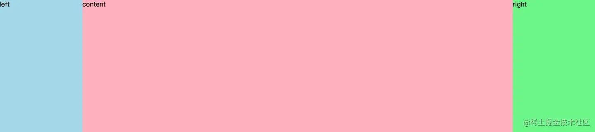
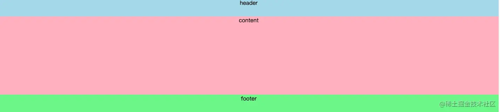
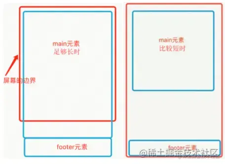
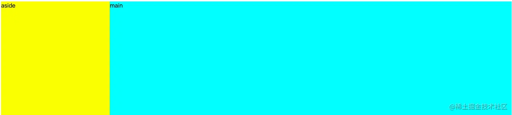
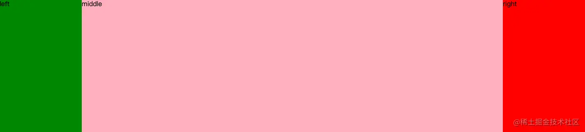

# CSS布局方案汇总

## 等高布局

等高布局一般把网页垂直分成几部分，每一部分的高度是取这几个模块中最高的那个。效果如下



- **flex布局实现**

```
<!DOCTYPE html>
<html>
  <head>
    <meta charset="UTF-8">
    <meta name="viewport" content="width=device-width, initial-scale=1.0">
    <meta http-equiv="X-UA-Compatible" content="ie=edge">
    <title>Document</title>
    <style type="text/css">
      html, body {
        height: 100%;
        margin: 0;
      }
      .wrap {
        display: flex;
        min-height: 100%;
      }
      .left {
        background: lightblue;
        flex-basis: 200px;
      }
      .content {
        background: lightpink;
        /* 这里的高度只是为了模拟内容多少 */
        /* height: 100px; */
        height: 1000px;
        flex-grow: 1;
      }
      .right {
        flex-basis: 200px;
        background: lightgreen;
      }
    </style>
  </head>
  <body>
    <div class="wrap">
      <div class="left">left</div>
      <div class="content">content</div>
      <div class="right">right</div>
    </div>
  </body>
</html>
```

- **grid布局实现**

```
<!DOCTYPE html>
<html>
  <head>
    <meta charset="UTF-8">
    <meta name="viewport" content="width=device-width, initial-scale=1.0">
    <meta http-equiv="X-UA-Compatible" content="ie=edge">
    <title>Document</title>
    <style type="text/css">
      html, body {
        height: 100%;
        margin: 0;
      }
      .wrap {
        display: grid;
        min-height: 100%;
        grid-template-columns: 200px auto 200px;
      }
      .left {
        background: lightblue;
      }
      .content {
        background: lightpink;
        /* 这里的高度只是为了模拟内容多少 */
        /* height: 100px; */
        height: 1000px;
      }
      .right {
        background: lightgreen;
      }
    </style>
  </head>
  <body>
    <div class="wrap">
      <div class="left">left</div>
      <div class="content">content</div>
      <div class="right">right</div>
    </div>
  </body>
</html>
```

## 单栏布局

单栏布局我们常用在网页框架上，一般我们把网页分为 header、content、footer三部分。



在不同的项目我们可能对这三部分的样式需求有所差别，比如需要顶部固定、需要底部固定等等。

#### 顶底部都不固定（单栏布局）

比如想实现如下效果，footer在内容不足的时候吸附在窗口底部，当内容多的时候又可以被抵到窗口下面。



- **使用padding加负margin实现**

```
<!DOCTYPE html>
<html>
  <head>
    <meta charset="UTF-8">
    <meta name="viewport" content="width=device-width, initial-scale=1.0">
    <meta http-equiv="X-UA-Compatible" content="ie=edge">
    <title>Document</title>
    <style type="text/css">
      html, body {
        height: 100%;
        margin: 0;
      }
      .wrap {
        min-height: 100%;
        padding-bottom: 50px;
        overflow: auto;
        box-sizing: border-box;
      }
      .header {
        height: 50px;
        background: lightblue;
      }
      .content {
        background: lightpink;
        /* 这里的高度只是为了模拟内容多少 */
        height: 100px; 
        /*  height: 1000px; */
      }
      .footer {
        height: 50px;
        background: lightgreen;
        margin-top: -50px;
      }
    </style>
  </head>
  <body>
    <div class="wrap">
      <div class="header">header</div>
      <div class="content">content</div>
    </div>
    <div class="footer">footer</div>
  </body>
</html>
```

- **使用flex实现**

```
<!DOCTYPE html>
<html>
  <head>
    <meta charset="UTF-8">
    <meta name="viewport" content="width=device-width, initial-scale=1.0">
    <meta http-equiv="X-UA-Compatible" content="ie=edge">
    <title>Document</title>
    <style type="text/css">
      html, body {
        height: 100%;
        margin: 0;
      }
      .wrap {
        display: flex;
        flex-direction: column;
        min-height: 100%;
      }
      .header {
        height: 50px;
        background: lightblue;
      }
      .content {
        background: lightpink;
        /* 这里的高度只是为了模拟内容多少 */
        height: 100px;
        /* height: 1000px; */
        flex-grow: 1;
      }
      .footer {
        height: 50px;
        background: lightgreen;
      }
    </style>
  </head>
  <body>
    <div class="wrap">
      <div class="header">header</div>
      <div class="content">content</div>
      <div class="footer">footer</div>
    </div>
  </body>
</html>
```

#### 顶部固定（单栏布局）

使用padding加负margin加fixed实现顶部固定布局

```
<!DOCTYPE html>
<html>
  <head>
    <meta charset="UTF-8">
    <meta name="viewport" content="width=device-width, initial-scale=1.0">
    <meta http-equiv="X-UA-Compatible" content="ie=edge">
    <title>Document</title>
    <style type="text/css">
      html, body {
        height: 100%;
        margin: 0;
      }
      .header {
        height: 50px;
        background: lightblue;
        position: fixed;
        width: 100%;
      }
      .wrap {
        min-height: 100%;
        padding-bottom: 50px;
        overflow: auto; /* 开启BFC */
        box-sizing: border-box;
      }
      .content {
        margin-top: 50px;
        background: lightpink;
        /* 这里的高度只是为了模拟内容多少 */
        height: 100px; 
        /* height: 1000px; */
      }
      .footer {
        height: 50px;
        background: lightgreen;
        margin-top: -50px;
      }
    </style>
  </head>
  <body>
    <div class="header">header</div>
    <div class="wrap">
    <div class="content">content</div>
    </div>
    <div class="footer">footer</div>
  </body>
</html>
```

- **使用flex加fixed定位实现**

```
<!DOCTYPE html>
<html>
  <head>
    <meta charset="UTF-8">
    <meta name="viewport" content="width=device-width, initial-scale=1.0">
    <meta http-equiv="X-UA-Compatible" content="ie=edge">
    <title>Document</title>
    <style type="text/css">
      html, body {
        height: 100%;
        margin: 0;
      }
      .wrap {
        display: flex;
        min-height: 100%;
        flex-direction:column;
      }
      .header {
        height: 50px;
        background: lightblue;
        position: fixed;
        width: 100%;
      }
      .content {
        background: lightpink;
        /* 这里的高度只是为了模拟内容多少 */
        /* height: 100px; */
        height: 1000px;
        margin-top: 50px;
        flex-grow: 1;
      }
      .footer {
        height: 50px;
        background: lightgreen;
      }
    </style>
  </head>
  <body>
    <div class="wrap">
      <div class="header">header</div>
      <div class="content">content</div>
      <div class="footer">footer</div>
    </div>
  </body>
</html>
```

#### 底部固定（单栏布局）

- **使用padding加负margin实现底部固定布局**

```
<!DOCTYPE html>
<html>
  <head>
    <meta charset="UTF-8">
    <meta name="viewport" content="width=device-width, initial-scale=1.0">
    <meta http-equiv="X-UA-Compatible" content="ie=edge">
    <title>Document</title>
    <style type="text/css">
      html, body {
        height: 100%;
        margin: 0;
      }
      .wrap {
        height: 100%;
        padding-bottom: 50px;
        overflow: auto;
        box-sizing: border-box;
      }
      .header {
        height: 50px;
        background: lightblue;
      }
      .content {
        background: lightpink;
        height: 100px;
        height: 1000px;
      }
      .footer {
        height: 50px;
        background: lightgreen;
        margin-top: -50px;
      }
    </style>
  </head>
  <body>
    <div class="wrap">
      <div class="header">header</div>
      <div class="content">content</div>
    </div>
    <div class="footer">footer</div>
  </body>
</html>
```

- **使用flex加fixed定位实现**

```
<!DOCTYPE html>
<html>
  <head>
    <meta charset="UTF-8">
    <meta name="viewport" content="width=device-width, initial-scale=1.0">
    <meta http-equiv="X-UA-Compatible" content="ie=edge">
    <title>Document</title>
    <style type="text/css">
      html, body {
        height: 100%;
        margin: 0;
      }
      .wrap {
        display: flex;
        min-height: 100%;
        flex-direction:column;
      }
      .header {
        height: 50px;
        background: lightblue;
      }
      .content {
        background: lightpink;
        /* 这里的高度只是为了模拟内容多少 */
        /* height: 100px; */
        height: 1000px;
        flex-grow: 1;
        margin-bottom: 50px;
      }
      .footer {
        height: 50px;
        background: lightgreen;
        position: fixed;
        width: 100%;
        bottom: 0;
      }
    </style>
  </head>
  <body>
    <div class="wrap">
      <div class="header">header</div>
      <div class="content">content</div>
      <div class="footer">footer</div>
    </div>
  </body>
</html>
```

#### 顶底部都固定（单栏布局）

- **使用fixed实现顶底部固定布局**

```
<!DOCTYPE html>
<html>
  <head>
    <meta charset="UTF-8">
    <meta name="viewport" content="width=device-width, initial-scale=1.0">
    <meta http-equiv="X-UA-Compatible" content="ie=edge">
    <title>Document</title>
    <style type="text/css">
      html, body {
        height: 100%;
        margin: 0;
      }
      .header {
        height: 50px;
        background: lightblue;
        position: fixed;
        width: 100%;
      }
      .content {
        background: lightpink;
        padding-top: 50px;
        padding-bottom: 50px;
        /* height: 100px; */
        height: 1000px;
      }
      .footer {
        height: 50px;
        background: lightgreen;
        position: fixed;
        bottom: 0;
        width: 100%;
      }
    </style>
  </head>
  <body>
    <div class="header">header</div>
    <div class="content">content</div>
    <div class="footer">footer</div>
  </body>
</html>
```

- **使用flex加fixed定位实现**

```
<!DOCTYPE html>
<html>
  <head>
    <meta charset="UTF-8">
    <meta name="viewport" content="width=device-width, initial-scale=1.0">
    <meta http-equiv="X-UA-Compatible" content="ie=edge">
    <title>Document</title>
    <style type="text/css">
      html, body {
        height: 100%;
        margin: 0;
      }
      .wrap {
        display: flex;
        min-height: 100%;
        flex-direction:column;
      }
      .header {
        height: 50px;
        background: lightblue;
        position: fixed;
        width: 100%;
      }
      .content {
        background: lightpink;
        /* 这里的高度只是为了模拟内容多少 */
        /* height: 100px; */
        height: 1000px;
        flex-grow: 1;
        margin-bottom: 50px;
        margin-top: 50px;
      }
      .footer {
        height: 50px;
        background: lightgreen;
        position: fixed;
        width: 100%;
        bottom: 0;
      }
    </style>
  </head>
  <body>
    <div class="wrap">
      <div class="header">header</div>
      <div class="content">content</div>
      <div class="footer">footer</div>
    </div>
  </body>
</html>
```

## 两栏布局

两栏布局就是一边固定，另外一边自适应，效果如下



- **左 float，然后右 margin-left（右边自适应）**

```
<!DOCTYPE html>
<html>
  <head>
    <meta charset="UTF-8">
    <meta name="viewport" content="width=device-width, initial-scale=1.0">
    <meta http-equiv="X-UA-Compatible" content="ie=edge">
    <title>Document</title>
    <style type="text/css">
      div {
        height: 500px;
      }
      .aside {
        width: 300px;
        float: left;
        background: yellow;
      }
      .main {
        background: aqua;
        margin-left: 300px;
      }
    </style>
  </head>
  <body>
    <div class="aside"></div>
    <div class="main"></div>
  </body>
</html>
```

- **右 float，然后右 margin-right（左边自适应）**

```
<!DOCTYPE html>
<html>
  <head>
    <meta charset="UTF-8">
    <meta name="viewport" content="width=device-width, initial-scale=1.0">
    <meta http-equiv="X-UA-Compatible" content="ie=edge">
    <title>Document</title>
    <style type="text/css">
      div {
        height: 500px;
      }
      .aside {
        width: 300px;
        float: right;
        background: yellow;
      }
      .main {
        background: aqua;
        margin-right: 300px;
      }
    </style>
  </head>
  <body>
    <div class="aside"></div>
    <div class="main"></div>
  </body>
</html>
```

- **absolute定位加margin-left（右边自适应）**

```
<!DOCTYPE html>
<html>
  <head>
    <meta charset="UTF-8">
    <meta name="viewport" content="width=device-width, initial-scale=1.0">
    <meta http-equiv="X-UA-Compatible" content="ie=edge">
    <title>Document</title>
    <style type="text/css">
      div {
        height: 500px;
      }
      .wrap {
        position: relative;
      }
      .aside {
        width: 300px;
        background: yellow;
        position: absolute;
      }
      .main {
        background: aqua;
        margin-left: 300px;
      }
    </style>
  </head>
  <body>
    <div class="wrap">
      <div class="aside"></div>
      <div class="main"></div>
    </div>
  </body>
</html>
```

- **absolute定位加margin-right（左边自适应）**

```
<!DOCTYPE html>
<html>
  <head>
    <meta charset="UTF-8">
    <meta name="viewport" content="width=device-width, initial-scale=1.0">
    <meta http-equiv="X-UA-Compatible" content="ie=edge">
    <title>Document</title>
    <style type="text/css">
      div {
        height: 500px;
      }
      .wrap {
        position: relative;
      }
      .aside {
        width: 300px;
        background: yellow;
        position: absolute;
        right: 0;
      }
      .main {
        background: aqua;
        margin-right: 300px;
      }
    </style>
  </head>
  <body>
    <div class="wrap">
      <div class="aside"></div>
      <div class="main"></div>
    </div>
  </body>
</html>
```

- **使用flex实现**

```
<!DOCTYPE html>
<html>
  <head>
    <meta charset="UTF-8">
    <meta name="viewport" content="width=device-width, initial-scale=1.0">
    <meta http-equiv="X-UA-Compatible" content="ie=edge">
    <title>Document</title>
    <style type="text/css">
      div {
        height: 500px;
      }
      .wrap {
        display: flex;
      }
      .aside {
        flex: 0 0 300px;
        background: yellow;
        
      }
      .main {
        background: aqua;
        flex: 1 1;
      }
    </style>
  </head>
  <body>
    <div class="wrap">
      <div class="aside"></div>
      <div class="main"></div>
    </div>
  </body>
</html>
```

- **使用grid实现**

```
<!DOCTYPE html>
<html>
  <head>
    <meta charset="UTF-8">
    <meta name="viewport" content="width=device-width, initial-scale=1.0">
    <meta http-equiv="X-UA-Compatible" content="ie=edge">
    <title>Document</title>
    <style type="text/css">
      div {
        height: 500px;
      }
      .wrap {
        display: grid;
        grid-template-columns: 300px auto;
      }
      .aside {
        background: yellow;
        
      }
      .main {
        background: aqua;
      }
    </style>
  </head>
  <body>
    <div class="wrap">
      <div class="aside"></div>
      <div class="main"></div>
    </div>
  </body>
</html>
```

## 三栏布局

三栏布局就是两边固定，中间自适应布局，效果如下



- **position + margin-left + margin-right实现三栏布局**

```
<!DOCTYPE html>
<html>
  <head>
    <meta charset="UTF-8">
    <meta name="viewport" content="width=device-width, initial-scale=1.0">
    <meta http-equiv="X-UA-Compatible" content="ie=edge">
    <title>Document</title>
    <style type="text/css">
      html, body {
        margin: 0;
      }
      div {
        height: 500px;
      }
      .left {
        position: absolute;
        left: 0;
        top: 0;
        width: 200px;
        background: green;
      }
      .right {
        position: absolute;
        right: 0;
        top: 0;
        width: 200px;
        background: red;
      }
      .middle {
        margin-left: 200px;
        margin-right: 200px;
        background: lightpink;
      }
    </style>
  </head>
  <body>
    <div class="left"></div>
    <div class="middle"></div>
    <div class="right"></div>
  </body>
</html>
```

- **float + margin-left + margin-right实现三栏布局**

```
<!DOCTYPE html>
<html>
  <head>
    <meta charset="UTF-8">
    <meta name="viewport" content="width=device-width, initial-scale=1.0">
    <meta http-equiv="X-UA-Compatible" content="ie=edge">
    <title>Document</title>
    <style type="text/css">
      html, body {
        margin: 0;
      }
      div {
        height: 500px;
      }
      .left {
        width: 200px;
        background: green;
        float: left;
      }
      .right {
        width: 200px;
        background: yellow;
        float: right;
      }
      .middle {
        margin-left: 200px;
        margin-right: 200px;
        background: lightpink;
      }
    </style>
  </head>
  <body>
    <div class="left"></div>
    <div class="right"></div>
    <div class="middle"></div>
  </body>
</html>
```

- **flex实现三栏布局**

```
<!DOCTYPE html>
<html>
  <head>
    <meta charset="UTF-8">
    <meta name="viewport" content="width=device-width, initial-scale=1.0">
    <meta http-equiv="X-UA-Compatible" content="ie=edge">
    <title>Document</title>
    <style type="text/css">
      html, body {
        margin: 0;
      }
      div {
        height: 500px;
      }
      .wrap {
        display: flex;
      }
      .left {
        flex: 0 0 200px;
        background: green;
      }
      .right {
        flex: 0 0 200px;
        background: yellow;
      }
      .middle {
        background: lightpink;
        flex: 1 1;
      }
    </style>
  </head>
  <body>
    <div class="wrap">
      <div class="left"></div>
      <div class="middle"></div>
      <div class="right"></div>
    </div>
  </body>
</html>
```

- **grid实现三栏布局**

```
<!DOCTYPE html>
<html>
  <head>
    <meta charset="UTF-8">
    <meta name="viewport" content="width=device-width, initial-scale=1.0">
    <meta http-equiv="X-UA-Compatible" content="ie=edge">
    <title>Document</title>
    <style type="text/css">
      html, body {
        margin: 0;
      }
      div {
        height: 500px;
      }
      .wrap {
        display: grid;
        grid-template-columns: 200px auto 200px;
      }
      .left {
        background: green;
      }
      .right {
        background: yellow;
      }
      .middle {
        background: lightpink;
      }
    </style>
  </head>
  <body>
    <div class="wrap">
      <div class="left"></div>
      <div class="middle"></div>
      <div class="right"></div>
    </div>
  </body>
</html>
```

## 圣杯布局

```
<!DOCTYPE html>
<html>
  <head>
    <meta charset="UTF-8">
    <meta name="viewport" content="width=device-width, initial-scale=1.0">
    <meta http-equiv="X-UA-Compatible" content="ie=edge">
    <title>Document</title>
    <style type="text/css">
      div {
        height: 500px;
      }
      .container {
        padding: 0 200px 0 200px;
        border: 1px solid black;
      }
      .content {
        float: left;
        width: 100%;
        background: #f00;
      }
      .left {
        width: 200px;
        background: #0f0;
        float: left;
        margin-left: -100%;
        position: relative;
        left: -200px;
      }
      .right {
        width: 200px;
        background: #00f;
        float: left;
        margin-left: -200px;
        position: relative;
        right: -200px;
      }
    </style>
  </head>
  <body>
    <div class="container">
      <div class="content">中间内容</div>
      <div class="left">左侧区域</div>
      <div class="right">右侧区域</div>
    </div>
  </body>
</html>
```

## 双飞翼布局

```
<!DOCTYPE html>
<html>
  <head>
    <meta charset="UTF-8">
    <meta name="viewport" content="width=device-width, initial-scale=1.0">
    <meta http-equiv="X-UA-Compatible" content="ie=edge">
    <title>Document</title>
    <style type="text/css">
      div {
        
        height: 500px;
      }
      .main {
        float: left;
        width: 100%;
        background: #f00;
      }
      .main .content {
        /* margin、padding这两种方式都可以 */
        /* margin-left: 200px;
        margin-right: 300px; */
        padding-left: 200px;
        padding-right: 300px;
      }
      .left {
        width: 200px;
        background: #0f0;
        float: left;
        margin-left: -100%;
      }
      .right {
        width: 200px;
        background: #00f;
        float: left;
        margin-left: -200px;
      }
    </style>
  </head>
  <body>
    <div class="main">
      <div class="content">content</div>
    </div>
    <div class="left">left</div>
    <div class="right">right</div>
  </body>
</html>
```