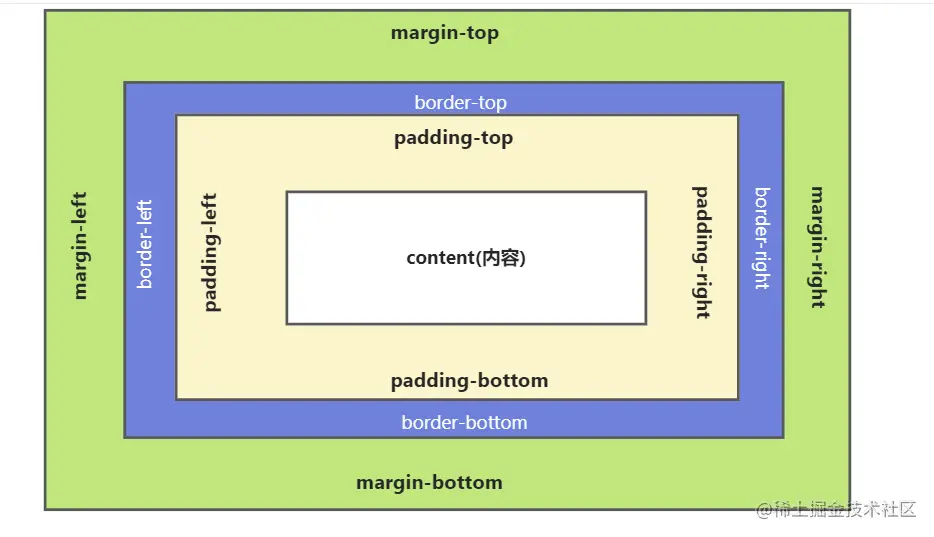
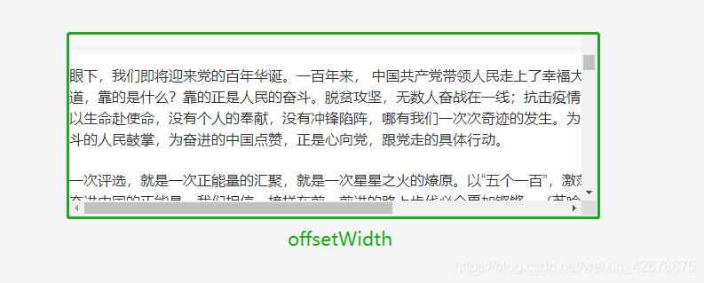
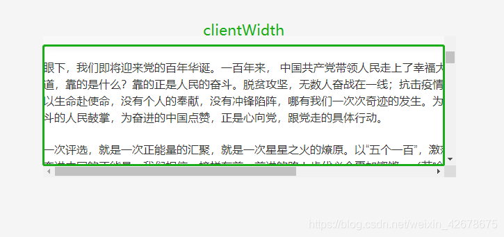
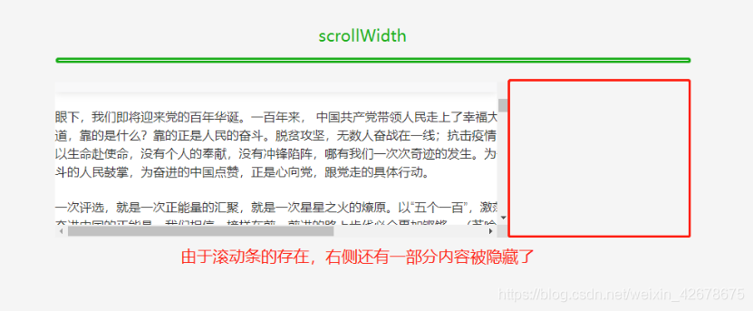
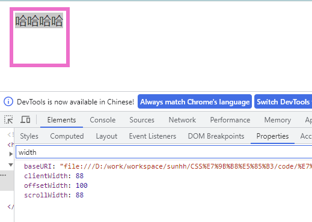
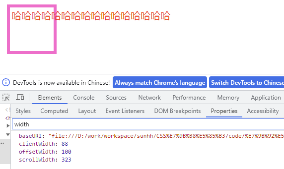

# 盒子模型及offsetWidth、clientWidth、scrollWidth如何计算

## 1、了解盒子模型

盒子模型指的就是CSS 盒模型。一个 HTML 元素包括四个区域,包括：

- 内容区content：包含HTML元素的实际内容，包括文本、图像等。
- 内边距区:pading(填充)：元素内容区周围的空白区域，用于控制元素内容与元素边框之间的距离。
- 边框区border：位于内边距区外面，用于装饰元素并将其与其他元素区分开。
- 外边距区margin：位于边框区外部的空白区域，用于控制当前元素与其它元素之间的距离。

这四个区域共同构成了一个元素的盒子模型，CSS 可以用来控制每个区域的大小、颜色、样式、位置等。当我们设置元素的宽度或高度时，实际上是设置了元素盒子模型的尺寸大小。

其中内容content又分为高(height)、宽(width)



日常应用中,根据计算盒子尺寸的总宽度和高度的不同,将盒模型区分为**标准盒模型**和**怪异盒模型**

### 标准盒模型(W3C盒子模型 box-sizing: content-box)

标准和模型又称为W3C盒子模型
标准盒模型将HTML元素宽度和高度定义为内容区域、内边距和边框三部分的总和。即我们设置HTML元素的宽度和高度时，实际上只是设置其**内容区域的大小**。
W3C 标准盒模型：属性包括 width ，height
**width=content**
**height=content**

### 怪异盒模型(IE盒模型 box-sizing: border-box)

怪异盒模型又称为IE盒模型
怪异盒模型将元素宽度和高度也定义为内容区域（content)、内边距和边框三部分的总和，不同的是怪异盒模型的content部分包括了padding和border.即当我们设置元素的大小时，我们实际设置是content、padding和border三部分的**总的大小**。

W3C 标准盒模型：属性包括 width ，height
**width**=**content**+**pading**(pading-left + padding-right)+**border**(border-left + border-right)
**height**=**content**+**pading**(pading-top + padding-bottom)+**border**(border-top + border-bottom)

### 指定盒子模型

实际应用中,除去一些旧版本的浏览器可能采用**怪异盒模型**,其他默认的都是**标准盒模型**，可能会因为浏览器版本不同显示出不同的效果。所以，在进行网页布局的时候，需要明确指定使用哪种盒模型，并考虑浏览器的兼容性问题

```
/* W3C(标准)盒子模型 */
box-sizing: content-box 
/* IE模型  */
box-sizing: border-box
```

## 2、offsetWidth、clientWidth

#### 1）这里先列出几个重要的概念

**offsetWidth**：控件元素的实际宽度



**clientWidth**：可视内容的宽度



**scrollWidth**：实际内容的宽度



#### 2）首先抛出一个问题，如下代码，不考虑滚动条宽度， offsetWidth 和 clientWidth 分别是多少？

① <font color=#c7254e>box-sizing: content-box</font>

```
#div {
  height: 100px;
  width: 100px;
  margin: 10px;
  padding: 3px;
  border: 6px solid #ff66cc;
}
```

在没有设置 <font color=#c7254e>box-sizing</font> 属性，默认情况下该盒子为 <font color=#c7254e>content-box</font> 类型，因此

**offsetWidth = width + padding(包含左右内边距) + border(包含左右边框) = 118px**

**clientWidth = width + padding(包含左右内边距) = 106px**

**<font color=red>注意：width = content</font>**

② <font color=#c7254e>box-sizing: border-box</font>

```
#div {
  height: 100px;
  width: 100px;
  margin: 10px;
  padding: 3px;
  border: 6px solid #ff66cc;
  box-sizing: border-box;
}
```

在 <font color=#c7254e>box-sizing</font> 设置了 <font color=#c7254e>border-box</font> 后，计算方式发生了改变，如下：

**offsetWidth = width = 100px**

**clientWidth = width - border(包含左右边框) = 88px**

**<font color=red>注意：width = content + padding + border</font>**

#### 3）总结

|             | content-box（width=content） | border-box（width = content + padding + border）
| ----------- | ---------------------------- | ----------------------------------------------
| offsetWidth | width + padding + border     | width
| clientWidth | width + padding              | width - border

## 3、scrollWidth

① <font color=#c7254e>box-sizing: content-box</font>

```
#div {
  height: 100px;
  width: 100px;
  margin: 10px;
  padding: 3px;
  border: 6px solid #ff66cc;
  font-size: 20px;
  white-space: nowrap;
  color: red;
}
<div class="box">哈哈哈哈</div>
```

文字未溢出时：



**scrollwidth = clientWidth**

文字溢出时：



**scrollWidth= clientWidth + 溢出的内容区的宽度**

② <font color=#c7254e>box-sizing: content-box</font>

```
#div {
  height: 100px;
  width: 100px;
  margin: 10px;
  padding: 3px;
  border: 6px solid #ff66cc;
  font-size: 20px;
  white-space: nowrap;
  color: red;
  box-sizing: border-box;
}
<div class="box">哈哈哈哈</div>
```

**同box-sizing: content-box效果一致**
