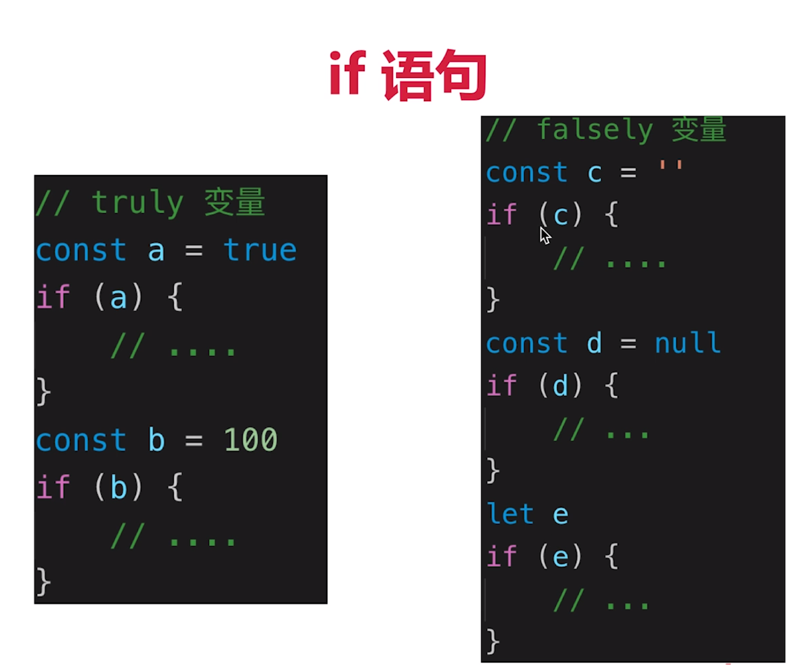

# truly变量与falsely变量

- truly变量： !!a === true 的变量
- falsely变量： !!b === false的变量

```
// 以下是 falsely 变量。除此之外都是 truly 变量
!!0 === false
!!NaN === false
!!'' === false
!!null === false
!!undefined === false
!!false === false
```

**if 语句判断时都是判断的 truly 和 falsely 变量**

