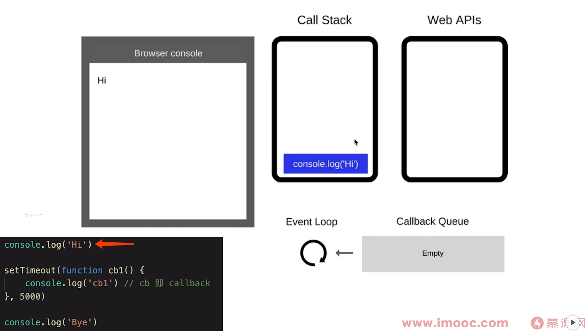
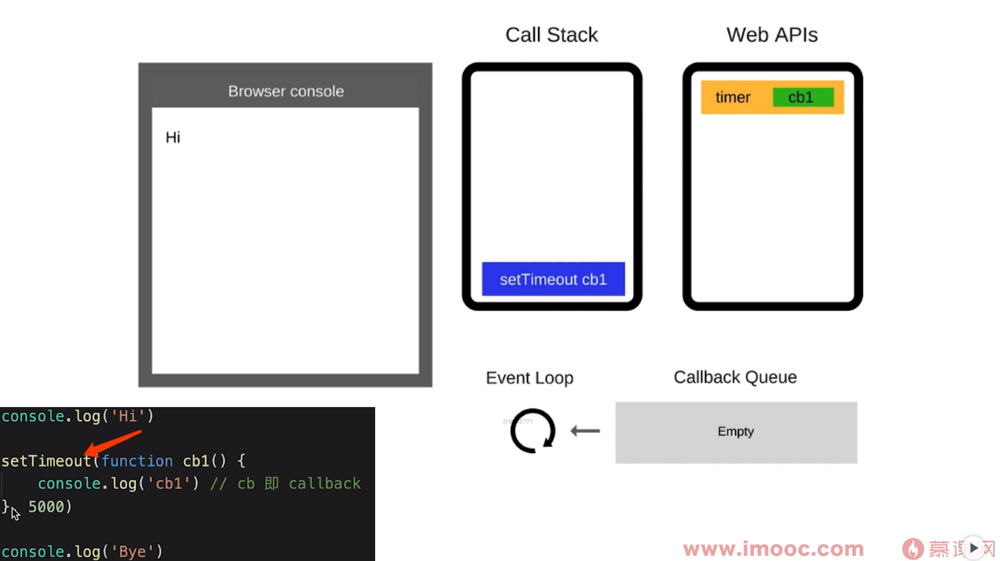
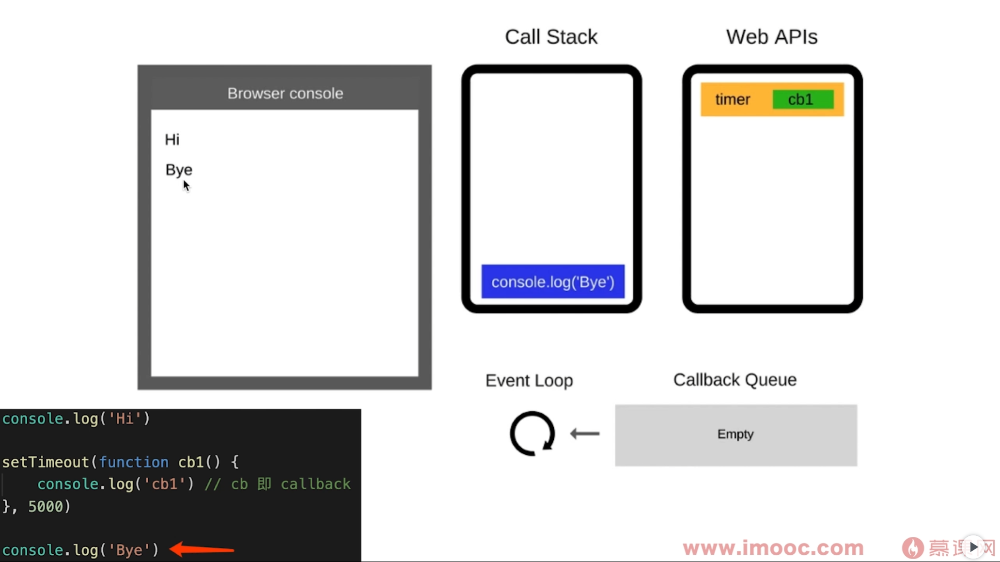
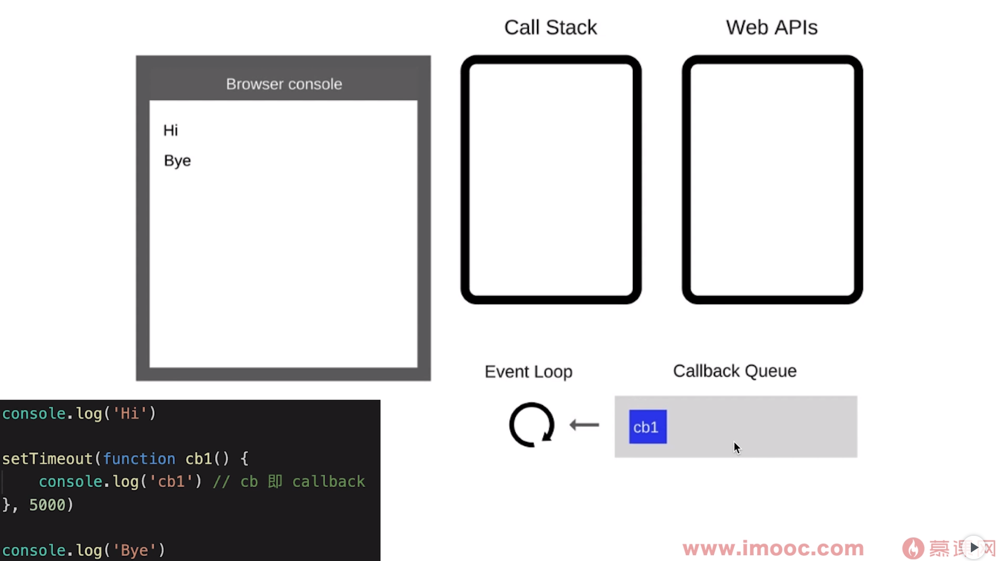
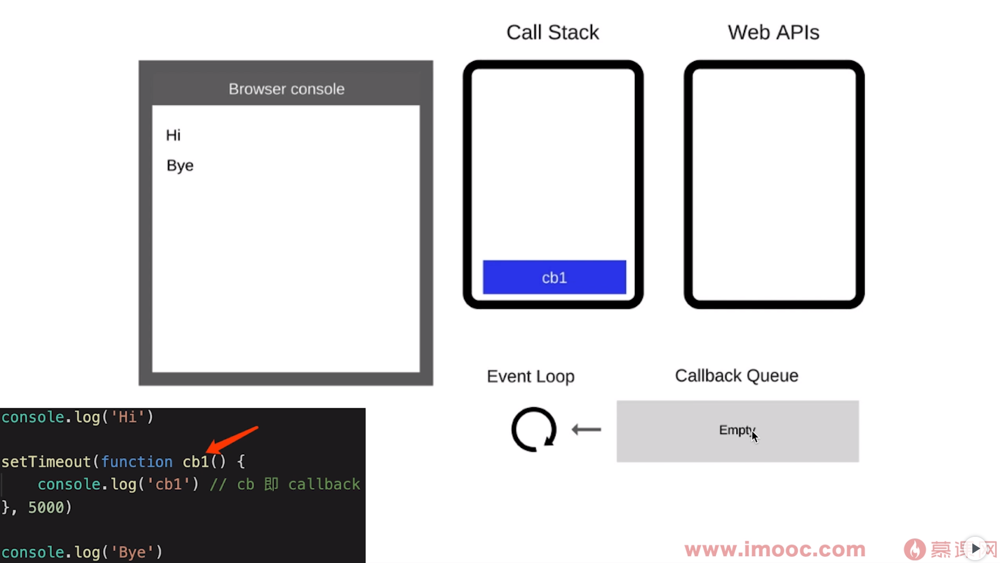
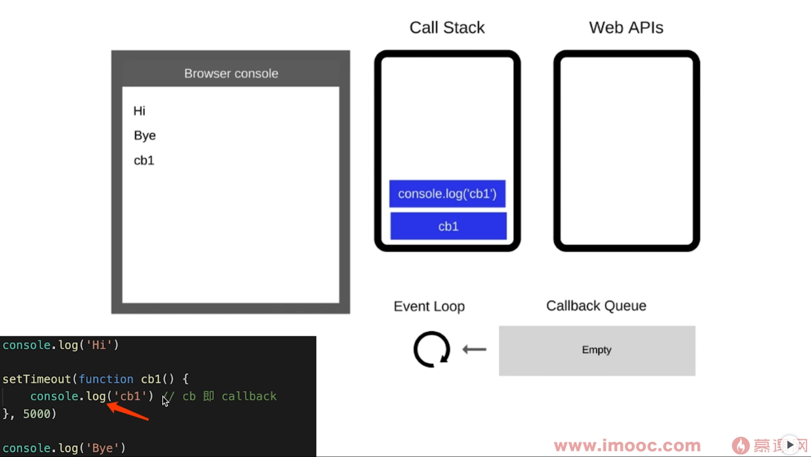
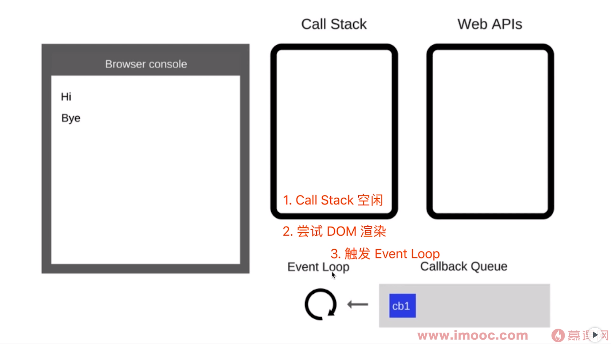
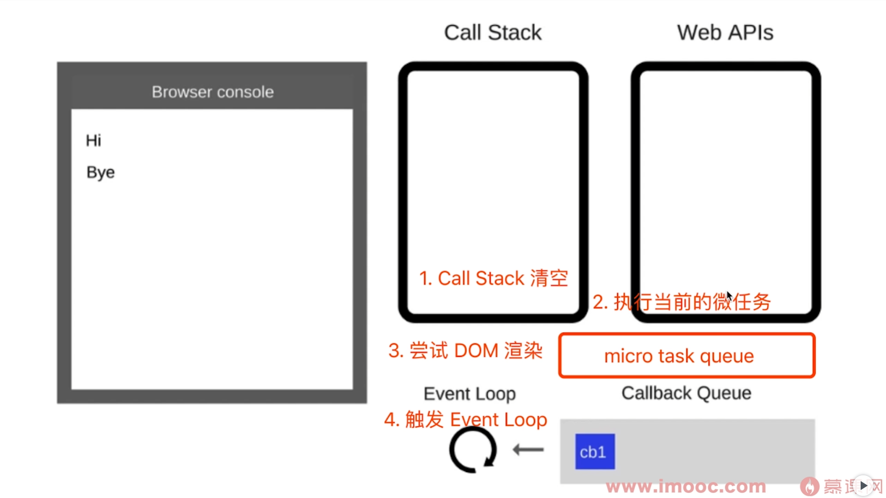

# 事件循环

## event loop 执行过程

先来看一个代码示例

```js
console.log('Hi')

setTimeout((function cb1) {
  console.log('cb1') // cb 即 callback
}, 5000)

console.log('Bye')
// 执行结果： Hi Bye cb1
```

分析执行过程如下：

1、js主线程顺序执行代码，遇到 conosle.log('Hi') ，把代码推入到 Call Stack（调用栈）并执行代码输出Hi，代码执行完后清空调用栈。



2、继续执行主线程代码，执行到setTimeout，会把timeout放到定时器任务中，等待5秒后才会把回调函数放到 Callback Queue 中，此时会清空调用栈，主线程会继续向下执行代码



3、继续执行主线程代码，执行到 console.log('Bye') ，会把代码推入到 Call Stack（调用栈）并执行代码输出 Bye ， 代码执行完后会再次清空调用栈。此时主线程代码已经执行结束了。



4、此时主线程代码执行结束了，浏览器内核会启动 event loop 机制，event loop 会从 callbackQueue查找是否有待执行函数。有则会把待执行函数放到调用栈中执行。

等待5秒左右定时器任务结束，把回调函数放到 Callback Queue 中


event loop 发现 Callback Queue 中有待执行函数，把回调函数放到调用栈中执行


执行结束，输出 cb1



## event loop 和 Dom 渲染之间的关系

当所有同步代码执行完后， Call Stack 空闲时，会尝试 DOM 渲染（不一定渲染，看代码是否有修改DOM结构），然后才去触发 event loop



代码演示

```html
<!DOCTYPE html>
<html lang="en">
  <head>
    <meta charset="UTF-8">
    <meta http-equiv="X-UA-Compatible" content="IE=edge">
    <meta name="viewport" content="width=device-width, initial-scale=1.0">
    <title>js异步demo</title>
  </head>
  <body>
    <p>js异步demo</p>
    <div id="container"></div>
    <script src="https://cdn.bootcss.com/jquery/3.4.0/jquery.js"></script>
    <script>
      const $p1 = $('<p>一段文字</p>');
      const $p2 = $('<p>一段文字</p>');
      const $p3 = $('<p>一段文字</p>');
      $('#container') 
                    .append($p1)
                    .append($p2)
                    .append($p3)
      console.log('length', $('#container').children().length)
      alert('本次 call stack 结束， DOM结构已更新，但尚未触发渲染')
    </script>
  </body>
</html>
```

## 微任务与宏任务的区别

宏任务：DOM 渲染后触发，如setTimeout

微任务：DOM 渲染前触发，如Promise



代码演示

```html
<!DOCTYPE html>
<html lang="en">
  <head>
    <meta charset="UTF-8">
    <meta http-equiv="X-UA-Compatible" content="IE=edge">
    <meta name="viewport" content="width=device-width, initial-scale=1.0">
    <title>js异步demo</title>
  </head>
  <body>
    <p>js异步demo</p>
    <div id="container"></div>
    <script src="https://cdn.bootcss.com/jquery/3.4.0/jquery.js"></script>
    <script>
      const $p1 = $('<p>一段文字</p>');
      const $p2 = $('<p>一段文字</p>');
      const $p3 = $('<p>一段文字</p>');
      $('#container') 
                    .append($p1)
                    .append($p2)
                    .append($p3)
      // 微任务：DOM 渲染前触发
      Promise.resolve().then(() => {
        console.log('length1', $('#container').children().length)
        alert('微任务触发')
      })
      // 宏任务：DOM 渲染后触发
      setTimeout(() => {
        console.log('length2', $('#container').children().length)
        alert('宏任务触发')
      })
    </script>
  </body>
</html>
```