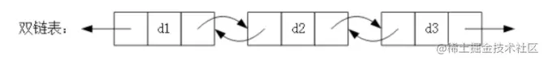

# JS常用数据结构

## 一、数组(array)

### 1. 数组的说明

数组（Array）是 javascript 语言中自带的一类数据结构，原生提供跟多方便快捷好用的方式和属性，数组的数据结构是一种最最常见的线性数据结构；

- 不需要自行封装 数组的数据结构，一般直接使用即可；
- 数组是引用类型，是一系列数据的有序集合，js中的数组允许为任意的数据类型；
- 数组结构在查询和修改指定元素是具有非常高的效率；但是在删除和添加元素时，内存中需要处理数组的大小和移动数据位置，效率不高
- 常见语言的数组不能存放不同的数据类型，因此所有在封装时通常存放在数组中的是Object类型。但是 JavaScript 语言的数组里面是可以存放任意的数据类型
- 常见语言的数组容量不会自动改变，（需要进行扩容操作，比较消耗内存）。但是 JavaScript 语言的数组长度可以自动动态变化的
- 常见语言的数组进行中间插入和删除操作性能比较低

### 2. 数组构造函数的属性和方法

<font color=red>isArray</font> 判断一个数据是不是数组

```js
Array.isArray(obj) // 判断obj是不是数组类型
```

<font color=red>from</font> 将一个类数组或者 <font color=red>iterable</font> 接口的数据转换为数组

```js
Array.from(obj) // 判断obj是不是数组类型
```


<font color=red>of</font> 将所有参数按顺序组成一个数组

```js
Array.of(a,b,c,d,...) // 将所有参数按顺序组成一个数组[a,b,c,d,...]
Array.of(111,222,333,444)  // => [111,222,333,444]
```

### 3. 数组实例的属性和方法

- 实例属性： length
- 遍历操作： forEach() ...
- 查找操作
...

## 二、栈(stack)

### 1. 栈的说明

栈（stack）是一种 后进先出（LIFO）的常见数据结构；
数组的线性结构可以方便的在数组的 任意位置 插入和删除数据，但有些应用场景需要堆这中任意性加以限制，栈和队列 就是比较常见的受限的线性数据结构，都有一些特定的应用场景；
js中没有原生的栈数据结构，需要自行封装使用；

### 2. 栈的结构特点

- 栈是一种受限的线性表，**后进先出**(LIFO) 的特点；
- 限制仅允许在 表的一端 进行插入和删除操作，这一端被称为栈顶，把另一端称为栈底；
- LIFO(last in first out)表示就是后进入的元素，第一个被弹出栈空间；
- 像一个栈插入新元素称作 进栈、入栈或压栈，它是把新元素放在栈顶元素的上面，使之称为新的栈顶元素；
- 从一个栈删除元素称作 出栈或退栈，它是把栈顶元素删除掉，使其相邻的元素成为新的栈顶元素；

### 3. 栈的实现

使用es6的class语法基于「数组」实现 栈（stack） 数据结构:

```js
class Stack {
  // 存放栈数据的内部属性
  _items;
  /**
   * 栈数据结构的构造函数
   * @params {Array<any>} arguments 创建栈数据的时候初始化压入栈中的数据元素
   */
  constructor(){
    this._items = [...arguments]
  }
  push(item){
    this._items.push(item)
  }
  pop(){
    return this._items.pop()
  }
  peek(){
    return this._items[this._items.length - 1]
  }
  isEmpty(){
    return !this._items.length
  }
  size(){
    return this._items.length
  }
  toString(){
    let result = '';
    this._items.forEach(item => {
      result = result + JSON.stringify(item) + ' '
    })
    return result
  }
}
```

### 4.栈结构的应用

十进制转换为其他进制

```js
/**
 * 将十进制数值number 转换为 base对应进制 的数
 * @param {number} number  要转换的数据
 * @param {number} base    要转换的进制（2～16）
 * @returns {String}
 */
function dec2bin(number, base) {
  let stack = new Stack();
  let keyMaps = ['a','b','c','d','e','f']
  while(number){
    let val = number % base;
    stack.push(val >= 10 ? keyMaps[val - 10] : val)
    number = Math.floor(number / base)
  }
  let result = '';
  while(!stack.isEmpty()){
    result += stack.pop()
  }
  return result
}

/**
 *  栈Stack 数据结构的面试题:
 *  有六个元素6，5，4，3，2，1 的顺序进栈，问下面哪一个不是合法的【出栈】顺序？
 *  A. 5 4 3 6 1 2  ✅ 65进 5出 4进4出 3进3出 6出 21进栈 1出 2出
 *  B. 4 5 3 2 1 6  ✅ 654进 4出 5出 3进3出 2进2出 1进1出 6出
 *  C. 3 4 6 5 2 1  ❌ 6543进 3出 4出 => 6和5顺序在栈中，5不能在6之前出栈
 *  D. 2 3 4 1 5 6  ✅ 65432进 2出 3出 4出 1进1出 5出 6出
 */
```

## 三、队列(queue)

### 1. 队列的说明

队列（Queue）是一种 **先进先出(FIFO)** 的常见数据结构，是另一种比较常见的受限的线性数据结构。 js中没有原生的队列数据结构，需要自行封装使用；

### 2. 队列的结构特点

- 队列是一种受限的线性表，先进先出（FIFO）的特点；
- 限制仅允许在 队列的后端进行插入操作，在队列的前端进行删除操作；
- FIFO(first in first out)表示就是先进入的元素，第一个被移除队列空间；

### 3. 队列的实现

使用es6的class语法基于「数组」实现 队列（Queue） 数据结构:

- enqueue(item): 向队列尾部添加一个或者多个新的元素；
- dequeue(): 移除队列的第一个元素（即排在队列最前面的元素），并返回被移除的元素；
- front(): 返回队列中的第一个元素 ———— 最先被添加，也是最先被移除的元素，不对队列做任何的修改，仅仅是返回队列的第一个元素；
- isEmpty(): 判断栈是否为空，没有任何元素就返回false， 否则返回true；
- size(): 返回栈中的元素个数。和数组中的length类似；
- toString(): 将栈中的内容以字符串的形式返回；

```js
class Queue {
  _items; // 存放队列的内部属性
  /**
   * 队列数据结构的构造函数
   * @params {Array<any>} arguments 创建队列数据的时候初始化的数据元素
   */
  constructor(){
    this._items = [...arguments]
  }
  // 添加元素 - 向队列尾部添加一个或者多个新的元素
  enqueue(){
    this._items.push(...arguments)
  }
  // 移除元素 - 移除队列的第一个元素
  dequeue(){
    return this._items.shift()
  }
  front(){
    return this._items[0]
  }
  isEmpty(){
    return !this._items.length
  }
  size(){
    return this._items.length
  }
  toString(){
    let result = ''
    for(let i = 0; i < this._items.length; i++){
      result += JSON.stringify(this._items[i]) + ' '
    }
    return result
  }
}
```

### 4.队列结构的应用

击鼓传花 规则：一列数据，从第一个元素起从1开始数数，当数到指定当数之后，当前的这个元素从队列中移除，然后后一个元素又开始从1重新数数

```js
function passFlower(nameList, num) {
  let current = 0
  let queue = new Queue(...nameList)
  while(queue.size() > 1){
    // 开始数数
    for(i = 0; i < num - 1; i++){
      // 不是num的时候，将队列的第一个元素放置到队列的最末尾
      queue.enqueue(queue.dequeue())
    }
    // 是num的时候将第一个元素移除即可，然后再次执行while循环，直到最后剩下一个元素
    queue.dequeue()
  }
  return queue.front()
}
const personList = ['lily', 'rose', 'jack', 'mario', 'kangkang']
console.log('参与游戏的人列表: ', personList)
console.log('最后胜出的人: ' + passFlower(personList, 3))
```

## 四、优先队列(queue)

### 1. 优先队列的说明

优先队列（PriorityQueue）是一种改进式的队列数据结构；普通队列插入一个元素，数数据会被放在后端，并且需要前面所有的元素都处理完成之后才处理这个元素；优先级队列是在插入一个元素的时候会考虑该数据的优先级；

### 2. 优先队列的结构特点

- 插入一个元素的时候会和其他数据优先级进行比较；
- 比较完成之后，可以得出这个元素在队列中正确的位置；
- 处理的其他方式和基本队列的处理方式一样，限制仅允许在队列的前端进行删除操作；
- 每个优先队列的元素不再只是一个数据，而是还要包含数据的优先级；
- 在添加方式中，根据优先级放入正确的位置；

### 3. 优先队列的实现

- enqueue(item): 向队列尾部添加一个或者多个新的元素；
- dequeue(): 移除队列的第一个元素（即排在队列最前面的元素），并返回被移除的元素；
- front(): 返回队列中的第一个元素 ———— 最先被添加，也是最先被移除的元素，不对队列做任何的修改，仅仅是返回队列的第一个元素；
- isEmpty(): 判断栈是否为空，没有任何元素就返回false， 否则返回true；
- size(): 返回栈中的元素个数。和数组中的length类似；
- toString(): 将栈中的内容以字符串的形式返回；

```js
class Node {
  constructor (data, priority) {
      this.data = data;
      this.priority = priority;
  }
}
class PriorityQueue {
  items = [];
  enqueue (data, priority) {
    const node = new Node(data, priority);
    if (this.items.length === 0) {
      this.items.push(node);
    } else {
      let isAdd = false;
      for (let i = 0; i < this.items.length; i++) {
        if (priority < this.items[i].priority) {
          this.items.splice(i, 0, node);
          isAdd = true
          break
        }
      }
      if (!isAdd) {
        this.items.push(node);
      }
    }
  }
  dequeue () {
    return this.items.shift();
  }
  front () {
    return this.items[0];
  }
  isEmpty () {
    return !this.items.length;
  }
  size () {
    return this.items.length;
  }
  toString () {
    let result = ''
    for(let i = 0; i < this.items.length; i++){
      result += JSON.stringify(this.items[i].data) + '-' + this.items[i].priority + ' '
    }
    return result;
  }
}
```

## 五、单向链表(queue)


### 1. 单向链表的说明

- 链表（LinkedList）是不同于数组的另一种非常常见的用于存储数据的线性数据结构；
- 链表和数组一样，可以用于存储一系列的元素，但是链表和数组的实现机制完全不同；
- 链表不同于数组，链表中的元素在内存中不必是连续的空间；
- 链表的每个元素由一个存储元素本身的节点和一个指向下一个元素的引用(有些语言称为指针或者连接)组成；

### 2. 链表的结构特点

- 链表类属于只能从火车头上车的火车结构；
- 内存空间不是必须连续的，可以充分利用计算机的内存，实现灵活的内存动态管理；
- 链表不必在创建的时候就确定大小，并且大小可以无限的延伸下去；
- 链表的插入和删除数据时，事件复杂度可以达到O(1)，相对数组效率高很多；
- 链表在查找和和修改数据的时候需要从头开始遍历链表才能找到对应的元素，没有数组直接下标定位来的方便

### 3. 单向链表的实现

- append(item): 向链表尾部添加一个新的元素，返回链表的长度；
- insert(position, item): 向链表的特定位置插入一个新的元素；
- get(position): 获取对应位置的元素；
- indexOf(item): 返回元素在链表中的索引，如果链表中没有该元素则返回-1；
- update(position,data): 修改某个位置的元素；
- removeAt(position): 移除链表中指定位置的元素；
- remove(item): 从列表中移除指定项；
- forEach(callback): 遍历链表中的每一项
- map(callback): 遍历链表中的每一项，生产一个新的链表
- isEmpty(): 判断栈是否为空，没有任何元素就返回false， 否则返回true；
- size(): 返回栈中的元素个数。和数组中的length类似；
- toString(): 将栈中的内容以字符串的形式返回；

```js
function LinkedList() {
  // 单向链表节点元素的构造函数 添加元素的时候用来根据数据和next指针生产单项链表数据的节点元素
  function Node(data) {
    this.data = data;
    this.next = null;
  }
  // 单向链表的链表节点引用
  this.head = null;
  // 单向链表的节点个数
  this.length = 0;
  // append 在单向链表末尾添加节点元素
  LinkedList.prototype.append = function (data) {
    let newNode = new Node(data)
    if(this.length === 0){
      this.head = newNode
    }else{
      let current = this.head;
      // 循环移动指针，当节点的next有数据时表示不是最后一个节点，指针往后移动
      while(current.next){
        current = current.next
      }
      current.next = newNode
    }
    // 添加完节点之后，链表的节点数加1
    this.length += 1
    // 添加成功后返回当前链表的节点个数
    return this.length
  }
  // insert 在单向链表的position位置插入数据data
  LinkedList.prototype.insert = function (position, data) {
    // 越界判断
    if(position < 0 || position > this.length) return false
    let newNode = new Node(data)
    if(position === 0){
      newNode.next = this.head;
      this.head = newNode;
    }else{
      let current = this.head;
      let previous = null
      let i = 0;
      while(i++ < position){
        previous = current;
        current = current.next;
      }
      // 找到对应位置的元素，移动指针
      newNode.next = current;
      previous.next = newNode
    }
    // 添加完节点之后，链表的节点数加1
    this.length += 1
    // 添加成功后返回当前链表的节点个数
    return this.length
  }
  // get 获取单向链表在position位置的data数据
  LinkedList.prototype.get = function (position) {
    // 越界判断
    if(position < 0 || position >= this.length) return null
    let index = 0;
    let current = this.head
    while(index < position){
      current = current.next
      index += 1
    }
    return current.data
  }
  // indexOf 获取data在单向链表中的位置position
  LinkedList.prototype.indexOf = function (data) {
    let current = this.head
    let index = 0
    while(current){
      if(current.data === data){
        return index
      }
      current = current.next
      index += 1
    }
    return -1
  }
  // update 将单向链表的position位置的数据data修改未新的data
  LinkedList.prototype.update = function (position, data) {
    // 越界判断
    if(position < 0 || position >= this.length) return false
    // 先查找到position位置的节点
    let current = this.head
    let index = 0
    while(index++ < position){
      current = current.next
    }
    // 再将新的data赋值给节点data
    current.data = data
    return true
  }
  // removeAt 移除单向链表中position位置的节点
  LinkedList.prototype.removeAt = function (position) {
    // 越界判断
    if(position < 0 || position >= this.length) return false
    let current  = this.head
    if(position === 0){
      this.head = this.head.next
    }else{
      let previous = null
      let index = 0
      while(index++ < position){
        previous = current
        current = current.next
      }
      previous.next = current.next
    }
    this.length -= 1
    return current.data
  }
  // remove 移除单向链表中数据为data的节点
  LinkedList.prototype.remove = function (data) {
    // 用indexOf获取data的位置信息
    let position = this.indexOf(data) // 没有则为-1
    // 根据位置信息position，调用removeAt方法移除即可
    return this.removeAt(position) // index为-1是返回false
  }
  // forEach 遍历单向链表中的每一项数据，回调函数接受 当前的节点data、当前下标 和 对应列表
  LinkedList.prototype.forEach = function (callback) {
    if(!(callback instanceof Function)){
      throw Error("链表的forEach只能接受一个回调函数，参数类型错误，请检查！")
    }
    let current = this.head
    let index = 0;
    while(current){
      callback(current.data, index++, this.head)
      current = current.next
    }
  }
  // map 遍历单向链表中的每一项数据，返回一个新的链表，回调函数接受 当前的节点data、当前下标 和 对应列表
  LinkedList.prototype.map = function (callback) {
    if(!(callback instanceof Function)){
      throw Error("链表的forEach只能接受一个回调函数，参数类型错误，请检查！")
    }
    let current = this.head
    let index = 0;
    // 创建一个新的链表数据结构
    let result = new LinkedList()
    while(current){
      // 处理当前链表的每一项，最后拿到对应的返回结果
      let item = callback(current.data, index++, this.head)
      // 将返回的就过链表的数据项添加到新的链表中
      result.append(item)
      current = current.next
    }
    return result
  }
  // isEmpty 单向链表中是否为空
  LinkedList.prototype.isEmpty = function () {
    return this.length === 0
  }
  // size 单向链表的长度
  LinkedList.prototype.size = function () {
    return this.length
  }
  LinkedList.prototype.toString = function () {
    let result = '';
    let current = this.head;
    while(current){
      result += JSON.stringify(current.data) + ' ';
      current = current.next
    }
    return result;
  }
}
```


## 六、双向链表(queue)



### 1. 双向链表的说明

- 双向链表（LinkedList）是不同于数组的另一种非常常见的用于存储数据的线性数据结构；
- 双向链表和数组一样，可以用于存储一系列的元素，但是双向链表和数组的实现机制完全不同；
- 双向链表不同于数组，双向链表中的元素在内存中不必是连续的空间；
- 双向链表的每个元素由一个存储元素本身的节点、一个指向下一个元素的引用 和 一个指向上一个元素的引用 (有些语言称为指针或者连接)组成；

### 2. 双向链表的结构特点

- 双向链表类属于只能从火车头或火车尾上车的火车结构；
- 内存空间不是必须连续的，可以充分利用计算机的内存，实现灵活的内存动态管理；
- 双向链表不必在创建的时候就确定大小，并且大小可以无限的延伸下去；
- 双向链表的插入和删除数据时，事件复杂度可以达到O(1)，相对数组效率高很多；
- 双向链表在查找和和修改数据的时候需要从头开始遍历链表才能找到对应的元素，没有数组直接下标定位来的方便

### 3. 双向链表的实现

- append(item): 向链表尾部添加一个新的元素；
- insert(position, item): 向链表的特定位置插入一个新的元素；
- get(position): 获取对应位置的元素；
- indexOf(item): 返回元素在链表中的索引，如果链表中没有该元素则返回-1；
- update(position): 修改某个位置的元素；
- removeAt(position): 移除链表中指定位置的元素；
- remove(item): 从列表中移除指定项；
- forwardForEach(callback): 正向遍历链表中的每一项
- backwardForEach(callback): 反向遍历链表中的每一项
- map(callback): 遍历链表中的每一项
- isEmpty(): 判断栈是否为空，没有任何元素就返回false， 否则返回true；
- size(): 返回栈中的元素个数。和数组中的length类似；
- toString(): 将栈中的内容以字符串的形式返回

```js
class Node {
  constructor (data) {
    this.data = data;
    this.prev = null;
    this.next = null;
  }
}
class DoubleLinkedList {
  head = null;
  tail = null;
  length = 0;
  // insert 向链表的特定位置插入一个新的元素
  append (data) {
    const newNode = new Node(data);
    if (this.length === 0) {
      this.head = this.tail = newNode;
    } else {
      this.tail.next = newNode;
      newNode.prev = this.tail;
      this.tail = newNode;
    }
    return ++this.length;
  }
  // append 在链表末尾添加节点元素
  insert (position, data) {
    if (position < 0 || position > this.length) {
      return
    }
    const newNode = new Node(data);
    if (this.length === 0) {
      this.head = this.tail = newNode
    } else {
      if (position === 0) {
        newNode.next = this.head;
        this.head.prev = newNode;
        this.head = newNode;
      } else if (position === this.length) {
        newNode.prev = this.tail;
        this.tail.next = newNode;
        this.tail = newNode;
      } else  {
        let current = this.head;
        while (position) {
          current = current.next;
          position--;
        }
        newNode.next = current;
        newNode.prev = current.prev;
        current.prev.next = newNode
        current.prev = newNode;
      }
    }
    return ++this.length;
  }
  // 二分查找
  get (position) {
    // 越界判断
    if(position < 0 || position >= this.length) return null
    let current = null
    if(position < Math.floor(this.length/2)){
      // 查找长度的前一半，从前往后找更快
      let index = 0; 
      current = this.head
      while(index < position){
        current = current.next
        index += 1
      }
    }else{
      // 查找长度的后一半，从后往前找更快
      let index = this.length-1;
      current = this.tail
      while(index-- > position){
        current = current.prev
      }
    }
    return current.data
  }
  // indexOf 获取data在单向链表中的位置position
  indexOf (data) {
    let current = this.head
    let index = 0
    while(current){
      if(current.data === data){
        return index
      }
      current = current.next
      index += 1
    }
    return -1
  }
  // update 将单向链表的position位置的数据data修改未新的data
  update (position, data) {
    // 越界判断
    if(position < 0 || position >= this.length) return false
    // 先查找到position位置的节点
    let current = this.head
    let index = 0
    while(index++ < position){
      current = current.next
    }
    // 再将新的data赋值给节点data
    current.data = data
    return true
  }
  // removeAt 移除单向链表中position位置的节点
  removeAt (position) {
    // 越界判断
    if(position < 0 || position >= this.length) return false
    let current  = this.head
    if(position === 0){
      this.head = this.head.next
    }else{
      let previous = null
      let index = 0
      while(index++ < position){
        previous = current
        current = current.next
      }
      previous.next = current.next
    }
    this.length -= 1
    return current.data
  }
  // remove 移除单向链表中数据为data的节点
  remove (data) {
    // 用indexOf获取data的位置信息
    let position = this.indexOf(data) // 没有则为-1
    // 根据位置信息position，调用removeAt方法移除即可
    return this.removeAt(position) // index为-1是返回false
  }
  // forEach 遍历单向链表中的每一项数据，回调函数接受 当前的节点data、当前下标 和 对应列表
  forEach (callback) {
    if(!(callback instanceof Function)){
      throw Error("链表的forEach只能接受一个回调函数，参数类型错误，请检查！")
    }
    let current = this.head
    let index = 0;
    while(current){
      callback(current.data, index++, this.head)
      current = current.next
    }
  }
  // map 遍历单向链表中的每一项数据，返回一个新的链表，回调函数接受 当前的节点data、当前下标 和 对应列表
  map (callback) {
    if(!(callback instanceof Function)){
      throw Error("链表的forEach只能接受一个回调函数，参数类型错误，请检查！")
    }
    let current = this.head
    let index = 0;
    // 创建一个新的链表数据结构
    let result = new DoubleLinkedList()
    while(current){
      // 处理当前链表的每一项，最后拿到对应的返回结果
      let item = callback(current.data, index++, this.head)
      // 将返回的就过链表的数据项添加到新的链表中
      result.append(item)
      current = current.next
    }
    return result
  }
  // isEmpty 单向链表中是否为空
  isEmpty () {
    return this.length === 0
  }
  // size 单向链表的长度
  size () {
    return this.length
  }
  toString () {
    let result = '';
    let current = this.head;
    while(current){
      result += JSON.stringify(current.data) + ' ';
      current = current.next
    }
    return result;
  }
}
```

将单向链表的首尾相连接，形成的链表称之为循环单向链表


将双向链表的首尾相连接，形成的链表称之为循环双向链表

## 七、集合结构(Set)

### 1. 集合结构的说明

- 集合通常是由一组无序，不能重复的元素构成
- 集合和数学中的集合名词比较相似，但是数学中的集合范围更大一些，也允许集合中的元素重复
- 在计算机中，集合通常表示的结构中元素是不允许重复的
- 集合不同于对象，在于集合只是 数据值 的集合，而对象是由键值对组成的数据集合，键名不可重复。

### 2. 集合结构的结构特点

将集合看成特殊的数组，特殊之处在于里面的元素 没有顺序，也不能重复。

- 没有顺序意味着不能通过下标值进行访问；
- 不能重复意味着相同的对象在集合中只会存在一份； 在es6中包含的 Set类 就是一个集合的类, 存储一个不重复的数据值的集合，并元素提供了很多方便操作的方式和属性。

### 3. 集合结构的实现

- add(item) 添加一个元素
- remove(item) 移除一个元素
- has(item) 集合中是否存在某个元素
- clear() 清空集合
- size() 集合中包含的元素个数
- values() 返回一个包含集合中的所有值的数组
集合之间的操作
- union(otherSet) 并集：对于给定的两个集合，返回一个包含两个集合中所有元素的新集合；
- cross(otherSet)交集：对于给定的两个集合，返回一个包含两个集合中共有元素的新集合；
- difference(otherSet)差集：对于给定的两个集合，返回一个包含所有存在于第一个集合且不存在于第二个集合的元素的新集合；
- isSub(otherSet)子集：验证当前集合的所有元素是不是都存在于另一个集合，是的话则说改集合是另一个集合的子集；

```js
const ITEMS_SYMBLE = Symbol('items');
function MySet() {
  // 属性
  this[ITEMS_SYMBLE] = []
  // 方法
  MySet.prototype.add = function (data) {
    if(this.has(data)){
      // 已经存在还数据值，添加失败
      return false
    }
    this[ITEMS_SYMBLE].push(data)
    return true
  }
  MySet.prototype.has = function (data) {
    return this[ITEMS_SYMBLE].includes(data)
  }
  MySet.prototype.remove = function (data) {
    let index = this[ITEMS_SYMBLE].indexOf(data)
    if(index === -1){
      return false
    }else{
      this[ITEMS_SYMBLE].splice(index, 1)
      return true
    }
  }
  MySet.prototype.clear = function () {
    this[ITEMS_SYMBLE] = []
    return true
  }
  MySet.prototype.size = function () {
    return this[ITEMS_SYMBLE].length
  }
  MySet.prototype.values = function () {
    return this[ITEMS_SYMBLE]
  }
  
  // 集合之间的操作方法：
  // 并集：
  MySet.prototype.union = function (otheeSet) {
    // this: 当前操作的集合A
    // 参数otherSet：需要求并集的另一个集合B
    let unionSet = new MySet()
    // 将当前集合添加到新的集合中
    for(let i = 0; i < this[ITEMS_SYMBLE].length; i++){
      unionSet.add(this[ITEMS_SYMBLE][i])
    }
    // 将otheeSet集合添加到新的集合中
    let values = otheeSet.values()
    for(let i = 0; i < values.length; i++){
      unionSet.add(values[i])
    }
    return unionSet
  }
  // 交集：
  MySet.prototype.cross = function (otheeSet) {
    // this: 当前操作的集合A
    // 参数otherSet：需要求交集的另一个集合B
    let crossSet = new MySet()
    // 遍历当前的集合
    for(let i = 0; i < this[ITEMS_SYMBLE].length; i++){
      let item = this[ITEMS_SYMBLE][i]
      if(otheeSet.has(item)){
        // 如果该元素同时 存在 于otheeSet，则将改元素添加到新的集合中
        crossSet.add(item)
      }
    }
    return crossSet
  }
  // 差集：
  MySet.prototype.difference = function (otheeSet) {
    // this: 当前操作的集合A
    // 参数otherSet：需要求差集的另一个集合B
    let differenceSet = new MySet()
    // 遍历当前的集合
    for(let i = 0; i < this[ITEMS_SYMBLE].length; i++){
      let item = this[ITEMS_SYMBLE][i]
      if(!otheeSet.has(item)){
        // 如果该元素同时 不存在 于otheeSet，则将改元素添加到新的集合中
        differenceSet.add(item)
      }
    }
    return differenceSet
  }
  // 子集：
  MySet.prototype.isSub = function (otheeSet) {
    // this: 当前操作的集合A
    // 参数otherSet：需要求集合A是不是该集合的子集
    for(let i = 0; i < this[ITEMS_SYMBLE].length; i++){
      let item = this[ITEMS_SYMBLE][i]
      if(!otheeSet.has(item)){
        return false
      }
    }
    return true
  }
```

前面封装的各种数据类型，其实很多属性都是内部使用的属性，正常来说外部实例不应该可以访问到这些属性，否则外部的误操作可能会破坏这个数据结构。
比如 这个集合类， 存放数据的 items 应该是一个内部的属性，外部的实例不应该可以访问到它，
可以采用 es6的 Symble 数据类型来定义这个属性，外部实例就无妨访问到这个属性，保证其安全可靠

## 八、字典结构(Map)

### 1. 字典结构的说明

数组 - 集合 - 字典类型的数据结构几乎在所有的高级编程语言中都有默认提供。javascript 语言在 es6 之后也提供了 map 这个字典类型的数据结构。字典的数据结构类似于对象，都是存放 键值对 结构的数据，只是 es6 的字典类型数据，其中的键key 可以是其他的数据类型，而对象object类型的键key只能是字符串类型。

### 2. 字典结构的特点

- 字典的主要特点就是键值之间 一一对应 的关系，可以通过键key取出对应的值value
- 字典中的键key是不可以重复的，而值value是可以重复的，并且字典中的键key是无序的

### 3. 字典结构和其他数据建构对比

- 字典和映射的关系：
  - 有些编程语言中称这种映射关系为字典，因为它确实和生活中的字段比较相似（如Swift中的Dictionary，Python中的dict）
  - 有些编程语言中称这种映射关系为Map，这里的Map不能翻译成地图，应该翻译成映射。（比如Java中的HashMap和TreeMap等）
- 字典和数组的关系： 
  - 字典和数字对比的话，字典可以非常方便的通过key来搜索对应的value，key可以包含特殊含义，也更容易被人们记住
- 字典和对象：
  - 很多编程语言中（比如Java）对字典和对象的区分比较明显，对象通常是一种在编译期就确定下来的结构，不可以动态的添加或者删除属性，而字典通常会使用类似于哈希表的数据结构去实现一种可以动态的添加数据的结构；
  - 但是在Javascript中，似乎对象本身就是一种字典，所以在早期的JavaScript中，没有字段这种数据类型，因为你完全可以使用对象代替它。但是，JavaScript中的对象对键key必须是字符串的数据类型，后面es6添加了Map的字典数据类型，这种类型的键key可以使用其他任意的数据类型当作字典的键key，并提供一些内置的操作方法。

## 九、树（tree）

### 1、树结构的说明


### 2、树结构的特点

- Tree(树)数据结构是多层结构。
- 与Array，Stack和Queue相比，它也是一种非线性数据结构。
- 这种结构在插入和搜索操作时效率很高。

### 3、树结构的实现

- root：树的根节点，无父节点
- parent node：上层的直接节点，只有一个
- child node：下层的直接节点可以有多个
- siblings：共享同一个父节点
- leaf：没有孩子的节点
- Edge：节点之间的分支或链接
- path：从起始节点到目标节点的边
- Height of Nod：特定节点到叶节点的最长路径的边数
- Height of Tree：根节点到叶节点的最长路径的边数
- Depth of Node：从根节点到特定节点的边数
- Degree of Node：子节点数

这里以二叉树为例。每个节点最多有两个节点，左边节点比当前节点小，右边节点比当前节点大。


二叉树中的常用方法：

- add：将节点插入树
- findMin：获取最小节点
- findMax：获取最大节点
- find：搜索特定节点
- isPresent：确定某个节点的存在
- remove：从树中删除节点

```js
class Node {
  constructor(data, left = null, right = null) {
    this.data = data;
    this.left = left;
    this.right = right;
  }
}

class BST {
  constructor() {
    this.root = null;
  }

  add(data) {
    const node = this.root;
    if (node === null) {
      this.root = new Node(data);
      return;
    } else {
      const searchTree = function (node) {
        if (data < node.data) {
          if (node.left === null) {
            node.left = new Node(data);
            return;
          } elseif (node.left !== null) {
            return searchTree(node.left);
          }
        } elseif (data > node.data) {
          if (node.right === null) {
            node.right = new Node(data);
            return;
          } elseif (node.right !== null) {
            return searchTree(node.right);
          }
        } else {
          returnnull;
        }
      };
      return searchTree(node);
    }
  }

  findMin() {
    let current = this.root;
    while (current.left !== null) {
      current = current.left;
    }
    return current.data;
  }

  findMax() {
    let current = this.root;
    while (current.right !== null) {
      current = current.right;
    }
    return current.data;
  }

  find(data) {
    let current = this.root;
    while (current.data !== data) {
      if (data < current.data) {
        current = current.left
      } else {
        current = current.right;
      }
      if (current === null) {
        returnnull;
      }
    }
    return current;
  }

  isPresent(data) {
    let current = this.root;
    while (current) {
      if (data === current.data) {
        returntrue;
      }
      if (data < current.data) {
        current = current.left;
      } else {
        current = current.right;
      }
    }
    returnfalse;
  }

  remove(data) {
    const removeNode = function (node, data) {
      if (node == null) {
        returnnull;
      }
      if (data == node.data) {
        // no child node
        if (node.left == null && node.right == null) {
          returnnull;
        }
        // no left node
        if (node.left == null) {
          return node.right;
        }
        // no right node
        if (node.right == null) {
          return node.left;
        }
        // has 2 child nodes
        var tempNode = node.right;
        while (tempNode.left !== null) {
          tempNode = tempNode.left;
        }
        node.data = tempNode.data;
        node.right = removeNode(node.right, tempNode.data);
        return node;
      } elseif (data < node.data) {
        node.left = removeNode(node.left, data);
        return node;
      } else {
        node.right = removeNode(node.right, data);
        return node;
      }
    }
    this.root = removeNode(this.root, data);
  }
}
```

测试一下

```js
const bst = new BST();
bst.add(4);
bst.add(2);
bst.add(6);
bst.add(1);
bst.add(3);
bst.add(5);
bst.add(7);
bst.remove(4);
console.log(bst.findMin());
console.log(bst.findMax());
bst.remove(7);
console.log(bst.findMax());
console.log(bst.isPresent(4));

1
7
6
false
```

## 十、哈希表(Hash)

### 1. 哈希表的说明

哈希表 通常是基于 数组 进行实现的。

数组的问题：

- 数组进行插入操作时，效率比较低
- 数组在查找到适合，使用下下标查找速度很快，但是如果通过内容查找，就需要遍历每一项，效率比较低
- 数组进行删除操作时，效率也不高

相对于数组，哈希表有很多的优势：

- 它可以提高非常快速的插入-删除-查找操作；
- 无论多少数据，插入和删除值仅仅需要接近于常量的时间，即O(1)的时间复杂度，实际上只需要几个机器指令就可以完成
- 哈希表的速度比 树结构还要快，基本可以瞬间查找到想要的元素
- 哈希表相对于树结构来说编码要容易很多

哈希表不足之处：

- 哈希表中的数据是无序的，不支持范围查找，所以不能以一种固定的方式（比如从小到大）来遍历其中的元素；
- 通常情况下，哈希表中的键key是不允许重复的，不能放置相同的key，用于保存不同的元素；

### 2. 哈希表到底是什么？

- 哈希表的结构就是数组，但是它神奇的地方在于对下标值的一种变换，这种变换我们可以称之为哈希函数，通过哈希函数就可以获取到HashCode。
- 简单的理解就是，我们要以数组值的形式查找一个大容量数组中的某个数据时，按照数组我们需要遍历整个数组，效率非常低，但是我们可以采用一种方式，通过这个要查找的值，映射到对应值的下标，然后通过这个下标就可以瞬间查找到这个数据。

例如：一家大型上市公司有100000员工，需要将这100000员工的个人信息（包括：工号、姓名、手机号、年龄、职位等）存储起来方便又要的时候可以快速查找。

通常做法可能是使用一个数组存储，每个数组项为一个包含员工信息的对象。但是这样如果需要通过员工姓名查找对应的手机号，我们需要遍历这个大数组，回去对应的值，如果后面还有有很多相同的操作，通过另外一个人的姓名查找对于的手机号，就需要再次遍历整个数组，那这样明显性能很低。

有一个优化的方式，就是只遍历一次数组，后面相同的才做可以快速找到想要的结果：就是遍历一次数组，返回一个对象，将用户的姓名作为对象的key，将手机号作为对象的值，这样后面通过姓名查询手机号就可以直接从这个对象瞬间获取即可。

但是这种方式是对业务层面的一种思考，这个映射关系是独立于原始数据而存在的，如果修改了数组中的数据，这个映射关系也需要同时更新，这并不是一个好的解决方式。如果能从本身数据结构层面处理这个问题，才是最好的解决方案，而哈希表就能完美的解决这个问题。

总结一下就是要实现一个 将字符串转换成数组下标值 的目标，做一个对应关系的映射。通过上面的分析，这我们知道要达到样一个目标：将一个字符串转换成数组的下标值。其实就是将字母/文字转换成数字。具体怎么才能做到呢？我们可以设计一种方案，将 单词 转换成 适当的下标。

其实在计算机中有很多的编码方案就是用数字单词的字符，这是我们常说的字符编码：

字符编码的发展（了解）：

- 1、Ebcdic 最开始出现1964年IBM为大型机器操作系统开发设计的扩展二进制编码的十进制交换码
- 2、ASCII 1968年美国国家标准学会ANS正式制定的美国信息交换标准码，是我们后续所有编码最基础、最重要，也是一直延续至今的编码方式
- 3、ISO-8859-1 由于西方国家的一些特定语言和字符，美国的ASCII编码不能满足他们的需求，就在ASCII的基础上在发展出这种编码，特点是 依然采用1个字节来表示，这对西方国家来说已经足够使用了。
- 4、GBxxxx：GB2312 采用两个字节来表示所有的字符，其中大约收录了6763个汉字，这些汉子已经包含了99.75%的常用汉字。
- 5、GBK   GB2312基本满足了汉语的需求，但是对于一些古汉语等方面出现的罕见字，计算机就无法表示，依然是个问题，微软就使用GB2312-80 未使用的编码空间，收录了一些生僻的字，定制了GBK编码（汉字依然占两个字节） GB18030 这种编码包罗万象，包含的汉字大约在10万左右，基本包含了所有的汉字，但是实际计算机系统中使用的并不是非常广泛
- 6、Unicode实现
  - UTF-32 采用的是每个字符使用4个字节来表示，浪费空间，空间效率极低
  - UTF-16 采用的是每个字符使用2个字节来表示，空间利用率是UTF-32的2倍，实际上大多数人不会用到超过65535个以外的字符，但是如果有超过65536的也会出现问题
  - UTF-8   是一种针对unicode的可变长度字符编码，可以用来表示Unicode标准中的任何字符，且编码的第一个字节依然与ASCII编码兼容，这使得然来出来ASCII字符的软件无需或只需小部分修改，即可继续使用。 是目前使用最广泛的一种编码方式。例如：在ASCII编码中，97表示a、98表示b、...、122表示z，这种映射的对应关系。

按照这个思路我们也可以自己设计一套简单的字符编码，来表示 小写字母和空格，即：1表示a、2表示b、...、26表示z，再加空格0表示空格。这样我们就用27个数字表示了26个小写字母和空格字符。

有了这样的字符编码之后，我们改如何将一个单词转换成数组呢？

- 方式一： 数字相加
  - 一种转换单词的简单方案就是把每个单词的每个字符的编码求和，如单词 cats 转换成数字是： 3+1+20+19 = 43，那么在哈希表中就将cats这个单词存放放在下标为43的位置，下次查找就先将要查询的单词通过这个编码方式转换为数字，再去哈希表的数组中去这个下标值即可。
  这种方案的问题：
  1、我们会发现很多单词最终的下标值都可能是这个43，如was/give等
  2、但是数组中的一个下标值只能存放一个数据，如果存入数据，必然造成数据的覆盖
  3、一个下表存放多个单词显然不合理
  4、当一个单词太长了，生产较大的下标，也会造成你申请的数组空间太大而浪费空间
- 方式二： 幂的连乘
  - 我们可以通过一种算法，让cats转成数字后的下标不那么普通，以避免冲突。数字相加的方案就有些过于普通，采用幂的连乘方式：我们平时使用的十进制数字，可以以幂的连乘来表示，如：7654 = 7 * 10^3 + 6 * 10^2 + 5 * 10^1 + 4 * 10^0   我们的单词采用这种方式就是：cats = 3 * 27^3 + 1 * 27^2 + 20 * 27^1 + 19*27^0
  这里选择底数为27，首先是因为我们的编码总数为27，其次选择的27为质数，选择比总数大的最小质数最为合理这样得到的数字可以基本保证它的唯一性。
  这种方案的问题：
  1、假如一个单词事zzzzzzzzzz这样的十个字母的单词，那么这种方法得到的数字将超过700000000000000，数组可以表示这么大的下标值么？
  2、就算能够创建这么大的数组，事实上很多空间都是无效的空间，是没有意义的，严重浪费了内存

面对上面的问题，这个方式确实实现了对字符的编码，但是依然还是会存在重复，只是重复的概率变的更小了，同时也造成了严重的内存浪费。

我们需要有一种 压缩方法，把 幂的连乘方案系统中得到的巨大整数范围压缩到可接受的数组范围中。对于英文单词，多大对数组 才算合适的呢？假如只有50000个单词，可能会定义一个长度为50000的数组，但实际情况中往往需要更大的空间来存储这些单词，因为我们不能保证单词回映射到每一个位置，比如用两倍多大小，长度为 100000。

那现在该如何压缩呢？ 就是要找一种方法，将0到超过700000000000000的范围，压缩为0～100000。一种简单的方法就是使用取余操作符，它的作用就是得到一个数被另一个数整除后的余数，将数组的下标范围压缩减小，但是又会重复的问题。

对于这种造成重复的冲突问题，通常采用以下两种方案处理：

- 处理方案一： 
  - 链地址法（拉链法）
  前面说的为啥回出现冲突，就是因为使用取余的方式压缩下标值，产生的余数重复的概率大，比如0～99这一百个数字采用取余的方式存放在 0～9的下标数组中，3，23，33...取余之后都会放在下表为3的位置，这样就回冲突。
  链地址法 就是将这种发生冲突的数据以一个数组或链表的结构存储起来，而不是之前那种单纯的一位数组结构，这样就可以存储冲突了的数据。
  通常只要选择的数组长度和需要存储的数据下标在一个合理的比例范围之间，其实发生冲突的概率是比较小的，也就是说，在一个数组下标下面对应存储冲突的数据量是比较小的，这之后采用数组和链表的数据结构查询和操作数据都是很快的，不会严重影响到效率问题。
  通过上面的分析，我们知道链地址法解决冲突的办法就是每个数组单元中存储的不再是单个数据，而是一个链条，可以是数组或者链表。比如是链表，就是每个数组单元中存储一个链表，一旦发现重复，将重复的元素插入到链表的首端或末端即可，当查询时，先根据哈哈希化后的下标值找到对应的位置，再取出链表，依次查找要寻找的数据。这里到底是使用数组还是链表，其实效率上差不多，因为根据哈希化的index找出这个数组或者链表时，通常都会使用线性查找，这个时候链表和数组的效率是查不多的。
  当然在某些情况下，会讲新插入的数据放在数组或者链表的最前面，因为觉得新插入的数据用于取出的可能性更大，这种情况最好采用链表，因为数组新插入数据是需要所有其他项后移，链表就没有这样的问题。
- 处理方案二： 
  - 开放地址法
  开放地址法的主要工作方式是 选招空白的单元格 来添加重复的数据。 当插入的位置已经被占用之后，就继续往后查找空余的位置插入，

### 3. 哈希表的相关概念

- 哈希化：将大数字转化为数组范围内下标的过程，我们称之为 哈希化
- 哈希函数：通常我们将单词转成大数字，大数字在进行哈希化的代码实现放在一个函数中，这个函数我们称之为 哈希函数，一般包括两个部分：
  - 一个是将单词转换为比较大的数字，确保单词对应的下标值不会重复
  - 另外一个是将大的数字列表转换为合理的小范围数字列表
- 哈希表：最终将数据插入导到的这个数组，对整个结构的封装，我们称之为是一个哈希表