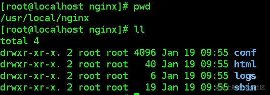

# Nginx详细安装及配置

## 一、简介

Nginx （engine x） 是一个高性能的Web服务器和反向代理服务器，也可以作为邮件代理服务器，使用C语言开发。

Nginx 特点是占有内存少，并发处理能力强，以高性能、低系统资源消耗而闻名，Nginx官方测试为5万并发请求。

日常中的并发量上限4万左右。

### 1. 正向代理

正向代理类似一个跳板机，代理访问外部资源。比如：我是一个用户，我访问不了某网站，但是我能访问一个代理服务器，这个代理服务器，它能访问那个我不能访问的网站，于是我先连上代理服务器，告诉它我需要那个无法访问网站的内容，代理服务器去取回来，然后返回给我。代理客户端去请求服务器，隐藏了真实客户端，服务器并不知道真实的客户端是谁。

### 2. 反向代理

反向代理（Reverse Proxy）方式是指以代理服务器来接受Internet上的连接请求，然后将请求转发给内部网络上的服务器，并将从服务器上得到的结果返回给Internet上请求连接的客户端，此时代理服务器对外就表现为一个反向代理服务器；

反向代理隐藏了真正的服务端，就像你每天使用百度的时候，只知道敲打www.baidu.com就可以打开百度搜索页面，但背后成千上万台百度服务器具体是哪一台为我们服务的，我们并不知道。我们只知道这个代理服务器，它会把我们的请求转发到真实为我们服务的那台服务器那里去。

**综上所述：正向代理代理对象是客户端，反向代理代理对象是服务端。软件层面一般常用Nginx来做反向代理服务器，它的性能非常好，用来做负载均衡。**

## 二、Nginx环境搭建

### 1. 下载

免费开源版的官方网站：[http://nginx.org/en/download.html](http://nginx.org/en/download.html)，可以下载稳定版（Stable version）

Nginx 有 Windows 版本和 Linux 版本，但更推荐在 Linux 下使用 Nginx；
下载nginx-1.14.2.tar.gz的源代码文件：wget http://nginx.org/download/nginx-1.14.2.tar.gz
或者在Windows上下载下来再上传到Linux中

### 2. 安装

#### （1）安装相关库

Nginx的安装需要确定Linux安装相关的几个库，否则配置和编译会出现错误，相关库有：

- gcc编译器
- openssl库
- pcre库
- zlib库

一次性检查并安装，若已安装则跳过，若有更新，则进行更新：

```
yum install gcc openssl openssl-devel pcre pcre-devel zlib zlib-devel -y
```

检查库是否安装成功，下面的命令只能一个一个的检查，或者再运行一遍上面的命令，若没有操作则说明相关库已经存在

```
yum list installed | grep gcc
yum list installed | grep openssl
yum list installed | grep pcre
yum list installed | grep zlib
```

#### （2）安装Nginx

1、解压下载下来的nginx文件（.tar.gz），执行命令：tar -zxvf nginx-1.18.0.tar.gz

2、切换至解压后的nginx主目录，在nginx主目录nginx-1.18.0下执行命令：

```
# 简洁配置，--prefix后的参数是安装路径，要自己修改
./configure \
--prefix=/usr/local/nginx \
--with-http_ssl_module \
--with-http_v2_module \
--with-http_stub_status_module \
--with-http_gzip_static_module

# 详细配置（需要自己下载相应的模块，安装完后也可以添加）
./configure \
--prefix=/user/local/nginx \
--sbin-path=/usr/local/nginx/sbin/nginx \
--conf-path=/usr/local/nginx/conf/nginx.conf \
--error-log-path=/usr/local/nginx/log/error.log \
--http-log-path=/usr/local/nginx/log/access.log \
--pid-path=/usr/local/nginx/log/nginx.pid \
--lock-path=/var/lock/nginx.lock \
--user=nginx \
--group=nginx \
--with-http_ssl_module \
--with-http_stub_status_module \
--with-http_gzip_static_module \
--with-http_v2_module \
--http-client-body-temp-path=/var/tmp/nginx/client/ \
--http-proxy-temp-path=/var/tmp/nginx/proxy/ \
--http-fastcgi-temp-path=/var/tmp/nginx/fcgi/ \
--http-uwsgi-temp-path=/var/tmp/nginx/uwsgi \
# 下面的三个配置，请先下载第三方模块，详见（第二章第7节）
--with-pcre=../pcre-8.44
--with-zlib=../zlib-1.2.11
--with-openssl=../openssl-1.1.1g
```

常用编译选项说明（更多请查看官方文档：[https://docs.nginx.com/nginx/admin-guide/installing-nginx/installing-nginx-open-source/#sources)](https://docs.nginx.com/nginx/admin-guide/installing-nginx/installing-nginx-open-source/#sources))

```
nginx 大部分常用模块，编译时 ./configure --help 查看以 --without 开头的都默认安装。
--prefix=PATH ： 指定nginx的安装目录。默认 /usr/local/nginx
--conf-path=PATH ： 设置 nginx.conf 配置文件的路径。nginx 允许使用不同的配置文件启动，通过命令行中的 -c 选项。默认为prefix/conf/nginx.conf
--user=name： 设置nginx工作进程的用户。安装完成后，可以随时在 nginx.conf 配置文件更改user指令。默认的用户名是 nobody。--group=name 类似
--with-pcre ： 设置PCRE库的源码路径，如果已通过yum方式安装，使用--with-pcre自动找到库文件。使用--with-pcre=PATH时，需要从PCRE网站下载pcre库的源码（最新版本号）并解压，剩下的就交给Nginx的./configure和make来完成。perl正则表达式使用在location指令和 ngx_http_rewrite_module 模块中。
--with-zlib=PATH ： 指定 zlib（最新版本号）的源码解压目录。在默认就启用的网络传输压缩模块 ngx_http_gzip_module 时需要使用zlib 。
--with-openssl：支持HTTPS协议。（最新版本号）
--with-http_ssl_module：使用https协议模块。默认情况下，该模块没有被构建。前提是openssl与openssl-devel已安装
--with-http_stub_status_module：用来监控 Nginx 的当前状态
--with-http_realip_module ： 通过这个模块允许我们改变客户端请求头中客户端IP地址值(例如X-Real-IP 或 X-Forwarded-For)，意义在于能够使得后台服务器记录原始客户端的IP地址
--with-http_v2_module：开启 HTTP/2请求支持
--add-module=PATH ： 添加第三方外部模块，如 nginx-sticky-module-ng 或缓存模块。每次添加新的模块都要重新编译（Tengine可以在新加入module时无需重新编译）
```

3、执行命令进行编译：make

4、执行命令进行安装：make install

安装成功后，可以切换到/usr/local/nginx目录下，查看内容

#### （3）目录简介



- conf：存放配置文件，文件夹中每个配置文件都有两份，以 .default 结尾的是默认配置
- html：存放页面
- logs：存放日志
- sbin：存放可执行文件
- *_temp：Nginx启动后，安装目录下会出现一些_temp结尾的文件，这些是临时文件，不用管。

### 3. 启动

默认启动：

- 切换到nginx安装目录的sbin目录下，执行：./nginx

通过配置文件启动：

- 通过 -c 指定配置文件的位置，而且配置文件路径必须指定绝对路径
- 可以在配置文件后加上 -t 参数，检查配置文件是否存在语法错误

```
./nginx -c /usr/local/nginx/conf/nginx.conf  # 相对路径启动
/usr/local/nginx/sbin/nginx -c /usr/local/nginx/conf/nginx.conf # 绝对路径启动

./nginx -c /usr/local/nginx/conf/nginx.conf -t  # 检查配置文件是否存在语法错误
```

### 4. 查看进程

查看进程：<font color=red>ps -ef | grep nginx</font>


nginx 体系结构由 master 进程和其 worker 进程组成，启动成功后至少有两个进程，少于两个则没有成功

- master 进程为主进程，读取配置文件，并维护和管理 worker 进程，其父进程pid为1
- worker 进程则对请求进行实际处理，worker可以有更多，>=1，父进程pid为master的pid

Nginx的默认端口为80，在浏览器中访问 <font color=red>http://ip地址:80</font> 即可访问到Nginx，（默认端口为80时，在地址栏中可以不指定端口）

### 5. 关闭

#### （1）优雅的关闭

- 找出nginx的进程号：<font color=red>ps -ef | grep nginx</font>
- 执行命令：<font color=red>kill -QUIT 主pid</font>

**注意：**

- 其中pid是主进程号的pid（master process），其他为子进程pid（worker process）
- 这种关闭方式会处理完请求后再关闭，所以称之为优雅的关闭

#### （2）快速关闭

- 找出nginx的进程号：<font color=red>ps -ef | grep nginx</font>
- <font color=red>kill -TERM 主pid</font>

**注意：**

- 其中pid是主进程号的pid（master process），其他为子进程pid（worker process）
- 这种关闭方式不管请求是否处理完成，直接关闭，比较暴力，称之为快速的关闭

#### （3）直接kill

- 找出nginx的进程号：<font color=red>ps -ef | grep nginx</font>
- <font color=red>kill -9 主pid</font>

### 6. 重启

重启使用的较多，当修改配置文件后，便需要重启Nginx，重启时不需要指定配置文件，使用的是最近一次启动时用的配置文件

注意：如果用同一个Nginx使用多个不同的配置文件启动了多个Nginx，则不能使用重启，因为Nginx会不知道重启哪个配置文件

```
./nginx -s reload
```

### 7. 在Nginx中添加第三方模块

以安装 PCRE 为例（这里是对[官方文档](https://docs.nginx.com/nginx/admin-guide/installing-nginx/installing-nginx-open-source/#installing-nginx-dependencies)进行详细描述，要找到对应版本Nginx的模块）：

安装新模块要使用到 <font color=red>Nginx</font> 未编译前的目录，

```
$ wget ftp://ftp.csx.cam.ac.uk/pub/software/programming/pcre/pcre-8.44.tar.gz
$ tar -zxf pcre-8.44.tar.gz
$ cd pcre-8.44
$ ./configure
$ make
$ sudo make install
```

### 8. 其它

Linux上查看nginx版本：/usr/local/nginx/sbin/nginx -V

- <font color=red>-v</font>：显示 nginx 的版本
- <font color=red>-V</font>：显示 nginx 的版本、编译器版本和配置参数

### 9. Windows环境简介

在官方网站下载最新windows版的nginx：[http://nginx.org/en/download.html](http://nginx.org/en/download.html)
将下载下来的nginx压缩包解压到一个目录下，解压后该软件就可以启动使用了
启动方式1：双击解压目录下的 <font color=red>nginx.exe</font> 文件即可运行nginx；
启动方式2：进入dos窗口，切换到nginx主目录下，在dos窗口执行命令：<font color=red>start nginx</font>
关闭方式1：在资源管理器杀掉Nginx进程（有两个进程）
关闭方式2：在dos窗口切换到Nginx安装主目录下执行命令：<font color=red>nginx -s stop</font>

## 三、配置文件介绍

学习Nginx首先需要对它的核心配置文件有一定的认识，这个文件位于Nginx的安装目录 <font color=red>/usr/local/nginx/conf</font> 目录下，名字为 <font color=red>nginx.conf</font>

Nginx的核心配置文件主要由三个部分构成：基本配置，events配置，http配置

### 1. 基本配置

在文件中直接进行配置的是基本配置：

```conf
#配置worker进程运行用户 nobody也是一个linux用户，一般用于启动程序，没有密码
#user  nobody;  
#配置工作进程数目，根据硬件调整，通常等于CPU数量或者2倍于CPU数量
worker_processes  1;  

#配置全局错误日志及类型，[debug | info | notice | warn | error | crit]，默认是error
error_log  logs/error.log;  
#error_log  logs/error.log  notice;
#error_log  logs/error.log  info;

pid  logs/nginx.pid;  #配置进程pid文件 
```

### 2. events配置

events主要用于配置工作模式和连接数，在 events{} 中进行配置

```conf
events {
	# 配置每个worker进程连接数上限，nginx支持的总连接数就等于worker_processes * worker_connections
	# 需要注意的是，worker_connections最大为 65536
    worker_connections  1024;  
}
```

### 3. http配置

```conf
http {
    #配置nginx支持哪些多媒体类型，可以在conf/mime.types查看支持哪些多媒体类型
    include       mime.types;  
    #默认文件类型 流类型，可以理解为支持任意类型
    default_type  application/octet-stream;  
    #配置日志格式 
    #log_format  main  '$remote_addr - $remote_user [$time_local] "$request" '
    #                  '$status $body_bytes_sent "$http_referer" '
    #                  '"$http_user_agent" "$http_x_forwarded_for"';

    #配置access.log日志及存放路径，并使用上面定义的main日志格式，需要与上面的日志格式同时打开
    #access_log  logs/access.log  main;

    sendfile        on;  #开启高效文件传输模式
    #tcp_nopush     on;  #防止网络阻塞，上线时必须开

    #keepalive_timeout  0;
    keepalive_timeout  65;  #长连接超时时间，单位是秒

    #gzip  on;  #开启gzip压缩输出，上线时必须开，开发时不开，防止没有格式
	
	###-----------------------------------------------
	

    #配置虚拟主机
    server {
        listen       80;  #配置监听端口
        server_name  localhost;  #配置服务名，详见3.3.3

        #charset koi8-r;  #配置字符集

        #access_log  logs/host.access.log  main;  #配置本虚拟主机的访问日志

		#默认的匹配斜杠/的请求，当访问路径中有斜杠/，会被该location匹配到并进行处理
        location / {
	    	#root是配置服务器的默认网站根目录位置，默认为nginx安装主目录下的html目录
            root   html;  
	    	#配置首页文件的名称
            index  index.html index.htm;  
        }		

        #error_page  404              /404.html;  #配置404页面
        # redirect server error pages to the static page /50x.html
        #error_page   500 502 503 504  /50x.html;  #配置50x错误页面
        
		#精确匹配
		location = /50x.html {
            root   html;
        }

		#PHP 脚本请求全部转发到Apache处理
        # proxy the PHP scripts to Apache listening on 127.0.0.1:80
        #
        #location ~ \.php$ {
        #    proxy_pass   http://127.0.0.1;
        #}

		#PHP 脚本请求全部转发到FastCGI处理
        # pass the PHP scripts to FastCGI server listening on 127.0.0.1:9000
        #
        #location ~ \.php$ {
        #    root           html;
        #    fastcgi_pass   127.0.0.1:9000;
        #    fastcgi_index  index.php;
        #    fastcgi_param  SCRIPT_FILENAME  /scripts$fastcgi_script_name;
        #    include        fastcgi_params;
        #}

		#禁止访问 .htaccess 文件
        # deny access to .htaccess files, if Apache's document root
        # concurs with nginx's one
        #
        #location ~ /\.ht {
        #    deny  all;
        #}
    }

	
	#配置另一个虚拟主机
    # another virtual host using mix of IP-, name-, and port-based configuration
    #
    #server {
    #    listen       8000;
    #    listen       somename:8080;
    #    server_name  somename  alias  another.alias;

    #    location / {
    #        root   html;
    #        index  index.html index.htm;
    #    }
    #}

	
	#配置https服务，安全的网络传输协议，加密传输，端口443，运维来配置
	#
    # HTTPS server
    #
    #server {
    #    listen       443 ssl;
    #    server_name  localhost;

    #    ssl_certificate      cert.pem;
    #    ssl_certificate_key  cert.key;

    #    ssl_session_cache    shared:SSL:1m;
    #    ssl_session_timeout  5m;

    #    ssl_ciphers  HIGH:!aNULL:!MD5;
    #    ssl_prefer_server_ciphers  on;

    #    location / {
    #        root   html;
    #        index  index.html index.htm;
    #    }
    #}
}
```

#### （1）基本配置

http配置主要是配置http服务器，利用它的反向代理功能提供负载均衡支持，在 <font color=red>http{}</font> 中进行配置

**注意：**

- 上线必需要打开的配置：gzip on(开发时不开)，<font color=red>tcp_nopush on</font>

## 四、负载均衡

### 1. 简介

#### （1）硬件负载均衡

比如 F5、深信服、Array 等

- 优点：有厂商专业的技术服务团队提供支持，性能稳定
- 缺点：费用昂贵，对于规模较小的网络应用成本太高

#### （2）软件负载均衡

比如 Nginx、LVS、HAProxy 等

- 优点：免费开源，成本低廉
- 缺点：性能没有硬件高

所以，实际中，往往会两者结合使用，在关键的位置使用硬件负载均衡，而其余地方使用软件负载均衡

### 2. 负载均衡配置

#### （1）在http模块中加上upstream配置

- upstream：后面的地址随便指定，但是不能有重复
- server：指定Tomcat服务器的地址

```conf
upstream www.myweb.com { 
     	server  127.0.0.1:9100; 
      	server  127.0.0.1:9200;  
}
```

upstream是配置nginx与后端服务器负载均衡非常重要的一个模块，并且它还能对后端的服务器的健康状态进行检查，若后端服务器中的一台发生故障，则前端的请求不会转发到该故障的机器

#### （2）在server模块里添加location，并配置proxy_pass

- proxy_pass：<font color=red>http://</font> 加上 upstream 后面的字符串（固定结构：<font color=red>proxy_pass http://</font> ）

```conf
location /myweb {
	proxy_pass  http://www.myweb.com;
}
```

#### （3）location中添加配置

```conf
location /myweb {
	proxy_pass  http://www.myweb.com;
	proxy_set_header Host $host;  
}
```

参考：[http://www.phpfensi.com/php/20131127/466.html](http://www.phpfensi.com/php/20131127/466.html) 很详细：[https://blog.csdn.net/t8116189520/article/details/80668651](https://blog.csdn.net/t8116189520/article/details/80668651)

### 3. 常用负载均衡策略

实际中，若是服务器配置相同，则可以使用轮询，若配置不同，简单一点可以使用最小连接，也可以经过测试后，使用权重。至于Session丢失问题，这里使用的是通过SpringSession来解决。

#### （1）轮询（默认）

这里的轮询并不是每个请求轮流分配到不同的后端服务器，与ip_hash类似，但是按照访问url的hash结果来分配请求，使得每个url定向到同一个后端服务器，主要应用于后端服务器为缓存时的场景下。如果后端服务器down掉，将自动剔除

```conf
upstream backserver { 
    	server 127.0.0.1:8080; 
    	server 127.0.0.1:9090; 
}
```

#### （2）权重

每个请求按一定比例分发到不同的后端服务器，weight值越大访问的比例越大，访问比率约等于权重之比，权重越大访问机会越多，用于后端服务器性能不均的情况

```conf
upstream backserver { 
    	server 192.168.0.14 weight=5; 
    	server 192.168.0.15 weight=2; 
}
```

#### （3）ip_hash

ip_hash也叫IP绑定，每个请求按访问ip的hash值分配，这样每个访问客户端会固定访问一个后端服务器，可以解决会话Session丢失的问题

```conf
upstream backserver { 
    	ip_hash; 
    	server 127.0.0.1:8080; 
    	server 127.0.0.1:9090; 
}
```

#### （4）最少连接

web请求会被转发到连接数最少的服务器上

```conf
upstream backserver { 
    	least_conn;
    	server 127.0.0.1:8080; 
    	server 127.0.0.1:9090; 
}
```

### 4. 其它配置

backup：其它所有的非backup机器down的时候，才请求backup机器：

```conf
upstream backserver { 
   	server 127.0.0.1:9100;
	#其它所有的非backup机器down的时候，才请求backup机器
   	server 127.0.0.1:9200 backup; 
} 
```

down：down表示当前的server是down状态，不参与负载均衡：

```conf
upstream backserver { 
	server 127.0.0.1:9100;
	#down表示当前的server是down状态，不参与负载均衡
        server 127.0.0.1:9200 down; 
} 
```

## 五、静态代理

把所有静态资源的访问改为访问nginx，而不是访问tomcat，这种方式叫静态代理。因为nginx更擅长于静态资源的处理，性能更好，效率更高。所以在实际应用中，我们将静态资源比如图片、css、html、js等交给nginx处理，而不是由tomcat处理。

### 1. 方式一：配置后缀

当访问静态资源，则从linux服务器/opt/static目录下获取（举例）

```conf
location ~ .*\.(js|css|htm|html|gif|jpg|jpeg|png|bmp|swf|ioc|rar|zip|txt|flv|mid|doc|ppt|pdf|xls|mp3|wma)$ {
    	root /opt/static;
}
```

说明：

- <font color=red>~</font>：表示正则匹配，也就是说后面的内容可以是正则表达式匹配
- 第一个点 '<font color=red size=5>.</font>' 表示任意字符
- <font color=red>*</font>：表示一个或多个字符
- <font color=red>\\<font size=5>.</font></font>： 是转义字符，是后面这个点的转义字符
- <font color=red>|</font>： 表示或者
- <font color=red>$</font>：表示结尾

整个配置表示以 '<font color=red size=5>.</font>'后面括号里面的这些后缀结尾的文件都由nginx处理

注意：放置静态资源的目录，要注意一下目录权限问题，如果权限不足，给目录赋予权限； 否则会出现403错误

### 2. 方式二：配置目录

当访问静态资源，则从linux服务器/opt/static目录下获取（举例）

```conf
location ~ .*/(css|js|img|images) {
	root   /opt/static;
}
```

整个配置表示路径中含有这些括号里面的关键字的请求，都由nginx处理

**注意**：Nginx查找静态资源位置也是根据 <font color=red>ip + port</font> 等于 <font color=red>root</font> 的原则查找图片，假如网页请求的图片地址为 <font color=red>http://192.168.235.128/myweb/image/001.jpg</font> ，不管是方式一还是方式二，请求都会交给nginx服务器进行处理。根据 <font color=red>ip + port</font> 等于 <font color=red>root</font> 的原则，Nginx会找位置为 <font color=red>/opt/static/myweb/image/001.jpg</font> 的图片

## 六、动静分离

Nginx的负载均衡和静态代理结合在一起，我们可以实现动静分离，这是实际应用中常见的一种场景。
动态资源，如jsp由tomcat或其他web服务器完成
静态资源，如图片、css、js等由nginx服务器完成
它们各司其职，专注于做自己擅长的事情
动静分离充分利用了它们各自的优势，从而达到更高效合理的架构


实际中很常见的一种动静分离的架构

## 七、虚拟主机

一个域名只能绑定一台机器，一个 ip，而虚拟主机，就是把一台物理服务器划分成多个“虚拟”的服务器，这样我们的一台物理服务器就可以当做多个服务器来使用，从而可以配置多个网站，绑定多个域名。

Nginx提供虚拟主机的功能，就是为了让我们不需要安装多个Nginx，就可以运行多个域名不同的网站。

Nginx下，一个 <font color=red>server{}</font> 标签就是一个虚拟主机。nginx的虚拟主机就是通过nginx.conf中server节点指定的，想要设置多个虚拟主机，配置多个server节点即可；

### 1. 基于端口的虚拟主机

基于端口的虚拟主机配置，使用端口来区分 浏览器使用 同一个域名+端口 或 同一个ip地址+端口访问；

```conf
# 当访问：nginx-host:8080 -> http://www.baidu.com
server {
		listen 8080;
  		server_name www.myweb.com;
  		location / {
          	  proxy_pass https://www.baidu.com;
  		}
}
# 当访问：nginx-host:9090/ -> http://www.p2p.com
server {
  		listen 9090;
  		server_name www.myweb.com;
  		location / {
                  proxy_pass http://www.p2p.com;
  		}
}
```

### 2. 基于域名的虚拟主机

基于域名的虚拟主机是最常见的一种虚拟主机，通过 <font color=red>http.server.server_name</font> 来匹配域名

```conf
server {
	listen       80;
	server_name  www.myweb.com;
	location /myweb {
		proxy_pass  http://www.myweb.com;
	}
}
server {
	listen       80;
	server_name  www.p2p.com;
	location /myweb {
		proxy_pass  http://www.p2p.com;
	}
}
```

#### http.server.server_name 匹配规则

<font color=red>server_name</font> 指令主要用于配置基于名称的虚拟主机，当访问 nginx 时，根据域名来判断匹配哪个 server，<font color=red>server_name</font> 指令在接到请求后会按如下的匹配顺序进行匹配，如果都匹配不上，则默认执行第一个 <font color=red>server</font>。

1、准确的server_name匹配，例如：

```conf
server {
     listen       80;
     server_name  domain.com  www.domain.com;
     ...
}
```

2、以*通配符开始的字符串：

```conf
server {
     listen       80;
     server_name  *.domain.com;
     ...
}
```

3、以*通配符结束的字符串：

```conf
server {
     listen       80;
     server_name  www.*;
     ...
}
```

4、匹配正则表达式：

```conf
server {
     listen       80;
     server_name  ~^(?.+)\.domain\.com$;
     ...
}
```

### 3. 转发规则

```conf
server {
    listen       8080;
    server_name  localhost;

    location /t1 {
            proxy_pass http://10.211.55.2:10000;
    }
    location /t2 {
            proxy_pass http://10.211.55.2:10000/;
    }
    location /t3 {
            proxy_pass http://10.211.55.2:10000/index;
    }
    location /t4 {
            proxy_pass http://10.211.55.2:10000/index/;
    }
    location /t5/index {
            proxy_pass http://10.211.55.2:10000;
    }
    location /t6/index {
            proxy_pass http://10.211.55.2:10000/;
    }
    location /t7/index {
            proxy_pass http://10.211.55.2:10000/index;
    }
    location /t8/index {
            proxy_pass http://10.211.55.2:10000/index/;
    }
}
```

需要注意的是，在以上的配置中，<font color=red>t1</font> 和 <font color=red>t5</font> 两个配置中的**代理服务器**( <font color=red>proxy_pass</font> )设置是没有指定 <font color=red>URI</font> 的，而剩下的代理服务器设置都指定了 <font color=red>URI</font> 的(分别为 <font color=red>/</font> 和 <font color=red>/index</font> 和 <font color=red>/index/</font>)。

- 如果代理服务器地址中是带有 <font color=red>URI</font> 的，此 <font color=red>URI</font> 会替换掉 <font color=red>location</font> 所匹配的 <font color=red>URI</font> 部分。
- 如果代理服务器地址中是不带有 <font color=red>URI</font> 的，则会用完整的请求 <font color=red>URL</font> 来转发到代理服务器。

上面的配置中，相应的请求地址与转发地址示例如下：

```conf
localhost:8080/t1  -->> http://10.211.55.2:10000/t1
localhost:8080/t1/  -->> http://10.211.55.2:10000/t1/
localhost:8080/t1/index  -->> http://10.211.55.2:10000/t1/index
localhost:8080/t2  -->> http://10.211.55.2:10000/
localhost:8080/t2/  -->> http://10.211.55.2:10000//
localhost:8080/t2/index  -->> http://10.211.55.2:10000//index
localhost:8080/t2index -->> http://10.211.55.2:10000/index
localhost:8080/t3  -->> http://10.211.55.2:10000/index
localhost:8080/t3/  -->> http://10.211.55.2:10000/index/
localhost:8080/t3/index  -->> http://10.211.55.2:10000/index/index
localhost:8080/t4  -->> http://10.211.55.2:10000/index/
localhost:8080/t4/  -->> http://10.211.55.2:10000/index//
localhost:8080/t4/index  -->> http://10.211.55.2:10000/index//index
localhost:8080/t5/index  -->> http://10.211.55.2:10000/t5/index
localhost:8080/t6/index  -->> http://10.211.55.2:10000/
localhost:8080/t7/index  -->> http://10.211.55.2:10000/index
localhost:8080/t8/index  -->> http://10.211.55.2:10000/index/
```

**配置虚拟主机时root的位置**

```conf
server {
    listen       8080;
    server_name  localhost;

    location /health {
        root   html;
        index  index.html index.htm;
    }
}
```

- location 的参数表示匹配的 URI
- location中的 <font color=red>root</font> 参数表示：
  - 若参数前不加 <font color=red>/</font> 则表示 nginx的安装路径，例如：默认指定为html，即表示为nginx安装主目录下的html目录
  - 若参数前加 <font color=red>/</font> 则表示 Linux 中的根路径(<font color=red>/</font>)路径

<font color=red>/</font> 与 <font color=red>root</font> 后的路径是一一对应的：举个例子：比如说的我 Nginx 的ip为192.168.0.1，端口为 80，location 参数指定的值为 /aa（相当于是war包的名字），root 配置参数指定的值为 /opt/web（相当于把war包直接放到里面），若访问路径为 http://192.168.0.1:80/aa/index.html，则Nginx会访问 /opt/web/aa/index.html 静态文件

```conf
# 默认的匹配斜杠/的请求，当访问路径中有斜杠/，会被该location匹配到并进行处理
# 网站为：http://www.ip:80/aa
location /aa {
	# root是配置服务器的默认网站根目录位置，默认为nginx安装主目录下的html目录
	# 磁盘路径为：/opt/web/aa
    root   /opt/web;  
}
```

在windows中模拟DNS服务器解析域名：
需要修改一下本地的hosts文件，文件位置：C:\Windows\System32\drivers\etc\hosts
在hosts文件配置（前面是Linux的IP，后面是你自定义的域名）：
192.168.208.128 www.myweb.com
192.168.208.128 www.p2p.com

## 八、配置文件拆分

### 1. include引入单独的配置文件

可以将多个server{}标签配置在一个 nginx.conf 文件的 http{} 标签中，也可以单独配置在一个文件中，然后通过 <font color=red>include</font> 的方式引入虚拟主机配置

```conf
include /usr/local/nginx/conf/vhost/vhost.conf;
```

将虚拟目录的配置文件加入到”http {}”部分的末尾，与其他server并列；

文件是隔开的，配置更清晰，主文件没有那么多的server

### 2. include 引入文件夹中的所有配置

```conf
http{
	......

	# 在http模块下加入下面的代码，然后在conf.d文件夹下写虚拟主机的配置
	include /ect/nginx/conf.d/*.conf
}
```

<font color=red>conf.d</font> 目录下文件的优先级是按文件名字母序来的，同一个文件里的优先级是从上至下的（即有冲突的内容前面的匹配到后会忽略后面的）

## 九、到目前为止遇到的一些配置

### 1. VUE项目部署到nginx服务器中刷新页面404的问题

在 nginx 配置文件中增加如下配置：

```conf
location / {
    root ...
    index ...
    try_files $uri $uri/ /index.html; ---解决页面刷新404问题
}
```

原理：当访问 <font color=red>uri</font> 没有的时候，尝试访问 <font color=red>index.html</font>，由于 <font color=red>vue</font> 是单页模式，所以入口都是 <font color=red>index.html</font> 无论访问什么连接都由 <font color=red>vue</font> 本身接管

### 2. Nginx中的一些变量

访问后台时，设置一些请求头：

```conf
location /prod-api/{
		proxy_set_header Host $http_host;//host:端口
		proxy_set_header X-Real-IP $remote_addr;//客户端的IP地址
		proxy_set_header REMOTE-HOST $remote_addr;
		proxy_set_header X-Forwarded-For $proxy_add_x_forwarded_for;//HTTP的请求端真实的IP
		proxy_pass http://10.124.128.201:8084/;
}
```

[NGINX conf 配置文件中的变量大全](https://blog.csdn.net/u010418048/article/details/52062306)

### 3. 配置https证书

首先，<font color=red>Nginx</font> 在安装时已经加入了 <font color=red>ssl</font> 模块

```conf
server {
	listen 443 ssl;  # 1.1版本后这样写
	server_name www.domain.com; #填写绑定证书的域名
	ssl_certificate /ssl/ssl.pem;  # 指定证书的位置，绝对路径（.crt文件也行）
	ssl_certificate_key /ssl/ssl.key;  # 密钥绝对路径
	ssl_session_timeout 5m;
	ssl_protocols TLSv1 TLSv1.1 TLSv1.2; #按照这个协议配置
	ssl_ciphers ECDHE-RSA-AES128-GCM-SHA256:HIGH:!aNULL:!MD5:!RC4:!DHE;#按照这个套件配置
	ssl_prefer_server_ciphers on;
	location / {
	    proxy_pass http://10.124.128.201:8084/;
	}
}
```

### 4. http请求重定向到https请求

这种配置存在的问题（暂时不知道怎么解决）：post 请求会丢失请求体（原理，nginx 监听到 8888 端口的http，返回给浏览器 301，然后重定向到指定的 https 地址，对于 POST 请求会转发为 GET 请求，所以会丢失请求体）

```conf
server {
        listen       8888;
        server_name  forward;

        location /access {
	        # rewrite ^(.*)$  转发地址 permanent;
	        # 请求 ngnixHost:8888/access/index -> https://10.124.128.198:8081/dataproducer/index
            rewrite ^(.*)$  https://10.124.128.198:8081/dataproducer permanent;
        }
}
```

### 5. 正向代理配置

nginx 进行正向代理需要使用一个官方模块：[ngx_http_proxy_connect_module](https://github.com/chobits/ngx_http_proxy_connect_module?spm=a2c4e.10696291.0.0.47bd19a4H3i1uN#select-patch)

官方文档：[戳这里](https://github.com/chobits/ngx_http_proxy_connect_module?spm=a2c4e.10696291.0.0.47bd19a4H3i1uN#select-patch) 参考博客：[使用NGINX作为HTTPS正向代理服务器](https://segmentfault.com/a/1190000019563509)

1、下载模块包，这里直接从 [GitHub](https://github.com/chobits/ngx_http_proxy_connect_module?spm=a2c4e.10696291.0.0.47bd19a4H3i1uN#select-patch) 上下载 ZIP 包

2、解压并配置

```conf
> unzip ~/pkg/ngx_http_proxy_connect_module-master.zip

# 下面的命令都在nginx解压后的文件中执行
# 这里要根据nginx的版本，选择相应的.patch文件，请参照官方文档
> patch -p1 < /home/admin/pkg/ngx_http_proxy_connect_module-master/patch/proxy_connect_rewrite_1018.patch
# 指定解压出来的模块包的位置
> ./configure --add-module=/home/admin/pkg/ngx_http_proxy_connect_module-master
> make && make install
```

3、修改 nginx 配置文件

```conf
server {
    listen                         8080;

    # 配置DNS服务器地址
    resolver                       8.8.8.8 114.114.144.114;

    # forward proxy for CONNECT request
    proxy_connect;
    proxy_connect_allow            443 563;
    proxy_connect_connect_timeout  10s;
    proxy_connect_read_timeout     10s;
    proxy_connect_send_timeout     10s;

    # 正向代理的地址
    location / {
        proxy_pass http://$host;
        proxy_set_header Host $host;
    }
}
```

查看DNS服务器：

cat /etc/resolv.conf

```
> cat /etc/resolv.conf
nameserver 202.106.0.20
nameserver 202.106.196.115
```

nslookup www.baidu.com

```
> nslookup www.baidu.com
Server:		202.106.0.20
Address:	202.106.0.20#53
```

测试： 使用 -x 参数指定代理服务器地址，-v 参数打印细节

```
curl https://www.baidu.com -v -x localhost:8080
```

### 6. 安全相关

#### （1）配置Nginx账号登录锁定策略

<font color=red>Nginx</font> 服务建议使用非 <font color=red>root</font> 用户（如nginx，nobody）启动，并且确保启动用户的状态为锁定状态。可执行 <font color=red>passwd -l <Nginx启动用户></font> 如 <font color=red>passwd -l nginx</font> 来锁定Nginx服务的启动用户。命令 <font color=red>passwd -S <用户></font>  如 <font color=red>passwd -S nginx</font> 可查看用户状态。
修改配置文件中的 nginx 启动用户修改为 nginx 或 nobody
如：
<font color=red>user nobody</font>;
如果您是docker用户，可忽略该项（或添加白名单）

用户相关操作：

```
useradd nginx   # 添加用户
passwd nginx	# 修改密码
su nginx 		# 切换用户
passwd -l nginx	# 锁定用户
passwd -u nginx	# 解锁用户
passwd -S nginx	# 查看用户状态
```

#### （2）使非 root 启动的 nginx 也可以监听 1024 以下的端口

非 root 启动的 nginx 是不可以监听 1024 以下的端口的，需要使用如下的命令

```
# sudo setcap cap_net_bind_service=+ep nginx路径
sudo setcap cap_net_bind_service=+ep /usr/local/nginx/sbin/nginx
```

#### （3）隐藏Nginx后端服务指定Header的状态

1、打开 <font color=red>conf/nginx.conf</font> 配置文件； 2、在 <font color=red>http</font> 下配置 <font color=red>proxy_hide_header</font> 项，增加或修改为

```
proxy_hide_header X-Powered-By;
proxy_hide_header Server;
```

#### （4）Nginx后端服务指定的Header隐藏状态隐藏Nginx服务Banner的状态

1、打开 <font color=red>conf/nginx.conf</font> 配置文件； 2、在server栏目下，配置 <font color=red>server_tokens</font> 项 <font color=red>server_tokens off</font>; 如出现多项不支持，执行 <font color=red>ln <conf_path> /etc/nginx/nginx.conf</font>

#### （5）Nginx SSL协议采用TLSv1.2

1、打开conf/nginx.conf配置文件（或主配置文件中的inlude文件）； 2、配置

```
server { 
		...
		ssl_protocols TLSv1.2;
		...
	}
```

备注：配置此项请确认 nginx 支持 OpenSSL，运行 nginx -V 如果返回中包含built with OpenSSL 则表示支持OpenSSL。
如不支持，可能需要增加配置ssl_protocols TLSv1 TLSv1.1 TLSv1.2;