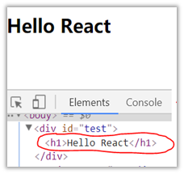
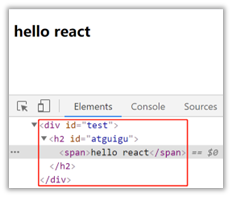
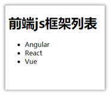
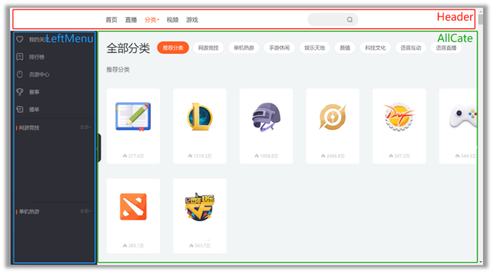

# React入门

## 1.1. React简介

### 1.1.1. 官网

1.	英文官网: [https://reactjs.org/](https://reactjs.org/)
2.	中文官网: [https://react.docschina.org/](https://react.docschina.org/)

### 1.1.2. 介绍描述

1.	用于动态构建用户界面的 JavaScript 库(只关注于视图)
2.	由Facebook开源

### 1.1.3. React的特点

1.	声明式编码
2.	组件化编码
3.	React Native 编写原生应用
4.	高效（优秀的Diffing算法）

### 1.1.4. React高效的原因

1.	使用虚拟(virtual)DOM, 不总是直接操作页面真实DOM。
2.	DOM Diffing算法, 最小化页面重绘。

## 1.2. React的基本使用

### 1.2.1. 效果



```html
<!DOCTYPE html>
<html lang="en">
<head>
	<meta charset="UTF-8">
	<title>hello_react</title>
</head>
<body>
	<!-- 准备好一个“容器” -->
	<div id="test"></div>

	<!-- 引入react核心库 -->
	<script type="text/javascript" src="../js/react.development.js"></script>
	<!-- 引入react-dom，用于支持react操作DOM -->
	<script type="text/javascript" src="../js/react-dom.development.js"></script>
	<!-- 引入babel，用于将jsx转为js -->
	<script type="text/javascript" src="../js/babel.min.js"></script>

	<script type="text/babel" > /* 此处一定要写babel */
		//1.创建虚拟DOM
		const VDOM = <h1>Hello,React</h1> /* 此处一定不要写引号，因为不是字符串 */
		//2.渲染虚拟DOM到页面
		ReactDOM.render(VDOM,document.getElementById('test'))
	</script>
</body>
</html>
```

### 1.2.2. 相关js库

1.	react.js：React核心库(注册全局对象React)。
2.	react-dom.js：提供操作DOM的react扩展库(注册全局对象ReactDom)。
3.	babel.min.js：解析JSX语法代码转为JS代码的库。

### 1.2.3. 创建虚拟DOM的两种方式

1.	纯JS方式(一般不用)

```html
<!DOCTYPE html>
<html lang="en">
<head>
	<meta charset="UTF-8">
	<title>2_使用js创建虚拟DOM</title>
</head>
<body>
	<!-- 准备好一个“容器” -->
	<div id="test"></div>

	<!-- 引入react核心库 -->
	<script type="text/javascript" src="../js/react.development.js"></script>
	<!-- 引入react-dom，用于支持react操作DOM -->
	<script type="text/javascript" src="../js/react-dom.development.js"></script>

	<script type="text/javascript" > 
		//1.创建虚拟DOM
		const VDOM = React.createElement('h1',{id:'title'},React.createElement('span',{},'Hello,React'))
		//2.渲染虚拟DOM到页面
		ReactDOM.render(VDOM,document.getElementById('test'))
	</script>
</body>
</html>
```

2.	JSX方式

```html
<!DOCTYPE html>
<html lang="en">
<head>
	<meta charset="UTF-8">
	<title>1_使用jsx创建虚拟DOM</title>
</head>
<body>
	<!-- 准备好一个“容器” -->
	<div id="test"></div>

	<!-- 引入react核心库 -->
	<script type="text/javascript" src="../js/react.development.js"></script>
	<!-- 引入react-dom，用于支持react操作DOM -->
	<script type="text/javascript" src="../js/react-dom.development.js"></script>
	<!-- 引入babel，用于将jsx转为js -->
	<script type="text/javascript" src="../js/babel.min.js"></script>

	<script type="text/babel" > /* 此处一定要写babel */
		//1.创建虚拟DOM
		const VDOM = (  /* 此处一定不要写引号，因为不是字符串 */
			<h1 id="title">
				<span>Hello,React</span>
			</h1>
		)
		//2.渲染虚拟DOM到页面
		ReactDOM.render(VDOM,document.getElementById('test'))
	</script>
</body>
</html>
```

### 1.2.4. 虚拟DOM与真实DOM

1、React提供了一些API来创建一种 “特别” 的一般js对象
  - const VDOM = React.createElement('xx',{id:'xx'},'xx')
  - 上面创建的就是一个简单的虚拟DOM对象

2、虚拟DOM对象最终都会被React转换为真实的DOM

3、我们编码时基本只需要操作react的虚拟DOM相关数据, react会转换为真实DOM变化而更新界面。

## 1.3. React JSX

### 1.3.1. 效果



### 1.3.2. JSX

1、全称:  JavaScript XML
2、react定义的一种类似于XML的JS扩展语法: JS + XML本质是<font color=red>React.createElement(component, props, ...children)</font>方法的语法糖
3、作用: 用来简化创建虚拟DOM 

  - 1)	写法：<font color=red>var ele = \<h1\>Hello JSX!\</h1\></font>
  - 2)	注意1：它不是字符串, 也不是HTML/XML标签
  - 3)	注意2：它最终产生的就是一个JS对象

4、标签名任意: HTML标签或其它标签
5、标签属性任意: HTML标签属性或其它
6、基本语法规则

  - 1)	遇到 <开头的代码, 以标签的语法解析: html同名标签转换为html同名元素, 其它标签需要特别解析
  - 2)	遇到以 { 开头的代码，以JS语法解析: 标签中的js表达式必须用{ }包含

7、babel.js的作用

  - 1)	浏览器不能直接解析JSX代码, 需要babel转译为纯JS的代码才能运行
  - 2)	只要用了JSX，都要加上type="text/babel", 声明需要babel来处理

```html
<!DOCTYPE html>
<html lang="en">
<head>
	<meta charset="UTF-8">
	<title>jsx语法规则</title>
	<style>
		.title{
			background-color: orange;
			width: 200px;
		}
	</style>
</head>
<body>
	<!-- 准备好一个“容器” -->
	<div id="test"></div>

	<!-- 引入react核心库 -->
	<script type="text/javascript" src="../js/react.development.js"></script>
	<!-- 引入react-dom，用于支持react操作DOM -->
	<script type="text/javascript" src="../js/react-dom.development.js"></script>
	<!-- 引入babel，用于将jsx转为js -->
	<script type="text/javascript" src="../js/babel.min.js"></script>

	<script type="text/babel" >
		const myId = 'aTgUiGu'
		const myData = 'HeLlo,rEaCt'

		//1.创建虚拟DOM
		const VDOM = (
			<div>
				<h2 className="title" id={myId.toLowerCase()}>
					<span style={{color:'white',fontSize:'29px'}}>{myData.toLowerCase()}</span>
				</h2>
				<h2 className="title" id={myId.toUpperCase()}>
					<span style={{color:'white',fontSize:'29px'}}>{myData.toLowerCase()}</span>
				</h2>
				<input type="text"/>
			</div>
		)
		//2.渲染虚拟DOM到页面
		ReactDOM.render(VDOM,document.getElementById('test'))

		/* 
				jsx语法规则：
						1.定义虚拟DOM时，不要写引号。
						2.标签中混入JS表达式时要用{}。
						3.样式的类名指定不要用class，要用className。
						4.内联样式，要用style={{key:value}}的形式去写。
						5.只有一个根标签
						6.标签必须闭合
						7.标签首字母
								(1).若小写字母开头，则将该标签转为html中同名元素，若html中无该标签对应的同名元素，则报错。
								(2).若大写字母开头，react就去渲染对应的组件，若组件没有定义，则报错。

		 */
	</script>
</body>
</html>
```

### 1.3.3. 渲染虚拟DOM(元素)

1、语法:  ReactDOM.render(virtualDOM, containerDOM)
2、作用: 将虚拟DOM元素渲染到页面中的真实容器DOM中显示
3、参数说明
  - 1)	参数一: 纯js或jsx创建的虚拟dom对象
  - 2)	参数二: 用来包含虚拟DOM元素的真实dom元素对象(一般是一个div)

### 1.3.4. JSX练习

需求: 动态展示如下列表



```html
<!DOCTYPE html>
<html lang="en">
<head>
	<meta charset="UTF-8">
	<title>jsx小练习</title>
</head>
<body>
	<!-- 准备好一个“容器” -->
	<div id="test"></div>
	
	<!-- 引入react核心库 -->
	<script type="text/javascript" src="../js/react.development.js"></script>
	<!-- 引入react-dom，用于支持react操作DOM -->
	<script type="text/javascript" src="../js/react-dom.development.js"></script>
	<!-- 引入babel，用于将jsx转为js -->
	<script type="text/javascript" src="../js/babel.min.js"></script>

	<script type="text/babel" >
		/* 
			一定注意区分：【js语句(代码)】与【js表达式】
					1.表达式：一个表达式会产生一个值，可以放在任何一个需要值的地方
								下面这些都是表达式：
										(1). a
										(2). a+b
										(3). demo(1)
										(4). arr.map() 
										(5). function test () {}
					2.语句(代码)：
								下面这些都是语句(代码)：
										(1).if(){}
										(2).for(){}
										(3).switch(){case:xxxx}
		
	 */
		//模拟一些数据
		const data = ['Angular','React','Vue']
		//1.创建虚拟DOM
		const VDOM = (
			<div>
				<h1>前端js框架列表</h1>
				<ul>
					{
						data.map((item,index)=>{
							return <li key={index}>{item}</li>
						})
					}
				</ul>
			</div>
		)
		//2.渲染虚拟DOM到页面
		ReactDOM.render(VDOM,document.getElementById('test'))
	</script>
</body>
</html>
```

## 1.4. 模块与组件、模块化与组件化的理解

### 1.4.1. 模块

1.	理解：向外提供特定功能的js程序, 一般就是一个js文件
2.	为什么要拆成模块：随着业务逻辑增加，代码越来越多且复杂。
3.	作用：复用js, 简化js的编写, 提高js运行效率

## 1.4.2. 组件

1.	理解：用来实现局部功能效果的代码和资源的集合(html/css/js/image等等)
2.	为什么要用组件： 一个界面的功能更复杂
3.	作用：复用编码, 简化项目编码, 提高运行效率

### 1.4.3. 模块化

当应用的js都以模块来编写的, 这个应用就是一个模块化的应用

### 1.4.4. 组件化

当应用是以多组件的方式实现, 这个应用就是一个组件化的应用



