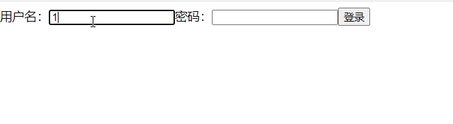
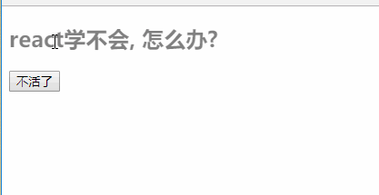

# React面向组件编程

## 2.1. 函数式组件

```html
<!DOCTYPE html>
<html lang="en">
<head>
	<meta charset="UTF-8">
	<title>1_函数式组件</title>
</head>
<body>
	<!-- 准备好一个“容器” -->
	<div id="test"></div>
	
	<!-- 引入react核心库 -->
	<script type="text/javascript" src="../js/react.development.js"></script>
	<!-- 引入react-dom，用于支持react操作DOM -->
	<script type="text/javascript" src="../js/react-dom.development.js"></script>
	<!-- 引入babel，用于将jsx转为js -->
	<script type="text/javascript" src="../js/babel.min.js"></script>

	<script type="text/babel">
		//1.创建函数式组件
		function MyComponent(){
			console.log(this); //此处的this是undefined，因为babel编译后开启了严格模式
			return <h2>我是用函数定义的组件(适用于【简单组件】的定义)</h2>
		}
		//2.渲染组件到页面
		ReactDOM.render(<MyComponent/>,document.getElementById('test'))
		/* 
			执行了ReactDOM.render(<MyComponent/>.......之后，发生了什么？
					1.React解析组件标签，找到了MyComponent组件。
					2.发现组件是使用函数定义的，随后调用该函数，将返回的虚拟DOM转为真实DOM，随后呈现在页面中。
		*/
	</script>
</body>
</html>
```

## 2.2. 类式组件

```html
<!DOCTYPE html>
<html lang="en">
<head>
	<meta charset="UTF-8">
	<title>2_类式组件</title>
</head>
<body>
	<!-- 准备好一个“容器” -->
	<div id="test"></div>
	
	<!-- 引入react核心库 -->
	<script type="text/javascript" src="../js/react.development.js"></script>
	<!-- 引入react-dom，用于支持react操作DOM -->
	<script type="text/javascript" src="../js/react-dom.development.js"></script>
	<!-- 引入babel，用于将jsx转为js -->
	<script type="text/javascript" src="../js/babel.min.js"></script>

	<script type="text/babel">
		//1.创建类式组件
		class MyComponent extends React.Component {
			render(){
				//render是放在哪里的？—— MyComponent的原型对象上，供实例使用。
				//render中的this是谁？—— MyComponent的实例对象 <=> MyComponent组件实例对象。
				console.log('render中的this:',this);
				return <h2>我是用类定义的组件(适用于【复杂组件】的定义)</h2>
			}
		}
		//2.渲染组件到页面
		ReactDOM.render(<MyComponent/>,document.getElementById('test'))
		/* 
			执行了ReactDOM.render(<MyComponent/>.......之后，发生了什么？
					1.React解析组件标签，找到了MyComponent组件。
					2.发现组件是使用类定义的，随后new出来该类的实例，并通过该实例调用到原型上的render方法。
					3.将render返回的虚拟DOM转为真实DOM，随后呈现在页面中。
		*/
	</script>
</body>
</html>
```

### 2.1.3. 注意

1.	组件名必须首字母大写
2.	虚拟DOM元素只能有一个根元素
3.	虚拟DOM元素必须有结束标签

### 2.1.4. 渲染类组件标签的基本流程

1.	React内部会创建组件实例对象
2.	调用render()得到虚拟DOM, 并解析为真实DOM
3.	插入到指定的页面元素内部

## 2.2. 组件三大核心属性1: state

### 2.2.1. 效果

需求: 定义一个展示天气信息的组件
1.	默认展示天气炎热 或 凉爽
2.	点击文字切换天气


### 2.2.2. 理解

1.	state是组件对象最重要的属性, 值是对象(可以包含多个key-value的组合)
2.	组件被称为"状态机", 通过更新组件的state来更新对应的页面显示(重新渲染组件)

### 2.2.3. 强烈注意

1.	组件中render方法中的this为组件实例对象
2.	组件自定义的方法中this为undefined，如何解决？
  a)	强制绑定this: 通过函数对象的bind()
  b)	箭头函数
3.	状态数据，不能直接修改或更新

```html
<!DOCTYPE html>
<html lang="en">
<head>
	<meta charset="UTF-8">
	<title>state</title>
</head>
<body>
	<!-- 准备好一个“容器” -->
	<div id="test"></div>
	
	<!-- 引入react核心库 -->
	<script type="text/javascript" src="../js/react.development.js"></script>
	<!-- 引入react-dom，用于支持react操作DOM -->
	<script type="text/javascript" src="../js/react-dom.development.js"></script>
	<!-- 引入babel，用于将jsx转为js -->
	<script type="text/javascript" src="../js/babel.min.js"></script>

	<script type="text/babel">
		//1.创建组件
		class Weather extends React.Component{
			
			//构造器调用几次？ ———— 1次
			constructor(props){
				console.log('constructor');
				super(props)
				//初始化状态
				this.state = {isHot:false,wind:'微风'}
				//解决changeWeather中this指向问题
				this.changeWeather = this.changeWeather.bind(this)
			}

			//render调用几次？ ———— 1+n次 1是初始化的那次 n是状态更新的次数
			render(){
				console.log('render');
				//读取状态
				const {isHot,wind} = this.state
				return <h1 onClick={this.changeWeather}>今天天气很{isHot ? '炎热' : '凉爽'}，{wind}</h1>
			}

			//changeWeather调用几次？ ———— 点几次调几次
			changeWeather(){
				//changeWeather放在哪里？ ———— Weather的原型对象上，供实例使用
				//由于changeWeather是作为onClick的回调，所以不是通过实例调用的，是直接调用
				//类中的方法默认开启了局部的严格模式，所以changeWeather中的this为undefined
				
				console.log('changeWeather');
				//获取原来的isHot值
				const isHot = this.state.isHot
				//严重注意：状态必须通过setState进行更新,且更新是一种合并，不是替换。
				this.setState({isHot:!isHot})
				console.log(this);

				//严重注意：状态(state)不可直接更改，下面这行就是直接更改！！！
				//this.state.isHot = !isHot //这是错误的写法
			}
		}
		//2.渲染组件到页面
		ReactDOM.render(<Weather/>,document.getElementById('test'))
				
	</script>
</body>
</html>
```

简写方式：

```html
<!DOCTYPE html>
<html lang="en">
<head>
	<meta charset="UTF-8">
	<title>state简写方式</title>
</head>
<body>
	<!-- 准备好一个“容器” -->
	<div id="test"></div>
	
	<!-- 引入react核心库 -->
	<script type="text/javascript" src="../js/react.development.js"></script>
	<!-- 引入react-dom，用于支持react操作DOM -->
	<script type="text/javascript" src="../js/react-dom.development.js"></script>
	<!-- 引入babel，用于将jsx转为js -->
	<script type="text/javascript" src="../js/babel.min.js"></script>

	<script type="text/babel">
		//1.创建组件
		class Weather extends React.Component{
			//初始化状态
			state = {isHot:false,wind:'微风'}

			render(){
				const {isHot,wind} = this.state
				return <h1 onClick={this.changeWeather}>今天天气很{isHot ? '炎热' : '凉爽'}，{wind}</h1>
			}

			//自定义方法————要用赋值语句的形式+箭头函数
			changeWeather = ()=>{
				const isHot = this.state.isHot
				this.setState({isHot:!isHot})
			}
		}
		//2.渲染组件到页面
		ReactDOM.render(<Weather/>,document.getElementById('test'))
				
	</script>
</body>
</html>
```

## 2.3. 组件三大核心属性2: props

### 2.3.1. 效果

需求: 自定义用来显示一个人员信息的组件
1.	姓名必须指定，且为字符串类型；
2.	性别为字符串类型，如果性别没有指定，默认为男
3.	年龄为字符串类型，且为数字类型，默认值为18


### 2.3.2. 理解

1.	每个组件对象都会有props(properties的简写)属性
2.	组件标签的所有属性都保存在props中

### 2.3.3. 作用

1.	通过标签属性从组件外向组件内传递变化的数据
2.	注意: 组件内部不要修改props数据

### 2.3.4. 编码操作

1、内部读取某个属性值


2、对props中的属性值进行类型限制和必要性限制

- 第一种方式（React v15.5 开始已弃用）：


- 第二种方式（新）：使用prop-types库进限制（需要引入prop-types库）


3、扩展属性: 将对象的所有属性通过props传递


4、默认属性值


5、组件类的构造函数


**props基本使用**

```html
<!DOCTYPE html>
<html lang="en">
<head>
	<meta charset="UTF-8">
	<title>props基本使用</title>
</head>
<body>
	<!-- 准备好一个“容器” -->
	<div id="test1"></div>
	<div id="test2"></div>
	<div id="test3"></div>
	
	<!-- 引入react核心库 -->
	<script type="text/javascript" src="../js/react.development.js"></script>
	<!-- 引入react-dom，用于支持react操作DOM -->
	<script type="text/javascript" src="../js/react-dom.development.js"></script>
	<!-- 引入babel，用于将jsx转为js -->
	<script type="text/javascript" src="../js/babel.min.js"></script>

	<script type="text/babel">
		//创建组件
		class Person extends React.Component{
			render(){
				// console.log(this);
				const {name,age,sex} = this.props
				return (
					<ul>
						<li>姓名：{name}</li>
						<li>性别：{sex}</li>
						<li>年龄：{age+1}</li>
					</ul>
				)
			}
		}
		//渲染组件到页面
		ReactDOM.render(<Person name="jerry" age={19}  sex="男"/>,document.getElementById('test1'))
		ReactDOM.render(<Person name="tom" age={18} sex="女"/>,document.getElementById('test2'))

		const p = {name:'老刘',age:18,sex:'女'}
		// console.log('@',...p);
		// ReactDOM.render(<Person name={p.name} age={p.age} sex={p.sex}/>,document.getElementById('test3'))
		ReactDOM.render(<Person {...p}/>,document.getElementById('test3'))
	</script>
</body>
</html>
```

**对props进行限制**

```html
<!DOCTYPE html>
<html lang="en">
<head>
	<meta charset="UTF-8">
	<title>对props进行限制</title>
</head>
<body>
	<!-- 准备好一个“容器” -->
	<div id="test1"></div>
	<div id="test2"></div>
	<div id="test3"></div>
	
	<!-- 引入react核心库 -->
	<script type="text/javascript" src="../js/react.development.js"></script>
	<!-- 引入react-dom，用于支持react操作DOM -->
	<script type="text/javascript" src="../js/react-dom.development.js"></script>
	<!-- 引入babel，用于将jsx转为js -->
	<script type="text/javascript" src="../js/babel.min.js"></script>
	<!-- 引入prop-types，用于对组件标签属性进行限制 -->
	<script type="text/javascript" src="../js/prop-types.js"></script>

	<script type="text/babel">
		//创建组件
		class Person extends React.Component{
			render(){
				// console.log(this);
				const {name,age,sex} = this.props
				//props是只读的
				//this.props.name = 'jack' //此行代码会报错，因为props是只读的
				return (
					<ul>
						<li>姓名：{name}</li>
						<li>性别：{sex}</li>
						<li>年龄：{age+1}</li>
					</ul>
				)
			}
		}
		//对标签属性进行类型、必要性的限制
		Person.propTypes = {
			name:PropTypes.string.isRequired, //限制name必传，且为字符串
			sex:PropTypes.string,//限制sex为字符串
			age:PropTypes.number,//限制age为数值
			speak:PropTypes.func,//限制speak为函数
		}
		//指定默认标签属性值
		Person.defaultProps = {
			sex:'男',//sex默认值为男
			age:18 //age默认值为18
		}
		//渲染组件到页面
		ReactDOM.render(<Person name={100} speak={speak}/>,document.getElementById('test1'))
		ReactDOM.render(<Person name="tom" age={18} sex="女"/>,document.getElementById('test2'))

		const p = {name:'老刘',age:18,sex:'女'}
		// console.log('@',...p);
		// ReactDOM.render(<Person name={p.name} age={p.age} sex={p.sex}/>,document.getElementById('test3'))
		ReactDOM.render(<Person {...p}/>,document.getElementById('test3'))

		function speak(){
			console.log('我说话了');
		}
	</script>
</body>
</html>
```

**props的简写方式**

```html
<!DOCTYPE html>
<html lang="en">
<head>
	<meta charset="UTF-8">
	<title>对props进行限制</title>
</head>
<body>
	<!-- 准备好一个“容器” -->
	<div id="test1"></div>
	<div id="test2"></div>
	<div id="test3"></div>
	
	<!-- 引入react核心库 -->
	<script type="text/javascript" src="../js/react.development.js"></script>
	<!-- 引入react-dom，用于支持react操作DOM -->
	<script type="text/javascript" src="../js/react-dom.development.js"></script>
	<!-- 引入babel，用于将jsx转为js -->
	<script type="text/javascript" src="../js/babel.min.js"></script>
	<!-- 引入prop-types，用于对组件标签属性进行限制 -->
	<script type="text/javascript" src="../js/prop-types.js"></script>

	<script type="text/babel">
		//创建组件
		class Person extends React.Component{

			constructor(props){
				//构造器是否接收props，是否传递给super，取决于：是否希望在构造器中通过this访问props
				// console.log(props);
				super(props)
				console.log('constructor',this.props);
			}

			//对标签属性进行类型、必要性的限制
			static propTypes = {
				name:PropTypes.string.isRequired, //限制name必传，且为字符串
				sex:PropTypes.string,//限制sex为字符串
				age:PropTypes.number,//限制age为数值
			}

			//指定默认标签属性值
			static defaultProps = {
				sex:'男',//sex默认值为男
				age:18 //age默认值为18
			}
			
			render(){
				// console.log(this);
				const {name,age,sex} = this.props
				//props是只读的
				//this.props.name = 'jack' //此行代码会报错，因为props是只读的
				return (
					<ul>
						<li>姓名：{name}</li>
						<li>性别：{sex}</li>
						<li>年龄：{age+1}</li>
					</ul>
				)
			}
		}

		//渲染组件到页面
		ReactDOM.render(<Person name="jerry"/>,document.getElementById('test1'))
	</script>
</body>
</html>
```

**函数组件使用props**

```html
<!DOCTYPE html>
<html lang="en">
<head>
	<meta charset="UTF-8">
	<title>对props进行限制</title>
</head>
<body>
	<!-- 准备好一个“容器” -->
	<div id="test1"></div>
	<div id="test2"></div>
	<div id="test3"></div>
	
	<!-- 引入react核心库 -->
	<script type="text/javascript" src="../js/react.development.js"></script>
	<!-- 引入react-dom，用于支持react操作DOM -->
	<script type="text/javascript" src="../js/react-dom.development.js"></script>
	<!-- 引入babel，用于将jsx转为js -->
	<script type="text/javascript" src="../js/babel.min.js"></script>
	<!-- 引入prop-types，用于对组件标签属性进行限制 -->
	<script type="text/javascript" src="../js/prop-types.js"></script>

	<script type="text/babel">
		//创建组件
		function Person (props){
			const {name,age,sex} = props
			return (
					<ul>
						<li>姓名：{name}</li>
						<li>性别：{sex}</li>
						<li>年龄：{age}</li>
					</ul>
				)
		}
		Person.propTypes = {
			name:PropTypes.string.isRequired, //限制name必传，且为字符串
			sex:PropTypes.string,//限制sex为字符串
			age:PropTypes.number,//限制age为数值
		}

		//指定默认标签属性值
		Person.defaultProps = {
			sex:'男',//sex默认值为男
			age:18 //age默认值为18
		}
		//渲染组件到页面
		ReactDOM.render(<Person name="jerry"/>,document.getElementById('test1'))
	</script>
</body>
</html>
```

## 2.4. 组件三大核心属性3: refs与事件处理

### 2.4.1. 效果

需求: 自定义组件, 功能说明如下:
  1. 点击按钮, 提示第一个输入框中的值
  2. 当第2个输入框失去焦点时, 提示这个输入框中的值


### 2.4.2. 理解

组件内的标签可以定义ref属性来标识自己

### 2.4.3. 编码

1、字符串形式的ref


```html
<!DOCTYPE html>
<html lang="en">
<head>
	<meta charset="UTF-8">
	<title>1_字符串形式的ref</title>
</head>
<body>
	<!-- 准备好一个“容器” -->
	<div id="test"></div>
	
	<!-- 引入react核心库 -->
	<script type="text/javascript" src="../js/react.development.js"></script>
	<!-- 引入react-dom，用于支持react操作DOM -->
	<script type="text/javascript" src="../js/react-dom.development.js"></script>
	<!-- 引入babel，用于将jsx转为js -->
	<script type="text/javascript" src="../js/babel.min.js"></script>

	<script type="text/babel">
		//创建组件
		class Demo extends React.Component{
			//展示左侧输入框的数据
			showData = ()=>{
				const {input1} = this.refs
				alert(input1.value)
			}
			//展示右侧输入框的数据
			showData2 = ()=>{
				const {input2} = this.refs
				alert(input2.value)
			}
			render(){
				return(
					<div>
						<input ref="input1" type="text" placeholder="点击按钮提示数据"/>&nbsp;
						<button onClick={this.showData}>点我提示左侧的数据</button>&nbsp;
						<input ref="input2" onBlur={this.showData2} type="text" placeholder="失去焦点提示数据"/>
					</div>
				)
			}
		}
		//渲染组件到页面
		ReactDOM.render(<Demo a="1" b="2"/>,document.getElementById('test'))
	</script>
</body>
</html>
```

2、回调形式的ref


```html
<!DOCTYPE html>
<html lang="en">
<head>
	<meta charset="UTF-8">
	<title>1_字符串形式的ref</title>
</head>
<body>
	<!-- 准备好一个“容器” -->
	<div id="test"></div>
	
	<!-- 引入react核心库 -->
	<script type="text/javascript" src="../js/react.development.js"></script>
	<!-- 引入react-dom，用于支持react操作DOM -->
	<script type="text/javascript" src="../js/react-dom.development.js"></script>
	<!-- 引入babel，用于将jsx转为js -->
	<script type="text/javascript" src="../js/babel.min.js"></script>

	<script type="text/babel">
		//创建组件
		class Demo extends React.Component{
			//展示左侧输入框的数据
			showData = ()=>{
				const {input1} = this
				alert(input1.value)
			}
			//展示右侧输入框的数据
			showData2 = ()=>{
				const {input2} = this
				alert(input2.value)
			}
			render(){
				return(
					<div>
						<input ref={c => this.input1 = c } type="text" placeholder="点击按钮提示数据"/>&nbsp;
						<button onClick={this.showData}>点我提示左侧的数据</button>&nbsp;
						<input onBlur={this.showData2} ref={c => this.input2 = c } type="text" placeholder="失去焦点提示数据"/>&nbsp;
					</div>
				)
			}
		}
		//渲染组件到页面
		ReactDOM.render(<Demo a="1" b="2"/>,document.getElementById('test'))
	</script>
</body>
</html>
```

回调ref中回调执行次数的问题

```html
<!DOCTYPE html>
<html lang="en">
<head>
	<meta charset="UTF-8">
	<title>3_回调ref中回调执行次数的问题</title>
</head>
<body>
	<!-- 准备好一个“容器” -->
	<div id="test"></div>
	
	<!-- 引入react核心库 -->
	<script type="text/javascript" src="../js/react.development.js"></script>
	<!-- 引入react-dom，用于支持react操作DOM -->
	<script type="text/javascript" src="../js/react-dom.development.js"></script>
	<!-- 引入babel，用于将jsx转为js -->
	<script type="text/javascript" src="../js/babel.min.js"></script>

	<script type="text/babel">
		//创建组件
		class Demo extends React.Component{

			state = {isHot:false}

			showInfo = ()=>{
				const {input1} = this
				alert(input1.value)
			}

			changeWeather = ()=>{
				//获取原来的状态
				const {isHot} = this.state
				//更新状态
				this.setState({isHot:!isHot})
			}

			saveInput = (c)=>{
				this.input1 = c;
				console.log('@',c);
			}

			render(){
				const {isHot} = this.state
				return(
					<div>
						<h2>今天天气很{isHot ? '炎热':'凉爽'}</h2>
						{/*<input ref={(c)=>{this.input1 = c;console.log('@',c);}} type="text"/><br/><br/>*/}
						<input ref={this.saveInput} type="text"/><br/><br/>
						<button onClick={this.showInfo}>点我提示输入的数据</button>
						<button onClick={this.changeWeather}>点我切换天气</button>
					</div>
				)
			}
		}
		//渲染组件到页面
		ReactDOM.render(<Demo/>,document.getElementById('test'))
	</script>
</body>
</html>
```

3、createRef创建ref容器·


```html
<!DOCTYPE html>
<html lang="en">
<head>
	<meta charset="UTF-8">
	<title>4_createRef</title>
</head>
<body>
	<!-- 准备好一个“容器” -->
	<div id="test"></div>
	
	<!-- 引入react核心库 -->
	<script type="text/javascript" src="../js/react.development.js"></script>
	<!-- 引入react-dom，用于支持react操作DOM -->
	<script type="text/javascript" src="../js/react-dom.development.js"></script>
	<!-- 引入babel，用于将jsx转为js -->
	<script type="text/javascript" src="../js/babel.min.js"></script>

	<script type="text/babel">
		//创建组件
		class Demo extends React.Component{
			/* 
				React.createRef调用后可以返回一个容器，该容器可以存储被ref所标识的节点,该容器是“专人专用”的
			 */
			myRef = React.createRef()
			myRef2 = React.createRef()
			//展示左侧输入框的数据
			showData = ()=>{
				alert(this.myRef.current.value);
			}
			//展示右侧输入框的数据
			showData2 = ()=>{
				alert(this.myRef2.current.value);
			}
			render(){
				return(
					<div>
						<input ref={this.myRef} type="text" placeholder="点击按钮提示数据"/>&nbsp;
						<button onClick={this.showData}>点我提示左侧的数据</button>&nbsp;
						<input onBlur={this.showData2} ref={this.myRef2} type="text" placeholder="失去焦点提示数据"/>&nbsp;
					</div>
				)
			}
		}
		//渲染组件到页面
		ReactDOM.render(<Demo a="1" b="2"/>,document.getElementById('test'))
	</script>
</body>
</html>
```

### 2.4.4. 事件处理

1.	通过onXxx属性指定事件处理函数(注意大小写)
	1)	React使用的是自定义(合成)事件, 而不是使用的原生DOM事件
	2)	React中的事件是通过事件委托方式处理的(委托给组件最外层的元素)
2.	通过event.target得到发生事件的DOM元素对象

```html
<!DOCTYPE html>
<html lang="en">
<head>
	<meta charset="UTF-8">
	<title>事件处理</title>
</head>
<body>
	<!-- 准备好一个“容器” -->
	<div id="test"></div>
	
	<!-- 引入react核心库 -->
	<script type="text/javascript" src="../js/react.development.js"></script>
	<!-- 引入react-dom，用于支持react操作DOM -->
	<script type="text/javascript" src="../js/react-dom.development.js"></script>
	<!-- 引入babel，用于将jsx转为js -->
	<script type="text/javascript" src="../js/babel.min.js"></script>

	<script type="text/babel">
		//创建组件
		class Demo extends React.Component{
			/* 
				(1).通过onXxx属性指定事件处理函数(注意大小写)
						a.React使用的是自定义(合成)事件, 而不是使用的原生DOM事件 —————— 为了更好的兼容性
						b.React中的事件是通过事件委托方式处理的(委托给组件最外层的元素) ————————为了的高效
				(2).通过event.target得到发生事件的DOM元素对象 ——————————不要过度使用ref
			 */
			//创建ref容器
			myRef = React.createRef()
			myRef2 = React.createRef()

			//展示左侧输入框的数据
			showData = (event)=>{
				console.log(event.target);
				alert(this.myRef.current.value);
			}

			//展示右侧输入框的数据
			showData2 = (event)=>{
				alert(event.target.value);
			}

			render(){
				return(
					<div>
						<input ref={this.myRef} type="text" placeholder="点击按钮提示数据"/>&nbsp;
						<button onClick={this.showData}>点我提示左侧的数据</button>&nbsp;
						<input onBlur={this.showData2} type="text" placeholder="失去焦点提示数据"/>&nbsp;
					</div>
				)
			}
		}
		//渲染组件到页面
		ReactDOM.render(<Demo a="1" b="2"/>,document.getElementById('test'))
	</script>
</body>
</html>
```

## 2.5. 收集表单数据

### 2.5.1. 效果

需求: 定义一个包含表单的组件
  输入用户名密码后, 点击登录提示输入信息



### 2.5.2. 理解

1、非受控组件（表单类dom获取值时，现用现取）

```html
<!DOCTYPE html>
<html lang="en">
<head>
	<meta charset="UTF-8">
	<title>1_非受控组件</title>
</head>
<body>
	<!-- 准备好一个“容器” -->
	<div id="test"></div>
	
	<!-- 引入react核心库 -->
	<script type="text/javascript" src="../js/react.development.js"></script>
	<!-- 引入react-dom，用于支持react操作DOM -->
	<script type="text/javascript" src="../js/react-dom.development.js"></script>
	<!-- 引入babel，用于将jsx转为js -->
	<script type="text/javascript" src="../js/babel.min.js"></script>

	<script type="text/babel">
		//创建组件
		class Login extends React.Component{
			handleSubmit = (event)=>{
				event.preventDefault() //阻止表单提交
				const {username,password} = this
				alert(`你输入的用户名是：${username.value},你输入的密码是：${password.value}`)
			}
			render(){
				return(
					<form onSubmit={this.handleSubmit}>
						用户名：<input ref={c => this.username = c} type="text" name="username"/>
						密码：<input ref={c => this.password = c} type="password" name="password"/>
						<button>登录</button>
					</form>
				)
			}
		}
		//渲染组件
		ReactDOM.render(<Login/>,document.getElementById('test'))
	</script>
</body>
</html>
```

2、受控组件（表单类dom获取值时把值维护到state中，使用时从state中获取）

```html
<!DOCTYPE html>
<html lang="en">
<head>
	<meta charset="UTF-8">
	<title>2_受控组件</title>
</head>
<body>
	<!-- 准备好一个“容器” -->
	<div id="test"></div>
	
	<!-- 引入react核心库 -->
	<script type="text/javascript" src="../js/react.development.js"></script>
	<!-- 引入react-dom，用于支持react操作DOM -->
	<script type="text/javascript" src="../js/react-dom.development.js"></script>
	<!-- 引入babel，用于将jsx转为js -->
	<script type="text/javascript" src="../js/babel.min.js"></script>

	<script type="text/babel">
		//创建组件
		class Login extends React.Component{

			//初始化状态
			state = {
				username:'', //用户名
				password:'' //密码
			}

			//保存用户名到状态中
			saveUsername = (event)=>{
				this.setState({username:event.target.value})
			}

			//保存密码到状态中
			savePassword = (event)=>{
				this.setState({password:event.target.value})
			}

			//表单提交的回调
			handleSubmit = (event)=>{
				event.preventDefault() //阻止表单提交
				const {username,password} = this.state
				alert(`你输入的用户名是：${username},你输入的密码是：${password}`)
			}

			render(){
				return(
					<form onSubmit={this.handleSubmit}>
						用户名：<input onChange={this.saveUsername} type="text" name="username"/>
						密码：<input onChange={this.savePassword} type="password" name="password"/>
						<button>登录</button>
					</form>
				)
			}
		}
		//渲染组件
		ReactDOM.render(<Login/>,document.getElementById('test'))
	</script>
</body>
</html>
```

## 2.6. 组件的生命周期

### 2.6.1. 效果

需求:定义组件实现以下功能：
  1. 让指定的文本做显示 / 隐藏的渐变动画
  2. 从完全可见，到彻底消失，耗时2S
  3. 点击“不活了”按钮从界面中卸载组件



### 2.6.2. 理解

1.	组件从创建到死亡它会经历一些特定的阶段。
2.	React组件中包含一系列勾子函数(生命周期回调函数), 会在特定的时刻调用。
3.	我们在定义组件时，会在特定的生命周期回调函数中，做特定的工作。

```html
<!DOCTYPE html>
<html lang="en">
<head>
	<meta charset="UTF-8">
	<title>1_引出生命周期</title>
</head>
<body>
	<!-- 准备好一个“容器” -->
	<div id="test"></div>
	
	<!-- 引入react核心库 -->
	<script type="text/javascript" src="../js/react.development.js"></script>
	<!-- 引入react-dom，用于支持react操作DOM -->
	<script type="text/javascript" src="../js/react-dom.development.js"></script>
	<!-- 引入babel，用于将jsx转为js -->
	<script type="text/javascript" src="../js/babel.min.js"></script>

	<script type="text/babel">
		//创建组件
		//生命周期回调函数 <=> 生命周期钩子函数 <=> 生命周期函数 <=> 生命周期钩子
		class Life extends React.Component{

			state = {opacity:1}

			death = ()=>{
				//卸载组件
				ReactDOM.unmountComponentAtNode(document.getElementById('test'))
			}

			//组件挂完毕
			componentDidMount(){
				console.log('componentDidMount');
				this.timer = setInterval(() => {
					//获取原状态
					let {opacity} = this.state
					//减小0.1
					opacity -= 0.1
					if(opacity <= 0) opacity = 1
					//设置新的透明度
					this.setState({opacity})
				}, 200);
			}

			//组件将要卸载
			componentWillUnmount(){
				//清除定时器
				clearInterval(this.timer)
			}

			//初始化渲染、状态更新之后
			render(){
				console.log('render');
				return(
					<div>
						<h2 style={{opacity:this.state.opacity}}>React学不会怎么办？</h2>
						<button onClick={this.death}>不活了</button>
					</div>
				)
			}
		}
		//渲染组件
		ReactDOM.render(<Life/>,document.getElementById('test'))
	</script>
</body>
</html>
```

### 2.6.3. 生命周期流程图(旧)


生命周期的三个阶段（旧）

1. 初始化阶段: 由ReactDOM.render()触发---初次渲染
	1.	constructor()
	2.	componentWillMount()
	3.	render()
	4.	componentDidMount()
2. 更新阶段: 由组件内部this.setSate()或父组件重新render触发
	1.	shouldComponentUpdate()
	2.	componentWillUpdate()
	3.	render()
	4.	componentDidUpdate()
3. 卸载组件: 由ReactDOM.unmountComponentAtNode()触发
	1.	componentWillUnmount()

```html
<!DOCTYPE html>
<html lang="en">
<head>
	<meta charset="UTF-8">
	<title>2_react生命周期(旧)</title>
</head>
<body>
	<!-- 准备好一个“容器” -->
	<div id="test"></div>
	
	<!-- 引入react核心库 -->
	<script type="text/javascript" src="../js/react.development.js"></script>
	<!-- 引入react-dom，用于支持react操作DOM -->
	<script type="text/javascript" src="../js/react-dom.development.js"></script>
	<!-- 引入babel，用于将jsx转为js -->
	<script type="text/javascript" src="../js/babel.min.js"></script>

	<script type="text/babel">
		/* 
				1. 初始化阶段: 由ReactDOM.render()触发---初次渲染
									1.	constructor()
									2.	componentWillMount()
									3.	render()
									4.	componentDidMount() =====> 常用
													一般在这个钩子中做一些初始化的事，例如：开启定时器、发送网络请求、订阅消息
				2. 更新阶段: 由组件内部this.setSate()或父组件render触发
									1.	shouldComponentUpdate()
									2.	componentWillUpdate()
									3.	render() =====> 必须使用的一个
									4.	componentDidUpdate()
				3. 卸载组件: 由ReactDOM.unmountComponentAtNode()触发
									1.	componentWillUnmount()  =====> 常用
													一般在这个钩子中做一些收尾的事，例如：关闭定时器、取消订阅消息
		*/
		//创建组件
		class Count extends React.Component{

			//构造器
			constructor(props){
				console.log('Count---constructor');
				super(props)
				//初始化状态
				this.state = {count:0}
			}

			//加1按钮的回调
			add = ()=>{
				//获取原状态
				const {count} = this.state
				//更新状态
				this.setState({count:count+1})
			}

			//卸载组件按钮的回调
			death = ()=>{
				ReactDOM.unmountComponentAtNode(document.getElementById('test'))
			}

			//强制更新按钮的回调
			force = ()=>{
				this.forceUpdate()
			}

			//组件将要挂载的钩子
			componentWillMount(){
				console.log('Count---componentWillMount');
			}

			//组件挂载完毕的钩子
			componentDidMount(){
				console.log('Count---componentDidMount');
			}

			//组件将要卸载的钩子
			componentWillUnmount(){
				console.log('Count---componentWillUnmount');
			}

			//控制组件更新的“阀门”
			shouldComponentUpdate(){
				console.log('Count---shouldComponentUpdate');
				return true
			}

			//组件将要更新的钩子
			componentWillUpdate(){
				console.log('Count---componentWillUpdate');
			}

			//组件更新完毕的钩子
			componentDidUpdate(){
				console.log('Count---componentDidUpdate');
			}

			render(){
				console.log('Count---render');
				const {count} = this.state
				return(
					<div>
						<h2>当前求和为：{count}</h2>
						<button onClick={this.add}>点我+1</button>
						<button onClick={this.death}>卸载组件</button>
						<button onClick={this.force}>不更改任何状态中的数据，强制更新一下</button>
					</div>
				)
			}
		}
		
		//父组件A
		class A extends React.Component{
			//初始化状态
			state = {carName:'奔驰'}

			changeCar = ()=>{
				this.setState({carName:'奥拓'})
			}

			render(){
				return(
					<div>
						<div>我是A组件</div>
						<button onClick={this.changeCar}>换车</button>
						<B carName={this.state.carName}/>
					</div>
				)
			}
		}
		
		//子组件B
		class B extends React.Component{
			//组件将要接收新的props的钩子
			componentWillReceiveProps(props){
				console.log('B---componentWillReceiveProps',props);
			}

			//控制组件更新的“阀门”
			shouldComponentUpdate(){
				console.log('B---shouldComponentUpdate');
				return true
			}
			//组件将要更新的钩子
			componentWillUpdate(){
				console.log('B---componentWillUpdate');
			}

			//组件更新完毕的钩子
			componentDidUpdate(){
				console.log('B---componentDidUpdate');
			}

			render(){
				console.log('B---render');
				return(
					<div>我是B组件，接收到的车是:{this.props.carName}</div>
				)
			}
		}
		
		//渲染组件
		ReactDOM.render(<Count/>,document.getElementById('test'))
	</script>
</body>
</html>
```

### 2.6.4. 生命周期流程图(新)


生命周期的三个阶段（新）

1. 初始化阶段: 由ReactDOM.render()触发---初次渲染
	1.	constructor()
	2.	getDerivedStateFromProps 
	3.	render()
	4.	componentDidMount()
2. 更新阶段: 由组件内部this.setSate()或父组件重新render触发
	1.	getDerivedStateFromProps
	2.	shouldComponentUpdate()
	3.	render()
	4.	getSnapshotBeforeUpdate
	5.	componentDidUpdate()
3. 卸载组件: 由ReactDOM.unmountComponentAtNode()触发
	1.	componentWillUnmount()

```html
<!DOCTYPE html>
<html lang="en">
<head>
	<meta charset="UTF-8">
	<title>3_react生命周期(新)</title>
</head>
<body>
	<!-- 准备好一个“容器” -->
	<div id="test"></div>
	
	<!-- 引入react核心库 -->
	<script type="text/javascript" src="../js/17.0.1/react.development.js"></script>
	<!-- 引入react-dom，用于支持react操作DOM -->
	<script type="text/javascript" src="../js/17.0.1/react-dom.development.js"></script>
	<!-- 引入babel，用于将jsx转为js -->
	<script type="text/javascript" src="../js/17.0.1/babel.min.js"></script>

	<script type="text/babel">
		//创建组件
		class Count extends React.Component{
			/* 
				1. 初始化阶段: 由ReactDOM.render()触发---初次渲染
								1.	constructor()
								2.	getDerivedStateFromProps 
								3.	render()
								4.	componentDidMount() =====> 常用
											一般在这个钩子中做一些初始化的事，例如：开启定时器、发送网络请求、订阅消息
				2. 更新阶段: 由组件内部this.setSate()或父组件重新render触发
								1.	getDerivedStateFromProps
								2.	shouldComponentUpdate()
								3.	render()
								4.	getSnapshotBeforeUpdate
								5.	componentDidUpdate()
				3. 卸载组件: 由ReactDOM.unmountComponentAtNode()触发
								1.	componentWillUnmount()  =====> 常用
											一般在这个钩子中做一些收尾的事，例如：关闭定时器、取消订阅消息
			*/
			//构造器
			constructor(props){
				console.log('Count---constructor');
				super(props)
				//初始化状态
				this.state = {count:0}
			}

			//加1按钮的回调
			add = ()=>{
				//获取原状态
				const {count} = this.state
				//更新状态
				this.setState({count:count+1})
			}

			//卸载组件按钮的回调
			death = ()=>{
				ReactDOM.unmountComponentAtNode(document.getElementById('test'))
			}

			//强制更新按钮的回调
			force = ()=>{
				this.forceUpdate()
			}
			
			//若state的值在任何时候都取决于props，那么可以使用getDerivedStateFromProps
			static getDerivedStateFromProps(props,state){
				console.log('getDerivedStateFromProps',props,state);
				return null
			}

			//在更新之前获取快照
			getSnapshotBeforeUpdate(){
				console.log('getSnapshotBeforeUpdate');
				return 'atguigu'
			}

			//组件挂载完毕的钩子
			componentDidMount(){
				console.log('Count---componentDidMount');
			}

			//组件将要卸载的钩子
			componentWillUnmount(){
				console.log('Count---componentWillUnmount');
			}

			//控制组件更新的“阀门”
			shouldComponentUpdate(){
				console.log('Count---shouldComponentUpdate');
				return true
			}

			//组件更新完毕的钩子
			componentDidUpdate(preProps,preState,snapshotValue){
				console.log('Count---componentDidUpdate',preProps,preState,snapshotValue);
			}
			
			render(){
				console.log('Count---render');
				const {count} = this.state
				return(
					<div>
						<h2>当前求和为：{count}</h2>
						<button onClick={this.add}>点我+1</button>
						<button onClick={this.death}>卸载组件</button>
						<button onClick={this.force}>不更改任何状态中的数据，强制更新一下</button>
					</div>
				)
			}
		}
		
		//渲染组件
		ReactDOM.render(<Count count={199}/>,document.getElementById('test'))
	</script>
</body>
</html>
```

### 2.6.5. 重要的勾子

1.	render：初始化渲染或更新渲染调用
2.	componentDidMount：开启监听, 发送ajax请求
3.	componentWillUnmount：做一些收尾工作, 如: 清理定时器

### 2.6.6. 即将废弃的勾子

1.	componentWillMount
2.	componentWillReceiveProps
3.	componentWillUpdate

现在使用会出现警告，下一个大版本需要加上UNSAFE_前缀才能使用，以后可能会被彻底废弃，不建议使用。

## 2.7. 虚拟DOM与DOM Diffing算法

### 2.7.1. 效果

需求：验证虚拟DOM Diffing算法的存在


### 2.7.2. 基本原理图


**验证Diffing算法**

```html
<!DOCTYPE html>
<html>
<head>
  <meta charset="UTF-8">
  <title>验证diff算法</title>
</head>
<body>
	<!-- 准备好一个“容器” -->
	<div id="test"></div>
	
	<!-- 引入react核心库 -->
	<script type="text/javascript" src="../js/17.0.1/react.development.js"></script>
	<!-- 引入react-dom，用于支持react操作DOM -->
	<script type="text/javascript" src="../js/17.0.1/react-dom.development.js"></script>
	<!-- 引入babel，用于将jsx转为js -->
	<script type="text/javascript" src="../js/17.0.1/babel.min.js"></script>

	<script type="text/babel">
		class Time extends React.Component {
			state = {date: new Date()}

			componentDidMount () {
				setInterval(() => {
					this.setState({
						date: new Date()
					})
				}, 1000)
			}

			render () {
				return (
					<div>
						<h1>hello</h1>
						<input type="text"/>
						<span>
							现在是：{this.state.date.toTimeString()}
							<input type="text"/>
						</span>
					</div>
				)
			}
		}

		ReactDOM.render(<Time/>,document.getElementById('test'))
</script>
</body>
</html>
```

**key的作用**

```html
<!DOCTYPE html>
<html>
<head>
  <meta charset="UTF-8">
  <title>key的作用</title>
</head>
<body>
<div id="test"></div>
<!-- 引入react核心库 -->
<script type="text/javascript" src="../js/react.development.js"></script>
<!-- 引入react-dom -->
<script type="text/javascript" src="../js/react-dom.development.js"></script>
<!-- 引入babel -->
<script type="text/javascript" src="../js/babel.min.js"></script>

<script type="text/babel">
	/*
   经典面试题:
      1). react/vue中的key有什么作用？（key的内部原理是什么？）
      2). 为什么遍历列表时，key最好不要用index?
      
			1. 虚拟DOM中key的作用：
					1). 简单的说: key是虚拟DOM对象的标识, 在更新显示时key起着极其重要的作用。

					2). 详细的说: 当状态中的数据发生变化时，react会根据【新数据】生成【新的虚拟DOM】, 
												随后React进行【新虚拟DOM】与【旧虚拟DOM】的diff比较，比较规则如下：

									a. 旧虚拟DOM中找到了与新虚拟DOM相同的key：
												(1).若虚拟DOM中内容没变, 直接使用之前的真实DOM
												(2).若虚拟DOM中内容变了, 则生成新的真实DOM，随后替换掉页面中之前的真实DOM

									b. 旧虚拟DOM中未找到与新虚拟DOM相同的key
												根据数据创建新的真实DOM，随后渲染到到页面
									
			2. 用index作为key可能会引发的问题：
								1. 若对数据进行：逆序添加、逆序删除等破坏顺序操作:
												会产生没有必要的真实DOM更新 ==> 界面效果没问题, 但效率低。

								2. 如果结构中还包含输入类的DOM：
												会产生错误DOM更新 ==> 界面有问题。
												
								3. 注意！如果不存在对数据的逆序添加、逆序删除等破坏顺序操作，
									仅用于渲染列表用于展示，使用index作为key是没有问题的。
					
			3. 开发中如何选择key?:
								1.最好使用每条数据的唯一标识作为key, 比如id、手机号、身份证号、学号等唯一值。
								2.如果确定只是简单的展示数据，用index也是可以的。
   */
	
	/* 
		慢动作回放----使用index索引值作为key

			初始数据：
					{id:1,name:'小张',age:18},
					{id:2,name:'小李',age:19},
			初始的虚拟DOM：
					<li key=0>小张---18<input type="text"/></li>
					<li key=1>小李---19<input type="text"/></li>

			更新后的数据：
					{id:3,name:'小王',age:20},
					{id:1,name:'小张',age:18},
					{id:2,name:'小李',age:19},
			更新数据后的虚拟DOM：
					<li key=0>小王---20<input type="text"/></li>
					<li key=1>小张---18<input type="text"/></li>
					<li key=2>小李---19<input type="text"/></li>

	-----------------------------------------------------------------

	慢动作回放----使用id唯一标识作为key

			初始数据：
					{id:1,name:'小张',age:18},
					{id:2,name:'小李',age:19},
			初始的虚拟DOM：
					<li key=1>小张---18<input type="text"/></li>
					<li key=2>小李---19<input type="text"/></li>

			更新后的数据：
					{id:3,name:'小王',age:20},
					{id:1,name:'小张',age:18},
					{id:2,name:'小李',age:19},
			更新数据后的虚拟DOM：
					<li key=3>小王---20<input type="text"/></li>
					<li key=1>小张---18<input type="text"/></li>
					<li key=2>小李---19<input type="text"/></li>


	 */
	class Person extends React.Component{

		state = {
			persons:[
				{id:1,name:'小张',age:18},
				{id:2,name:'小李',age:19},
			]
		}

		add = ()=>{
			const {persons} = this.state
			const p = {id:persons.length+1,name:'小王',age:20}
			this.setState({persons:[p,...persons]})
		}

		render(){
			return (
				<div>
					<h2>展示人员信息</h2>
					<button onClick={this.add}>添加一个小王</button>
					<h3>使用index（索引值）作为key</h3>
					<ul>
						{
							this.state.persons.map((personObj,index)=>{
								return <li key={index}>{personObj.name}---{personObj.age}<input type="text"/></li>
							})
						}
					</ul>
					<hr/>
					<hr/>
					<h3>使用id（数据的唯一标识）作为key</h3>
					<ul>
						{
							this.state.persons.map((personObj)=>{
								return <li key={personObj.id}>{personObj.name}---{personObj.age}<input type="text"/></li>
							})
						}
					</ul>
				</div>
			)
		}
	}

	ReactDOM.render(<Person/>,document.getElementById('test'))
</script>
</body>
</html>
```


