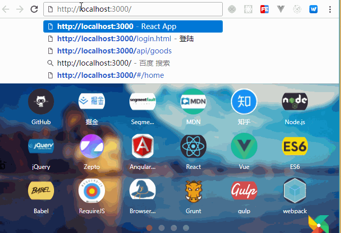
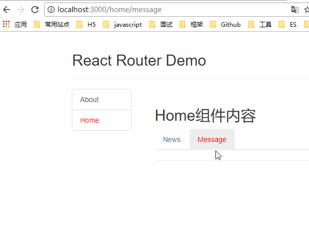
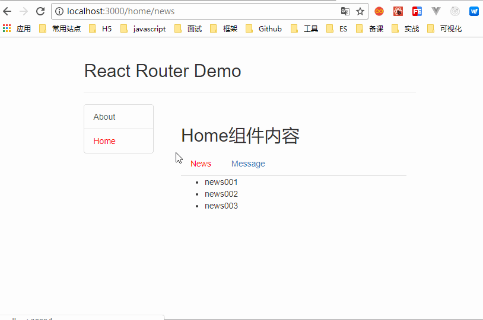

# React路由

## 5.1. 相关理解

### 5.1.1. SPA的理解

1.	单页Web应用（single page web application，SPA）。
2.	整个应用只有一个完整的页面。
3.	点击页面中的链接不会刷新页面，只会做页面的局部更新。
4.	数据都需要通过ajax请求获取, 并在前端异步展现

### 5.1.2. 路由的理解

**1、什么是路由?**

1.	一个路由就是一个映射关系(key:value)
2.	key为路径, value可能是function或component

**2、路由分类**

1、后端路由：

- 理解： value是function, 用来处理客户端提交的请求。
- 注册路由： router.get(path, function(req, res))
- 工作过程：当node接收到一个请求时, 根据请求路径找到匹配的路由, 调用路由中的函数来处理请求, 返回响应数据

2、前端路由：

- 浏览器端路由，value是component，用于展示页面内容。
- 注册路由: <Route path="/test" component={Test}>
- 工作过程：当浏览器的path变为/test时, 当前路由组件就会变为Test组件

### 5.1.3. react-router-dom的理解

1.	react的一个插件库。
2.	专门用来实现一个SPA应用。
3.	基于react的项目基本都会用到此库。

## 5.2. react-router-dom相关API

### 5.2.1. 内置组件

1.	\<BrowserRouter\>
2.	\<HashRouter\>
3.	\<Route\>
4.	\<Redirect\>
5.	\<Link\>
6.	\<NavLink\>
7.	\<Switch\>

### 5.2.2. 其它

1.	history对象
2.	match对象
3.	withRouter函数

## 5.3. 基本路由使用

### 5.3.1. 效果


### 5.3.2. 准备

1.	下载react-router-dom: npm install --save react-router-dom
2.	引入bootstrap.css: \<link rel="stylesheet" href="/css/bootstrap.css"\>

```js
// code/react/react_staging/08_src_路由的基本使用
// code/react/react_staging/09_src_NavLink的使用
// code/react/react_staging/10_src_封装NavLink
// code/react/react_staging/11_src_Switch的使用
// code/react/react_staging/12_src_解决样式丢失问题
// code/react/react_staging/13_src_精准匹配与模糊匹配
// code/react/react_staging/14_src_Redirect的使用
```

## 5.4. 嵌套路由使用

### 5.4.1 效果



```js
// code/react/react_staging/15_src_嵌套路由的使用
```

## 5.5. 向路由组件传递参数数据

### 5.5.1 效果



```js
// code/react/react_staging/16_src_向路由组件传递params参数
// code/react/react_staging/17_src_向路由组件传递search参数
// code/react/react_staging/18_src_向路由组件传递state参数
```

## 5.6. 多种路由跳转方式

### 5.6.1 效果



```js
// code/react/react_staging/20_src_编程式路由导航
// code/react/react_staging/21_src_withRouter的使用
```

