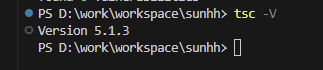
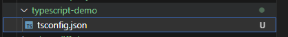
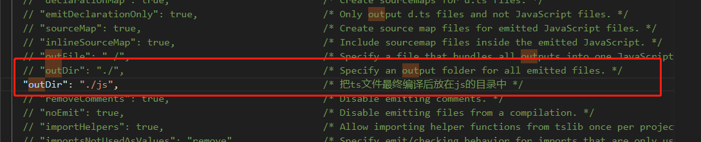
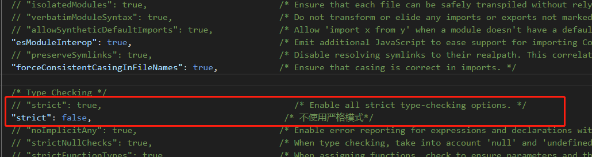
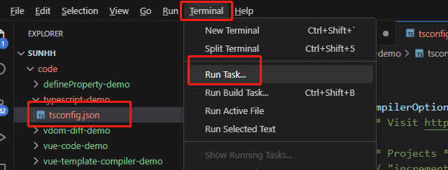
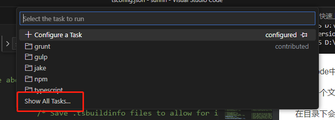
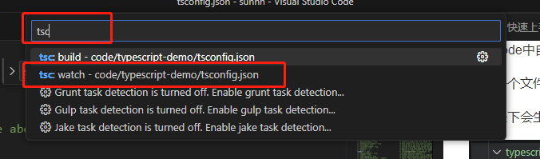
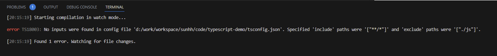
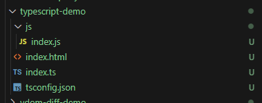
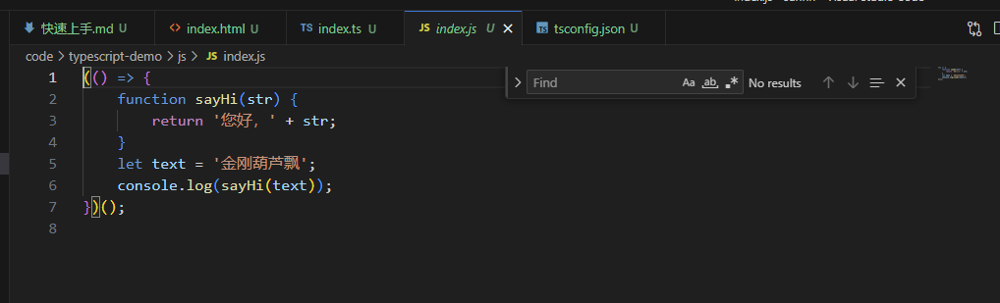

# 环境搭建-VScode中自动编译ts文件

命令行运行如下命令，全局安装 TypeScript：

```
npm install -g typescript
```

安装完成后，在控制台运行如下命令，检查安装是否成功：

```
tsc -V 
```



在vscode中自动编译ts

新建一个文件typescript-demo，在typescript-demo目录下执行命令 tsc --init

在目录下会生成tsconfig.json配置文件



修改配置文件内容如下：





启动监视任务








运行结果有报错如下：



忽略，不影响代码执行

typescript-demo目录下新建index.html、index.ts

index.html

```
<!DOCTYPE html>
<html lang="zh">
  <head>
    <meta charset="utf-8" >
    <mate name="viewport" content="width=device-width,initial-scale=1.0">
    <mate http-equiv="X-UA-Compatible" content="ie=edge">
    <title>金刚葫芦飘</title>
  </head>
  <body>
    
    <script src="./js/index.js"></script>
  </body>
</html>
```

index.ts

```
(() => {
  function sayHi(str: string) {
    return '您好，' + str
  }
  let text = '金刚葫芦飘'
  console.log(sayHi(text))
})()
```

目录结构如下：



自动生成index.js 如下



至此环境搭建完成

