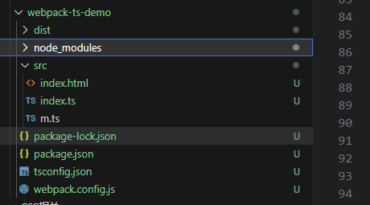

# 环境搭建-webpack打包ts代码

## 环境搭建

创建一个目录 webpack-ts-demo

目录下执行 
- npm init -y

- npm install -D webpack@4.41.2 webpack-cli@3.3.9 typescript@4.1.2 ts-loader@8.0.11 html-webpack-plugin@4.5.0 clean-webpack-plugin@3.0.0 webpack-dev-server@3.1.4 @babel/core@7.12.9 @babel/preset-env@7.12.7 babel-loader@8.2.2 core-js@3.8.0

**webpack.config.js**

```
const path = require('path');
const HtmlWebpackPlugin = require('html-webpack-plugin');

module.exports = {
  // 指定入口文件
  entry: "./src/index.ts",
  // 指定打包文件所在目录
  output: {
    // 指定打包文件的目录
    path: path.resolve(__dirname, 'dist'),
    // 打包后文件的文件名
    filename: "bundle.js",
  },
  // 指定打包webpack打包时要使用的模块
  module: {
    // 指定要加载的规则
    rules: [
      {
        // test指定规则生效的文件
        test: /\.ts$/,
        // 要使用的loader(从后向前执行)
        use: [
          // 配置babel
          {
            // 指定加载器
            loader: 'babel-loader',
            // 设置babel
            options: {
              // 设置预定义的环境
              presets: [
                [
                  // 指定环境插件
                  "@babel/preset-env",
                  {
                    // 要兼容的目标浏览器
                    targets: {
                      "chrome": "58", // chrome浏览器要兼容刀88版本
                      "ie": "11"
                    },
                    // 指定corejs的版本
                    "corejs": "3",
                    // 使用corejs的方式 "usage" 表示按需加载
                    "useBuiltIns": "usage" 
                  }
                ]
              ]
            }
          },
          'ts-loader'
        ],
        // 要排除的文件
        exclude: /node_modules/
      }
    ]
  },
  // 配置webpack插件
  plugins: [
    new HtmlWebpackPlugin({
      template: "./src/index.html"
    }),
  ],
  // 用来设置引用模块
  resolve: {
    extensions: ['.ts', '.js']
  }
}
```

**tsconfig.js**

```
{
  "compilerOptions": {
    "module": "ES2015", // 指定要使用的模块化规范
    "target": "ES2015", // 用来指定ts被编译为的ES版本
    "strict": false, // 所有严格检查的总开关
    "types" : []
  }
}
```

设置types因为执行 build 时，会自动查找node_modules下的@types，会报错。参考[链接](https://juejin.cn/post/6844903892094812173)

**package.json**

```
{
  "name": "webpack-ts-demo",
  "version": "1.0.0",
  "description": "",
  "main": "index.js",
  "scripts": {
    "test": "echo \"Error: no test specified\" && exit 1",
    "build": "webpack",
    "start": "webpack-dev-server"
  },
  "keywords": [],
  "author": "",
  "license": "ISC",
  "devDependencies": {
    "html-webpack-plugin": "^4.5.0",
    "ts-loader": "^8.0.11",
    "typescript": "^4.1.2",
    "webpack": "^4.41.2",
    "webpack-cli": "^3.3.9",
    "webpack-dev-server": "^3.1.4"
  }
}
```




