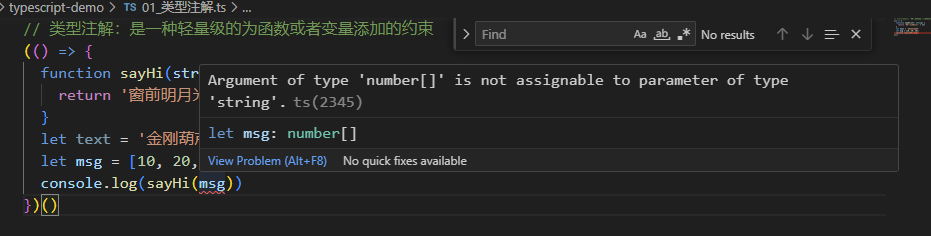
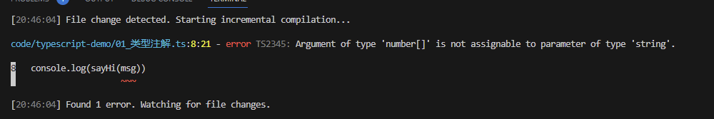

# TS的类型

先来看段代码

```ts
// 类型注解：是一种轻量级的为函数或者变量添加的约束
(() => {
  function sayHi(str: string) {
    return '窗前明月光，' + str
  }
  let text = '金刚葫芦飘'
  console.log(sayHi(text))
})()
```

修改代码如下：

```ts
// 类型注解：是一种轻量级的为函数或者变量添加的约束
(() => {
  function sayHi(str: string) {
    return '窗前明月光，' + str
  }
  let text = '金刚葫芦飘'
  let msg = [10, 20, 30];
  console.log(sayHi(msg))
})()
```

此时编辑器和输出结果如下：





在编译阶段就会提示报错，但是代码可以编译成功，也能执行

## 变量声明

```ts
let a: number;
let b: string;
let c: boolean;
let d: any;
let e: 10;
let f: unknown;
let g: object;
let h: array;
```

直接赋值，则首次赋值类型为声明的类型

```ts
let c = false;
c = true;
```

## 函数声明

```ts
function fn(a: number, b: number): void {
  return a + b;
}

let fn1: (a: number, b: number) => number; 
```

## TS中的类型

类型     |       例子        |      描述
---------|------------------|--------------
number  |    1,-33,2.5      |      任意数字
string  |    'hi',"hi",hi   |      任意字符串
boolean |    true、false    |      布尔值true或false
字面量   |      其本身       |      限制变量的值就是该字面量的值
any     |        *          |      任意类型
unknown |        *          |      类型安全的any
void    |  空值（undefined） |      没有值（或undefined）
never   |     没有值         |      不能是任何值
object  |  {name: '孙悟空'}  |      任意的js对象
array   |      [1,2,3]       |      任意js数组
tuple   |       [4,5]        |      元组，TS新增类型，固定长度数组
enum    |     enum{A,B}      |     枚举，TS中新增的类型

##### 联合类型

可以使用 | 来连接多个类型（多个类型可以是相同的）

```ts
let a: boolean | string | number;
a = true;
a = "hello";
a = 123;

let b = "male" | true;
b = "male";
b = true;
b = "hello"; // 会提示报错
```

##### number

```ts
let decimal: number = 6;
let hex: number = 0xf00d;
let binary: number = 0b1010;
let octal: number = 0o744;
let big:bigint = 100n;
```

##### string

```ts
let a: string = "hello";
a = "hi";
```

##### boolean

```ts
let a: boolean = true;
a = false;
```

##### 字面量

```ts
let a: 10;
a = 10;
a = 11; // 会提示报错
```

##### any

any表示任意类型，一个变量设置了类型为any后相当于对该变量关闭了TS的类型检测

```ts
let a = any;
a = 123;
a = true;
a = "hello"
```

声明变量如果不指定类型，则TS解析器会自动判断变量的类型为any（隐式any）

```ts
let a;
a = true;
a = "hello";
a = 123;
```

如果初始化时未声明变量直接赋值了，则赋值的类型就是声明的类型

```ts
let a = 10;
a = 20;
a = "hello"; // 会提示报错
```

##### unknown

unknown 实际上就是一个类型安全的any
unknown 类型的变量，不能直接赋值给其他变量

```ts
let a: any;
a = 100;
let s: string;
s = "hello"
s = a; // any类型可以赋值给任意类型的变量，不会报错

let u: unknown; // unknown 表示未知类型的值
u = "hello again";
s = u; // 虽然 u 的值是字符串，但是类型是 unknown 还是会提示报错
```

##### 类型断言

可以用来告诉解析器变量的实际类型，但是所赋值的类型与声明变量的类型不符依旧会报错

```ts
// as 类型语法
let a: string = "hello";
let b: string = "hello again";
a = b as string;

// <类型> 语法
let a: string = "hello";
let b: string = "hello again";
a = <string>b;

let a: string = "hello";
let b: number = 123;
a = b as string; // 会提示报错
```

当声明的类型为 unknwon 时，赋值给其他类型变量时，使用类型断言可以规避报错

```ts
let a: string = "hello";
let b: unknown = 123;
a = b; // 会提示报错
a = b as string // 不会报错
```

##### void

用来表示空，以函数为例，就表示没有返回值的函数

```ts
function fn(): void {
 console.log('当前函数没有返回值');
}

function fn(): void {
 console.log('当前函数返回undefined');
 return undefined
}
```

##### never

表示永远不会返回值，一般用于报错

```ts
function fn(): never {
  console.log('当前函数没有返回值');
} // 会提示报错

function fn(): void {
  console.log('当前函数返回undefined');
  return undefined
} // 会提示报错

function fn(): never {
  throw new Error('报错了！！！')
} // 不会报错
```

##### object

表示一个js对象

```ts
let a: object;
a = {};
a = function(){};
```

{} 用来指定对象中可以包含哪些属性

语法：{ 属性1: 类型, 属性2: 类型, 属性3: 类型, ... }

在属性名后面加一个 ? 表示属性是可选的

```ts
let a: {name: string}; // name属性是必须的
a = {}; // 会报错
a = { name: "孙悟空" } // 不会报错

let b: {name?: string}; // name属性是可选的
b = {}; // 不会报错
b = { name: "孙悟空" } // 不会报错
b = { name: "孙悟空", age: 18 } // 会报错，因为age未声明
```

有时我们只想设置几个属性的类型，其他属性不关注是否存在，类型是什么，可以如下设置

```ts
// [propName: streing]: any 表示任意类型的属性
let a: { name: string, [propName: streing]: any }
b = { name: "孙悟空" } // 不会报错
b = { name: "孙悟空", age: 18 } // 不会报错
```

##### array

string[] 表示一个字符串数组

```ts
let a: string[];
a = ['a', 'b', 'c'];
a = [1, 2, 3]; //会报错
```

Array\<number\> 表示一个数字数组

```ts
let a: Array<number>;
a = [1, 2, 3];
a = ['a', 'b', 'c']; // 会报错
```

##### tuple

元组，就是固定长度的数组

```ts
// 长度为2的字符串数组
let a: [string, string];
a = ['a', 'b'];
a = ['a', 'b', 'c']; // 会报错，长度不对
a = [1, 2] // 会报错，类型不对
```

##### enum

枚举，

```ts
enum Gender {
  Male = 0,
  Female = 1
}
let a: { name: string, gender: Gender };
a = { 
  name: "孙悟空",
  gender: Gender.Male
}
console.log(a.gender === Gender.Male)
```

## 补充内容

##### & 表示同时

```ts
let a: { name: string } & { age: number };
a = { name: "孙悟空", age: 18 };
a = { name: "孙悟空", age: 18, gender: "男" }; // 会报错，未声明 gender
```

##### 别名

```ts
type myType = 1 | 2 | 3 | 4 | 5;
let a: myType;
a = 1;
a = 2;
a = 9; // 会报错
```
