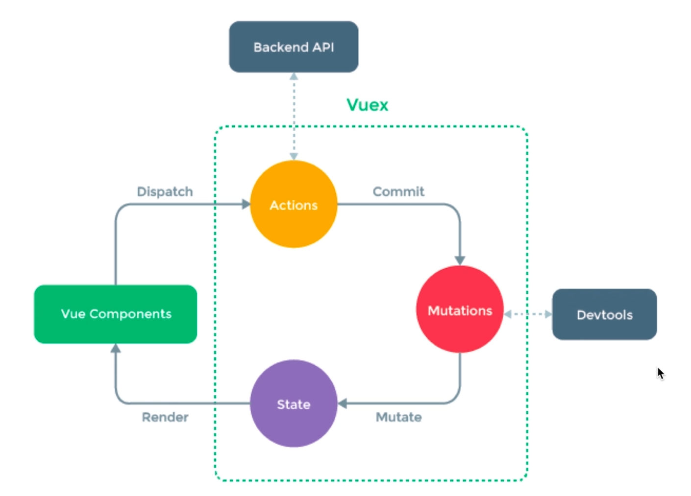

# VUEX

### vuex基本概念

- state

- getter

- action

- mutations

- module

### 辅助函数

- mapState

- mapAction

- mapMutations

- mapGetter

### createNamespacedHelpers

代码示例见：

```
code\vuex-demo
```



