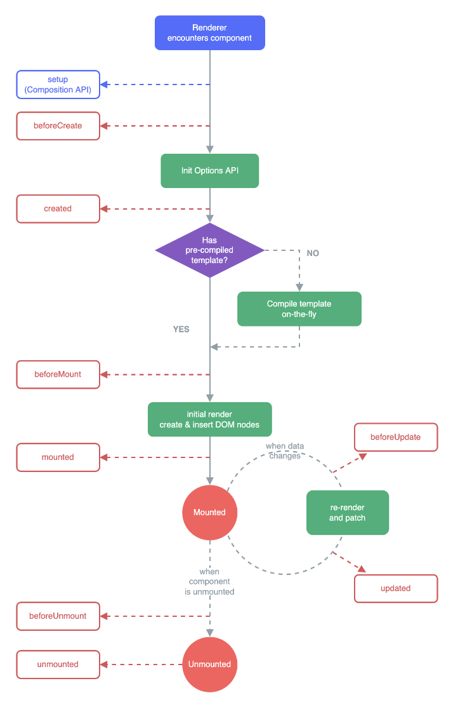

# VUE组件

### VUE组件间如何通信

- props 和 $emit（父子组件通讯）

- 组件间通讯-自定义事件（兄弟组件通讯）

- 组件生命周期

```
code\vue-code-demo\src\components\ComponentsDemo\index.vue
```

### 组件生命周期（单个组件）



### 组件生命周期（父子组件）

初始化

- 父 beforeCreate

- 父 created

- 父 beforeMount

- 子 beforeCreate

- 子 created

- 子 beforeMount

- 子 mounted

- 父 mounted

更新

- 父 beforeUpdate

- 子 beforeUpdate

- 子 updated

- 父 updated

