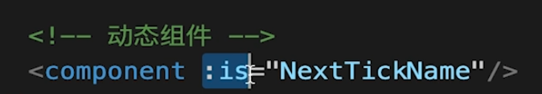

# VUE高级特性

**自定义v-model**

```
code/vue-code-demo/src/components/AdvancedUse/CustomVModel.vue
```

**$nextTick**

```
1、Vue是异步渲染
2、data改变之后，DOM不会立刻渲染
3、$nextTick会在DOM渲染之后被触发，以获取最新DOM节点
代码见：code/vue-code-demo/src/components/AdvancedUse/NextTick.vue
```

**slot**

```
// 基本使用
code/vue-code-demo/src/components/AdvancedUse/ SlotDemo.vue

//作用域插槽
code/vue-code-demo/src/components/AdvancedUse/ScopedSlotDemo.vue
```

具名插槽


**动态、异步组件**

1、动态组件

:is= "component-name" 用法

需要根据数据，动态渲染的场景。即组件类型不确定。



```
code/vue-code-demo/src/components/AdvancedUse/index.vue
```

2、异步组件

- import() 函数

- 按需加载，异步加载大组件

```
code/vue-code-demo/src/components/AdvancedUse/index.vue
```

**mixin**

- 多个组件有相同的逻辑，抽离出来

- mixin并不是完美的解决方案，会有一些问题

- Vue3提出的Composition API旨在解决这些问题

```
code/vue-code-demo/src/components/AdvancedUse/MixinDemo.vue
```
