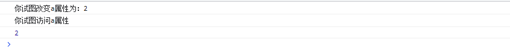
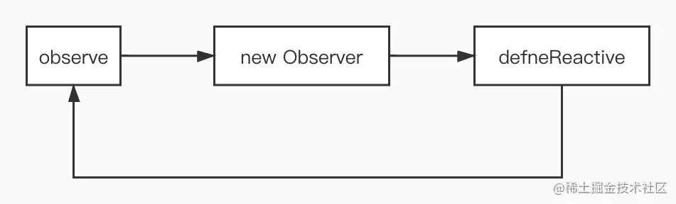
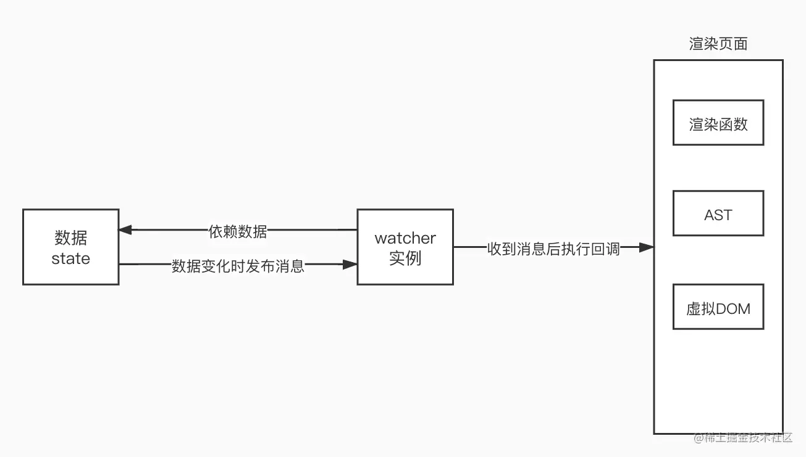

# 响应式原理

使用Vue时，我们只需要修改数据(state)，视图就能够获得相应的更新，这就是响应式系统。要实现一个自己的响应式系统，我们首先要明白要做什么事情

1、数据劫持：当数据变化时，我们可以做一些特定的事情

2、依赖收集：我们要知道那些视图层的内容(DOM)依赖了哪些数据(state)

3、派发更新：数据变化后，如何通知依赖这些数据的DOM 接下来，我们将一步步地实现一个自己的玩具响应式系统

### 1、数据劫持

几乎所有的文章和教程，在讲解Vue响应式系统时都会先讲：Vue使用Object.defineProperty来进行数据劫持。那么，我们也从数据劫持讲起，大家可能会对劫持这个概念有些迷茫，没有关系，看完下面的内容，你一定会明白

```html
<!DOCTYPE html>
<html lang="en">
  <head>
    <meta charset="UTF-8">
    <meta http-equiv="X-UA-Compatible" content="IE=edge">
    <meta name="viewport" content="width=device-width, initial-scale=1.0">
    <title>响应式</title>
  </head>
  <body>
    <script>
      function defineReactive(data, key, val) {
        if (arguments.length === 2) {
          val = data[key]
        }
        Object.defineProperty(data, key, {
          // 可枚举
          enumberable: true,
          // 可以被配置，比如可以被delete
          configurable: true,
          get() {
            console.log("你试图访问" + key + "属性");
            return val;
          },
          set(newValue) {
            console.log("你试图改变" + key + "属性为：" + newValue);
            if (newValue === val) return
            val = newValue;
          }
        })
      }
      const obj = {
        a: 1
      }
      defineReactive(obj, 'a')
      obj.a = 2;
      console.log(obj.a);
    </script>
  </body>
</html>
```

代码运行输出如下：



如果obj有多个属性呢？obj内有嵌套的属性呢？我们可以新建一个类Observer来遍历该对象

```html
<!DOCTYPE html>
<html lang="en">
  <head>
    <meta charset="UTF-8">
    <meta http-equiv="X-UA-Compatible" content="IE=edge">
    <meta name="viewport" content="width=device-width, initial-scale=1.0">
    <title>响应式</title>
  </head>
  <body>
    <script>
      function defineReactive(data, key, val) {
        if (arguments.length === 2) {
          val = data[key]
        }
        // 子元素要进行observe，至此形成了递归。这个递归不是函数自己调用自己，而是多个函数、类循环调用。
        observe(val);
        Object.defineProperty(data, key, {
          // 可枚举
          enumberable: true,
          // 可以被配置，比如可以被delete
          configurable: true,
          get() {
            console.log("你试图访问" + key + "属性");
            return val;
          },
          set(newValue) {
            console.log("你试图改变" + key + "属性为：" + newValue);
            if (newValue === val) return
            val = newValue;
            // 当设置了新值，这个新值也要被observe
            observe(newValue);
          }
        })
      }
      class Observer {
        constructor(value) {
          console.log('我是Observer构造器', value);
          this.walk(value)
        }
        // 遍历
        walk(value) {
          for (let key in value) {
            defineReactive(value, key);
          }
        }
      }
      function observe(data) {
        if (typeof data !== 'object') return
        // 调用Observer
        new Observer(data)
      }
      const obj = {
        a: 1,
        b: {
          c: 2
        }
      }
      observe(obj)
    </script>
  </body>
</html>
```

对于这一部分，大家可能有点晕，接下来梳理一下：

```
执行observe(obj)
├── new Observer(obj),并执行this.walk()遍历obj的属性，执行defineReactive()
    ├── defineReactive(obj, a)
        ├── 执行observe(obj.a) 发现obj.a不是对象，直接返回
        ├── 执行defineReactive(obj, a) 的剩余代码
    ├── defineReactive(obj, b) 
	    ├── 执行observe(obj.b) 发现obj.b是对象
	        ├── 执行 new Observer(obj.b)，遍历obj.b的属性，执行defineReactive()
                    ├── 执行defineReactive(obj.b, c)
                        ├── 执行observe(obj.b.c) 发现obj.b.c不是对象，直接返回
                        ├── 执行defineReactive(obj.b, c)的剩余代码
            ├── 执行defineReactive(obj, b)的剩余代码
代码执行结束
```

可以看出，上面三个函数的调用关系如下：



三个函数相互调用从而形成了递归，与普通的递归有所不同。只要在setter中调用一下渲染函数来重新渲染页面，不就能完成在数据变化时更新页面了吗？确实可以，但是这样做的代价就是：任何一个数据的变化，都会导致这个页面的重新渲染，代价未免太大了吧。我们想做的效果是：数据变化时，只更新与这个数据有关的DOM结构，那就涉及到下文的内容了：依赖

### 2、收集依赖与派发更新

##### 依赖

在正式讲解依赖收集之前，我们先看看什么是依赖。举一个生活中的例子：淘宝购物。现在淘宝某店铺上有一块显卡(空气)处于预售阶段，如果我们想买的话，我们可以点击预售提醒，当显卡开始卖的时候，淘宝为我们推送一条消息，我们看到消息后，可以开始购买。

将这个例子抽象一下就是发布-订阅模式：买家点击预售提醒，就相当于在淘宝上登记了自己的信息(订阅)，淘宝则会将买家的信息保存在一个数据结构中(比如数组)。显卡正式开放购买时，淘宝会通知所有的买家：显卡开卖了(发布)，买家会根据这个消息进行一些动作(比如买回来挖矿)。

在<font color=red>Vue</font>响应式系统中，显卡对应数据，那么例子中的买家对应什么呢？就是一个抽象的类: <font color=red>Watcher</font>。大家不必纠结这个名字的含义，只需要知道它做什么事情：每个<font color=red>Watcher</font>实例订阅一个或者多个数据，这些数据也被称为<font color=red>wacther</font>的依赖(商品就是买家的依赖)；当依赖发生变化，<font color=red>Watcher</font>实例会接收到数据发生变化这条消息，之后会执行一个回调函数来实现某些功能，比如更新页面(买家进行一些动作)。



因此Watcher类可以如下实现

```js
var uid = 0;
export default class Watcher {
  constructor(target, expression, callback) {
    /**
     * target: 数据对象，如obj
     * expression：表达式，如b.c，根据data和expression就可以获取watcher依赖的数据
     * callback：依赖变化时触发的回调
     */
    console.log("我是Watcher类的构造器");
    this.id = uid++;
    this.target = target;
    this.getter = parsePath(expression);
    this.callback = callback;
    // 初始化watcher实例时订阅数据
    this.value = this.get();
  } 
  // 当收到数据变化的消息时执行该方法，从而调用cb
  update() {
    this.run();
  }
  get() {
    const obj = this.target;
    var value = this.getter(obj);
    return value;
  }
  run() {
    this.getAndInvoke(this.callback);
  }
  getAndInvoke(cb) {
    const value = this.get();
    if (value !== this.value || typeof value === 'object') {
      const oldValue = this.value;
      this.value = value;
      cb.call(this.target, value, oldValue)
    }
  }
}
/**
 * var obj = {
 *  a: {
 *    b: {
 *      c: {
 *        d: 100
 *      }
 *    }
 *  }
 * }
 * var getter = parsePath('a.b.c.d');
 * var result = getter(obj)
 * consle.log(result) // 输出100
 */
export const parsePath = function(str) {
  var segments = str.split('.');
  return (obj) => {
    for (let i=0; i<segments.length; i++) {
      if (!obj) return
      obj = obj[segments[i]];
    }
    return obj
  }
}
```

如果你对Watcher这个类什么时候实例化有疑问的话，没关系，下面马上就会讲到

其实前文例子中还有一个点我们尚未提到：显卡例子中说到，淘宝会将买家信息保存在一个数组中，那么我们的响应式系统中也应该有一个数组来保存买家信息，也就是watcher。

总结一下我们需要实现的功能：

1、有一个数组来存储watcher

2、watcher实例需要订阅(依赖)数据，也就是获取依赖或者收集依赖

3、watcher的依赖发生变化时触发watcher的回调函数，也就是派发更新。

每个数据都应该维护一个属于自己的数组，该数组来存放依赖自己的watcher，我们可以在defineReactive中定义一个数组dep，这样通过闭包，每个属性就能拥有一个属于自己的dep

```
function defineReactive(data, key, val) {
  if (arguments.length === 2) {
    val = data[key]
  }
  const dep = [] // 增加
  // 子元素要进行observe，至此形成了递归。这个递归不是函数自己调用自己，而是多个函数、类循环调用。
  observe(val);
  Object.defineProperty(data, key, {
    // 可枚举
    enumberable: true,
    // 可以被配置，比如可以被delete
    configurable: true,
    get() {
      console.log("你试图访问" + key + "属性");
      return val;
    },
    set(newValue) {
      console.log("你试图改变" + key + "属性为：" + newValue);
      if (newValue === val) return
      val = newValue;
      // 当设置了新值，这个新值也要被observe
      observe(newValue);
    }
  })
}
```

##### 依赖收集

现在我们把目光集中到页面的初次渲染过程中(暂时忽略渲染函数和虚拟DOM等部分)：渲染引擎会解析模板，比如引擎遇到了一个插值表达式，如果我们此时实例化一个watcher，会发生什么事情呢？从Watcher的代码中可以看到，实例化时会执行get方法，get方法的作用就是获取自己依赖的数据，而我们重写了数据的访问行为，为每个数据定义了getter，因此getter函数就会执行，如果我们在getter中把当前的watcher添加到dep数组中(淘宝低登记买家信息)，不就能够完成依赖收集了吗！！


**注意**：执行到getter时，new Watcher()的get方法还没有执行完毕。
new Watcher()时执行constructor，调用了实例的get方法，实例的get方法会读取数据的值，从而触发了数据的getter，getter执行完毕后，实例的get方法执行完毕，并返回值，constructor执行完毕，实例化完毕。

有些同学可能会有疑惑：明明是watcher收集依赖，应该是watcher收集数据，怎么成了数据的dep收集watcher了呢？有此疑问的同学可以再看一下前面淘宝的例子(是淘宝记录了用户信息)，或者深入了解一下发布-订阅模式。

通过上面的分析，我们只需要对getter进行一些修改：

```
get() {
  dep.push(watcher); // 新增
  return value
}
```

问题又来了，watcher这个变量从哪里来呢？我们是在模板编译函数中的实例化watcher的，getter中取不到这个实例啊。解决方法也很简单，将watcher实例放到全局不就行了吗，比如放到window.target上。因此，Watcher的get方法做如下修改

```
// 此get方法为Watcher类中的方法
get() {
    // 进入依赖收集阶段，让全局的Dep.target设置为Watcher本身，那么就是进入依赖收集阶段
    Dep.target = this;
    const obj = this.target;
    var value = this.getter(obj);
    return value;
  }
```

通过上面的分析，我们只需要对getter进行一些修改：

```
// 此方法为defineReactive.js中设置数据响应式的get方法
get() {
  dep.depend(); // depend方法封装了收集watcher实例，通过Dep.target获取watcher实例，并放入到数组中。
  return value
}
```

依赖收集过程：渲染页面时碰到插值表达式，v-bind等需要数据等地方，会实例化一个watcher,实例化watcher就会对依赖的数据求值，从而触发getter，数据的getter函数就会添加依赖自己的watcher，从而完成依赖收集。我们可以理解为watcher在收集依赖，而代码的实现方式是在数据中存储依赖自己的watcher


细心的读者可能会发现，利用这种方法，每遇到一个插值表达式就会新建一个watcher，这样每个节点就会对应一个watcher。实际上这是vue1.x的做法，以节点为单位进行更新，粒度较细。而vue2.x的做法是每个组件对应一个watcher，实例化watcher时传入的也不再是一个expression，而是渲染函数，渲染函数由组件的模板转化而来，这样一个组件的watcher就能收集到自己的所有依赖，以组件为单位进行更新，是一种中等粒度的方式。要实现vue2.x的响应式系统涉及到很多其他的东西，比如组件化，虚拟DOM等，而这个系列文章只专注于数据响应式的原理，因此不能实现vue2.x，但是两者关于响应式的方面，原理相同。

##### 派发更新

实现依赖收集后，我们最后要实现的功能是派发更新，也就是依赖变化时触发watcher的回调。从依赖收集部分我们知道，获取哪个数据，也就是说触发哪个数据的getter，就说明watcher依赖哪个数据，那数据变化的时候如何通知watcher呢？相信很多同学都已经猜到了：在setter中派发更新。

```
// 此方法为defineReactive.js中设置数据响应式的set方法
set(newValue) {
  console.log("你试图改变" + key + "属性为：" + newValue);
  if (newValue === val) return
  val = newValue;
  // 当设置了新值，这个新值也要被observe
  observe(newValue);
  // 发布订阅模式，通知dep
  dep.notify();
}
```

### 3. 优化代码

##### Dep类

我们可以将dep数组抽象为一个类:

```
class Dep {
  constructor() {
    console.log("我是Dep类的构造器");
    // 用数组存储自己的订阅者。subs是英语subscribes订阅者的缩写。
    //这里面放的是watcher的实例
    this.subs = [];
  }
  // 添加订阅
  addSub(sub) {
    this.subs.push(sub)
  }
  // 添加依赖
  depend() {
    // Dep.target就是一个我们自己指定的全局的位置，你用window.target也行，只要是全局唯一，没有歧义就行。
    if (Dep.target) {
      this.addSub(Dep.target);
    }
  }
  // 通知更新
  notify() {
    console.log("我是notify");
    // 浅克隆一份
    const subs = this.subs.slice();
    // 遍历
    for (let i=0,l=subs.length; i<l; i++) {
      subs[i].update();
    }
  }
}
```

defineReactive函数只需做相应的修改

```
function defineReactive(data, key, val) {
  const dep = new Dep();
  console.log("我是defineReactive", data, key)
  if (arguments.length === 2) {
    val = data[key]
  }
  // 子元素要进行observe，至此形成了递归。这个递归不是函数自己调用自己，而是多个函数、类循环调用。
  observe(val);
  Object.defineProperty(data, key, {
    // 可枚举
    enumberable: true,
    // 可以被配置，比如可以被delete
    configurable: true,
    get() {
      console.log("你试图访问" + key + "属性");
      // 如果现在处于依赖收集阶段
      if (Dep.target) {
        dep.depend();
      }
      return val;
    },
    set(newValue) {
      console.log("你试图改变" + key + "属性为：" + newValue);
      if (newValue === val) return
      val = newValue;
      // 当设置了新值，这个新值也要被observe
      observe(newValue);
      // 发布订阅模式，通知dep
      dep.notify();
    }
  })
}
```

##### Dep.target

在watcher的get方法中

```
// 此get方法为Watcher类中的方法
get() {
  // 进入依赖收集阶段，让全局的Dep.target设置为Watcher本身，那么就是进入依赖收集阶段
  Dep.target = this;
  const obj = this.target;
  var value = this.getter(obj);
  return value;
}
```

大家可能注意到了，我们没有重置window.target。有些同学可能认为这没什么问题，但是考虑如下场景：有一个对象obj: { a: 1, b: 2 }我们先实例化了一个watcher1，watcher1依赖obj.a，那么window.target就是watcher1。之后我们访问了obj.b，会发生什么呢？访问obj.b会触发obj.b的getter，getter会调用dep.depend()，那么obj.b的dep就会收集window.target， 也就是watcher1，这就导致watcher1依赖了obj.b，但事实并非如此。为解决这个问题，我们做如下修改

```
// Watcher的get方法
get() {
  // 进入依赖收集阶段，让全局的Dep.target设置为Watcher本身，那么就是进入依赖收集阶段
  Dep.target = this;
  const obj = this.target;
  var value;
  try {
    value = this.getter(obj);
  } finally {
    Dep.target = null;
  }
  return value;
}

// Dep的depend方法
depend() {
  // Dep.target就是一个我们自己指定的全局的位置，你用window.target也行，只要是全局唯一，没有歧义就行。
  if (Dep.target) {
    this.addSub(Dep.target);
  }
}
```

通过上面的分析能够看出，Dep.target的含义就是当前执行上下文中的watcher实例。由于js单线程的特性，同一时刻只有一个watcher的代码在执行，因此Dep.target就是当前正在处于实例化过程中的watcher

##### 总结代码

```
完整代码见：code\defineProperty-demo
```

##### 总结

1、调用observe(obj)，将obj设置为响应式对象，observe函数，Observe, defineReactive函数三者互相调用，从而递归地将obj设置为响应式对象

2、渲染页面时实例化watcher，这个过程会读取依赖数据的值，从而完成在getter中获取依赖

3、依赖变化时触发setter，从而派发更新，执行回调，完成在setter中派发更新

PS：
完整代码见：code\defineProperty-demo
视频地址：https://www.bilibili.com/video/BV1G54y1s7xV/?p=2&vd_source=065eef0e1a9908ea1d07233c188d9ced
参考：https://juejin.cn/post/6932659815424458760#comment
