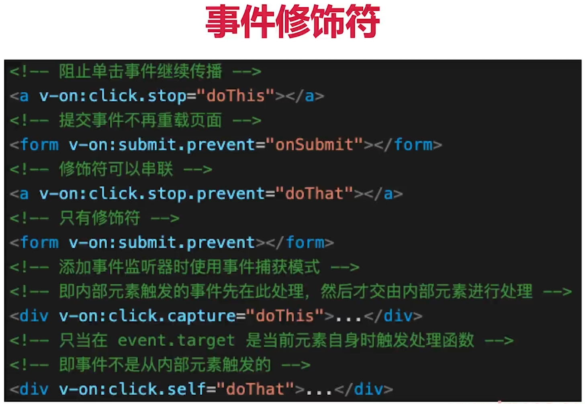
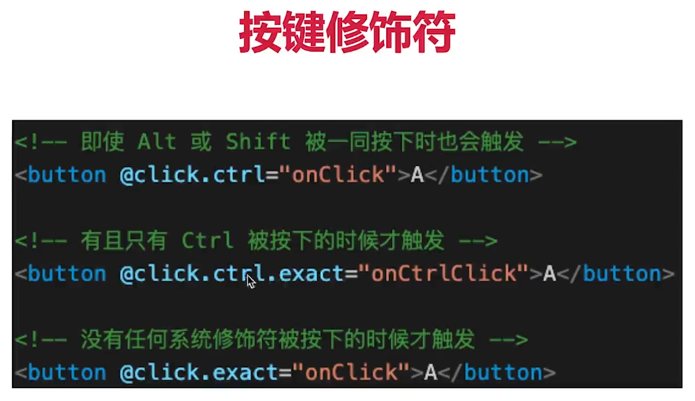

# 基本使用

### computed 和 watch

- computed有缓存，data不变则不会重新计算

```
代码见：code\vue-code-demo\src\components\BaseUse\ComputedDemo.vue
```

- watch如何深度监听

```
代码见：code\vue-code-demo\src\components\BaseUse\WatchDemo.vue
```

- watch监听引用类型，拿不到oldVal（引用类型，拿不到 oldVal 。因为指针相同，此时已经指向了新的 val）

```
代码见：code\vue-code-demo\src\components\BaseUse\WatchDemo.vue
```

### class 和 style

- 使用动态属性

```
code\vue-code-demo\src\components\BaseUse\ClassDemo.vue
```

- 使用驼峰式写法

```
code\vue-code-demo\src\components\BaseUse\ClassDemo.vue
```

### 循环列表渲染

- 如何遍历对象？---也可以使用v-for

```
code\vue-code-demo\src\components\BaseUse\ListDemo.vue
```

- key的重要性。key不能乱写（如radom或者index）

- v-for和v-if不能一起使用！

### 事件

- event参数，自定义参数

```
code\vue-code-demo\src\components\BaseUse\EventDemo.vue
```

- 事件修饰符，按键修饰符





- 【观察】事件被绑定到哪里？

### 表单

- v-model（重点）

```
code\vue-code-demo\src\components\AdvancedUse\CustomVModel.vue
```

- 常见表单项textarea checkbox radio select

- 修饰符lazy number trim

```
code\vue-code-demo\src\components\BaseUse\EventDemo.vue
```
