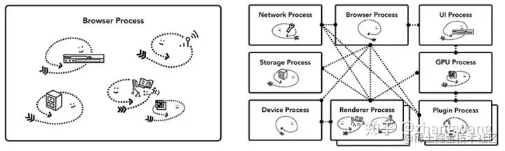
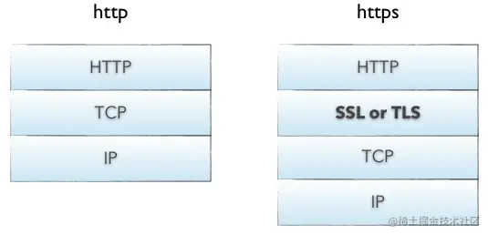
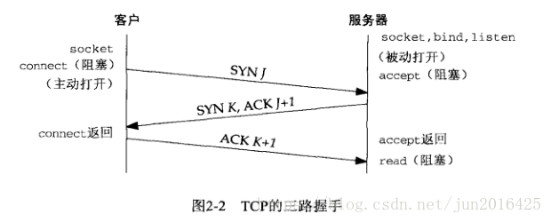

# 从输入url到渲染出页面的整个过程

转载：[https://juejin.cn/post/6858551640220729351#comment](https://juejin.cn/post/6858551640220729351#comment)

### 整体流程图

从图中可以看出，整个过程需要各个进程之间的配合，所以在开始正式流程之前，我们还是先来快速回顾下几个主要进程的职责。

- 浏览器进程主要负责用户交互、子进程管理和文件储存等功能：包括地址栏，书签栏，前进后退按钮等部分的工作；负责处理浏览器的一些不可见的底层操作，比如网络请求和文件访问；

- 网络进程是面向渲染进程和浏览器进程等提供网络下载功能。

- 渲染进程的主要职责是负责一个 tab 内关于网页呈现的所有事情：把从网络下载的 HTML、JavaScript、CSS、图片等资源解析为可以显示和交互的页面。因为渲染进程所有的内容都是通过网络获取的，会存在一些恶意代码利用浏览器漏洞对系统进行攻击，所以运行在渲染进程里面的代码是不被信任的。这也是为什么 Chrome 会让渲染进程运行在安全沙箱里，就是为了保证系统的安全。

- Plugin Process负责控制一个网页用到的所有插件，如 flash

- GPU Process负责处理 GPU 相关的任务

本文我们把ui线程和存储器线程放到浏览器进程来讲，google浏览器会根据不同机器的性能来控制是否将浏览器进程中的线程拆分成不同的线程，而且不同浏览器采用了不同的架构模式

### 浏览器进程和网络进程

##### 第一部分主要说下在输入url的过程中网络进程和浏览器进程中的ui线程做了哪些事

先说一下这部分不同线程的功能:

- **UI线程：** 控制浏览器上的按钮及输入框；

- **网络进程:** 处理网络请求，从网上获取数据；

- **存储器线程:** 控制文件等的访问；

回到我们最开始的流程图，当我们在浏览器地址栏中输入文字，并点击回车获得页面内容的过程在浏览器看来可以分为以下几步：

1、处理输入：UI线程需要判断用户输入的是 URL 还是 query；如果是搜索内容（query）则会拼接url，否则直接访问url

2、按下回车键ui线程所在的浏览器进程首先判断是否存在像301这种返回已经记录过的,对于这种请求，首先要进行一个重定向操作，这是纯客户端的行为然后再执行下一步，否则直接执行下一步

3、通过进程间IPC通信来通知网络进程发起请求获取网页内容，ui线程控制tab加载动画开始跳转；

4、请求的时候网络进程首先会先去查找浏览器缓存，因为可能请求的资源已经在浏览器上缓存过了，此时服务器上的资源如果没有增删改，就会直接用缓存过的资源，而不需要重新向服务器请求并下载资源，这样服务器减少了请求，用户也节省了带宽所以我们时常会看到状态码304,另外还会请求代理服务器缓存（nginx，apache）

5、如果没有缓存，网络进程会继续执行 DNS 查询：域名要转换成IP才能访问到服务器，所以要去查域名对应IP。

浏览器如何通过域名去查询 URL 对应的 IP 呢？

- 浏览器缓存：浏览器会按照一定的频率缓存 DNS 记录。

- 操作系统缓存：如果浏览器缓存中找不到需要的 DNS 记录，那就去操作系统中找。

- 路由缓存：路由器也有 DNS 缓存。

- ISP 的 DNS 服务器：ISP 是互联网服务提供商(Internet Service Provider)的简称，ISP 有专门的 DNS 服务器应对 DNS 查询请求。

- 根服务器：ISP 的 DNS 服务器还找不到的话，它就会向根服务器发出请求，进行递归查询（DNS 服务器先问根域名服务器.com 域名服务器的 IP 地址，然后再问.baidu 域名服务器，依次类推）

这过程会先查看本地hosts文件，查看有没有当前域名对应的ip地址，若有直接发起请求，没有的话会在本地域名服务器去查找，该查找属于递归查找，如果本地域名服务器没查找到，会从根域名服务器查找，该过程属于迭代查找，根域名会告诉你从哪个与服务器查找，最后查找到对应的ip地址后把对应规则保存到本地的hosts文件中。

如果想加速以上及之后的http请求过程的话可以使用缓存服务器CDN，CDN过程如下：

用户输入url地址后，本地DNS会解析url地址，不过会把最终解析权交给CNAME指向的CDN的DNS服务器CDN的DNS服务器会返回给浏览器一个全局负载均衡IP用户会根据全局负载均衡IP去请求全局负载均衡服务器全局负载均衡服务器会根据用户的IP地址，url地址，会告诉用户一个区域负载均衡设备，让用户去请求它。区域负载均衡服务器会为用户选择一个离用户较近的最优的缓存服务器，并把ip地址给到用户用户想缓存服务器发送请求，如果请求不到想要的资源的话，会一层层向上一级查找，直到查找到为止。

6、找到对于IP后需要进行三次握手，创建TCP链接，如果是https连接，要在tcp三次握手之后创建加密连接，来加密通信的上层数据（建立 SSL/TLS 连接）

**第一次握手**

客户端给服务器发送一个SYN段(在 TCP 标头中 SYN 位字段为 1 的 TCP/IP 数据包), 该段中也包含客户端的初始序列号(Sequence number = J)。

- SYN是同步的缩写，SYN 段是发送到另一台计算机的 TCP 数据包，请求在它们之间建立连接

**第二次握手**

服务器返回客户端 SYN +ACK 段(在 TCP 标头中SYN和ACK位字段都为 1 的 TCP/IP 数据包)， 该段中包含服务器的初始序列号(Sequence number = K)；同时使 Acknowledgment number = J + 1来表示确认已收到客户端的 SYN段(Sequence number = J)。

- ACK 是“确认”的缩写。 ACK 数据包是任何确认收到一条消息或一系列数据包的 TCP 数据包

**第三次握手**

客户端给服务器响应一个ACK段(在 TCP 标头中 ACK 位字段为 1 的 TCP/IP 数据包), 该段中使 Acknowledgment number = K + 1来表示确认已收到服务器的 SYN段(Sequence number = K)。

7、发送http请求Request的数据包

8、接收数据操作后响应Response，如果是短连接直接通过四次挥手关闭连接，否则则继续使用这个管道传输数据

9、如果返回头中301重定向，网络进程会通知ui线程 服务器要求重定向，之后，另外一个 URL 请求会被触发

10、否则网络进程会依据 Content-Type 来判断响应内容的格式，如果是文本或html用渲染进程渲染，否则如果是文件通知下载管理器

11、判断是html之后Safe Browsing会查看网页是否安全，不安全网络进程会展示警告页，此外 CORB 检测(跨域资源共享)也会触发确保敏感数据不会被传递给渲染进程

12、全部检查完成，网络进程确定可以导航请求网页则通知ui线程数据准备好了，ui线程会查找到一个render（渲染器）进程对页面进行渲染；

**支线1**：如果你监听过 beforeunload 事件，这个事件再次涉及到 浏览器进程 和 渲染器进程 的交互，当当前页面关闭时（关闭 Tab ，刷新等等），浏览器进程 需要通知 渲染器进程 进行相关的检查，对相关事件进行处理;

**支线2**：除了上述流程，有些页面还拥有 Service Worker （服务工作线程），Service Worker 让开发者对本地缓存及判断何时从网络上获取信息有了更多的控制权，如果 Service Worker 被设置为从本地 cache 中加载数据，那么就没有必要从网上获取更多数据了。

### 渲染器进程

进入主线，这一部分我们再来讲讲过经过了上述过程，数据以及渲染进程都可用了之后，渲染器进程是怎么把页面渲染到对应的tab上面的:此时，地址栏会更新，展示出新页面的网页信息。history tab 会更新，可通过返回键返回导航来的页面，为了让关闭 tab 或者窗口后便于恢复，这些信息会存放在硬盘中;

渲染进程中主要包含以下线程：

- 主线程 Main thread

- 工作线程 Worker thread

- 排版线程 Compositor thread

- 光栅线程 Raster thread

其主要工作流程如下所示，哈哈哈...

好了，进入正题,渲染器工作流程如下：

1、主线程将 html 文件转化为浏览器能够读懂的 DOM 树结构，HTML中的每个标签（tag）都是DOM树中的一个节点，根节点就是我们常用的document对象，DOM树里包含了HTML所有标签，包括display：none隐藏，还有用JS动态添加的元素等。DOM 树解析的过程是一个深度优先遍历，即先构建当前节点的所有子节点，再构建下一个兄弟节点。其中会通过网络进程加载次级资源，遇到 js 会停止构建 DOM 树，并执行 js。

2、主线程将 css 文件转化为浏览器能够读懂的 CSSOM（css对象模型） （这一过程会递归所有应该设置样式的标签，CSS 选择符是从右到左进行匹配的，比如 a > span { color: red; }，我们这个看似“没毛病”的选择器，实际开销相当高：浏览器必须遍历页面上每个 span 元素，并且每次都要去确认这个 span 元素的父元素是不是 a 标签找好几层然后给符合这种条件的 span 标签设置颜⾊，这样的递归过程就很复杂。所以我们应该尽可能的避免写过于具体的 CSS 选择器，然后对于 HTML 来说也尽量少的添加⽆意义标签，保证层级扁平，多用类选择器替代标签选择器），并将其中的属性标准化（去掉浏览器不能识别的样式，比如IE会去掉-moz开头的样式，而Firefox会去掉_开头的样式）最后计算每个节点的样式。解析 CSSOM   时 js 执行将暂停，直至 CSSOM 就绪，浏览器在 CSSOM 生成之前不会进行渲染。

3、主线程通过得到的 DOM 树和 CSSOM 合成一棵render tree（渲染树），和DOM树不一样，render tree 能识别样式，render tree的每一个节点都有自己的样式，而且render tree中不包含隐藏的节点（比如display：none的节点，还有head节点），因为这些节点不会用于呈现，而且不会影响呈现（注意：visibility：hidden隐藏的元素还是会包含到render tree中，因为visibility：hidden会影响布局（layout），会占有空间）。通过渲染树中渲染对象的信息，计算出每一个渲染对象的位置和尺寸生成布局树（layout Tree），在布局完成后，如果发现了某个部分（尺寸、位置等）发生了变化影响了布局，那就需要倒回去重新计算渲染树，重新渲染（这就是回流）。如果某个元素的背景颜色，文字颜色等，不影响元素周围或内部布局的属性，浏览器只会根据元素的新属性重新绘制（而不会改变渲染树），使元素呈现新的外观（这就是重绘）。

4、即使知道了不同元素的位置及样式信息，我们还需要知道不同元素的绘制先后顺序才能正确绘制出整个页面。在绘制阶段，主线程会遍历布局树以创建绘制记录。绘制记录可以看做是记录各元素绘制先后顺序的笔记。

5、复合是一种分割页面为不同的层，并单独栅格化，随后组合为帧的技术。不同层的组合由 compositor 线程（合成器线程）完成。主线程通过得到的布局树进行图层分层并得到一个图层树。

6、合成线程对图层进行分块处理（栅格化），并对视口区域内的图块进行位图转换（分成多个磁贴），将得到的结果通过 GPU 进程存入到 GPU 显存中。

7、（一旦磁贴被光栅化）合成线程收集位图信息（称为绘制四边形的磁贴信息）创建合成帧，并将消息通过 IPC 协议传给浏览器主进程，主进程收到消息后，会将页面内容绘制到内存中，最后再将内存显示在屏幕上。

8、当 渲染器进程 渲染结束（渲染结束意味着该页面内的所有的页面，包括所有 iframe 都触发了 onload 时），会发送 IPC 信号到 浏览器进程， UI线程会停止展示 tab 中的 spinner。

**总结**: 生成各种树，包括dom tree, css tree, layout tree, layer true, render tree，这些是渲染器进程中的GUI渲染线程做的事。其中js脚本的解析执行是同进程下的js引擎线程来做的，也就是大名鼎鼎的V8引擎。至于定时器回调，是定时器线程来计数，计数完毕会把回调推入事件触发线程维护的任务队列，当js线程空闲并且此线程维护的微任务队列无事件，才会去任务队列拿宏任务执行处理。

### 断开链接

当数据传送完毕，需要断开 tcp 连接，此时发起 tcp 四次挥手。

- **发起方向被动方发送报文，Fin、Ack、Seq，表示已经没有数据传输了。并进入 FIN_WAIT_1 状态。**(第一次挥手：由浏览器发起的，发送给服务器，我请求报文发送完了，你准备关闭吧)

- **被动方发送报文，Ack、Seq，表示同意关闭请求。此时主机发起方进入 FIN_WAIT_2 状态。**(第二次挥手：由服务器发起的，告诉浏览器，我请求报文接受完了，我准备关闭了，你也准备吧)

- **被动方向发起方发送报文段，Fin、Ack、Seq，请求关闭连接。并进入 LAST_ACK 状态。**(第三次挥手：由服务器发起，告诉浏览器，我响应报文发送完了，你准备关闭吧)

- **发起方向被动方发送报文段，Ack、Seq。然后进入等待 TIME_WAIT 状态。被动方收到发起方的报文段以后关闭连接。发起方等待一定时间未收到回复，则正常关闭。**(第四次挥手：由浏览器发起，告诉服务器，我响应报文接受完了，我准备关闭了，你也准备吧)

### 事件处理

1、如果页面有绑定事件，浏览器进程会发送事件类型及相应的坐标给渲染进程

2、滚动的时候产生新的ui，合成器可以独立于主线程之外直接合成新的帧而不用等到主线程的响应。但如果滚动中某个区域有绑定事件（这个区域叫做非快速滚动区域【non-fast scrollable region】），如果存在这个标注，合成器线程会把发生在此处的事件发送给主线程，等待主线程处理后再合成新的帧

3、但是如果整个页面都绑定了诸如addEventListener('pointermove'）这样的事件，每次都要询问，使用 passive: true 可以实现平滑滚动，但是垂直方向的滚动可能会先于event.preventDefault()发生，此时可以通过 event.cancelable 来防止这种情况。也可以使用css属性 touch-action 来完全消除事件处理器的影响

4、当组合器线程发送输入事件给主线程时，主线程依据绘制记录查找事件相关元素

5、出于优化的目的，Chrome 会合并连续的事件(如 wheel, mousewheel, mousemove, pointermove, touchmove )鼠标移动、滚动等，并延迟到下一帧渲染时候执行 。
而如 keydown, keyup, mouseup, mousedown, touchstart, 和 touchend 等非连续性事件则会立即被触发。

