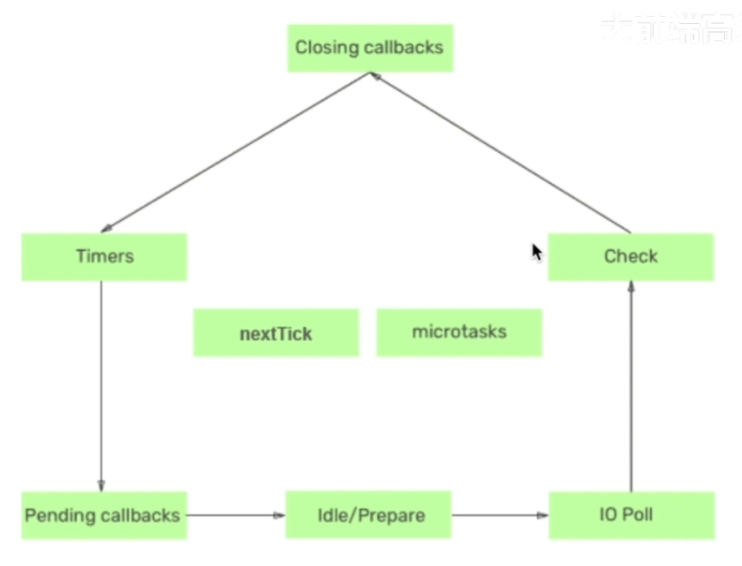

# 事件循环

## 事件循环的6个阶段

1、timers：用于存储定时器的回调函数（setInterval、setTimeout）

2、Pending callbacks：执行与操作系统相关的回调函数，比如启动服务器端应用时监听端口操作的回调函数就在这里调用。

3、Idle/prepare：系统内部使用。

4、IO Poll：存储I/O操作的回调函数队列，比如文件读写操作的回调函数。

&emsp;&emsp;如果事件队列中有回调函数，执行它们直到清空队列

&emsp;&emsp;否则事件循环将在此阶段停留一段事件以等待新的回调函数进入，这个等待取决于以下两个条件：

&emsp;&emsp;&emsp;&emsp;1、setImmediate队列(check阶段)中存在要执行的回调函数。

&emsp;&emsp;&emsp;&emsp;2、timers队列中存在要执行的回调函数，在这种情况下，事件循环将移至check阶段，然后移至 Closing callbacks 阶段，并最终从timers阶段进入下一次循环。

5、Check：存储setImmerdiate API 得回调函数。

6、Closing callbacks：执行与关闭事件相关的回调，例如关闭数据库连接的回调函数等。

循环体会不断运行以检测是否存在没有调用的回调函数，事件循环机制会按照先进先出的方式执行它们直到队列为空。

## 宏任务与微任务

宏任务：setInterval、setTimeout、setImmediate、I/O

微任务：Promise.then、Promise.catch、Promise.finally、promise.nextTick

## 宏任务与微任务的区别

1、微任务的回调函数被放置在微任务队列中，宏任务的回调函数被放置在宏任务队列中。

2、微任务优先级高于宏任务。

&emsp;&emsp;当微任务事件队列中存在可以执行的回调函数时，事件循环在执行完当前阶段的回调函数后会暂停进入事件循环的下一个阶段，事件循环会立即进入微任务的时间队列中开始执行回调函数，当微任务队列中的回调函数执行完成后，事件循环再进入到下一个阶段开始执行回调函数。

&emsp;&emsp;nextTick的优先级高于microTask（微任务），在执行任务时，只有nextTick中的所有回调函数执行完成后才会开始执行microTask。

&emsp;&emsp;不同阶段的宏任务的回调函数被放置在了不同的宏任务队列中，宏任务与宏任务之间没有优先级的概念，它们的执行顺序是按照事件循环的阶段顺序进行的。