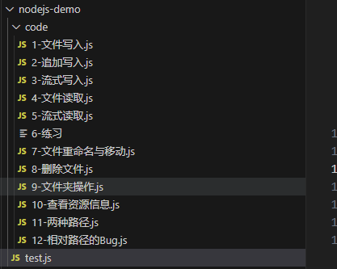

# fs模块

fs 全称为 file system ，称之为 文件系统，是Node.js中的内置模块，可以对计算机中的磁盘进行操作。

## 文件写入

文件写入就是将数据保存到文件中，我们可以使用如下几个方法实现该效果。

方法|说明
----|----
writeFile|异步写入
writeFileSync|同步写入
appendFile / appendFileSync|追加写入
createWriteStream|流式写入

### 1-1 writeFile 异步写入

语法：<font color=red>fs.writeFile(file, data[, options], callback)</font>

参数说明：

- file 文件名
- data 待写入的数据
- options 选项设置<font color=red>（可选）</font>
- callback 写入回调

返回值：<font color=red>undefined</font>

代码示例

```node
/**
 * 需求：
 * 新建一个文件，座右铭.txt，写入内容，三人行，则必有我师焉
 */

// 1、导入 fs 模块
const fs = require("fs");
// 2、异步写入文件
fs.writeFile("./座右铭.txt", "三人行，则必有我师焉", err => {
  //err 写入失败：错误对象， 写入成功：null
  if (err) {
    console.log("写入失败");
    return
  }
  console.log("写入成功")
});
```

### 1-2 writeFileSync 同步写入

语法：<font color=red>fs.writeFileSync(file, data[, options])</font>

参数与 fs.writeFile 大体一致，只是没有 callback 参数

返回值： undefined

代码示例

```node
/**
 * 需求：
 * 新建一个文件，座右铭.txt，写入内容，三人行，则必有我师焉
 */

// 1、导入 fs 模块
const fs = require("fs");
// 2、同步写入文件
fs.writeFileSync('./座右铭.txt', "三人行，则必有我师焉");
```

### 1-3 appendFile / appendFileSync 追加写入

appendFile 作用是在文件末尾追加内容，appendFile 语法与 writeFile 语法完全相同

语法：

<font color=red>fs.appendFile(file, data[, options], callback)</font>

<font color=red>fs.appendFileSync(file, data[, options])</font>

返回值： 二者都为 undefined

示例代码

```node
// 1、导入 fs 模块
const fs = require("fs");
// 写入文件
fs.writeFileSync('./座右铭.txt', "三人行，则必有我师焉。");
fs.appendFile("./座右铭.txt", '择其善者而从之，其不善者而改之。', err => {
  //err 写入失败：错误对象， 写入成功：null
  if (err) {
    console.log("追加失败");
    return
  }
  console.log("追加成功")
})
fs.appendFileSync("./座右铭.txt", '温故而知新, 可以为师矣。');
```

writeFile也可以实现追加写入

```node
// 1、导入 fs 模块
const fs = require("fs");
fs.writeFileSync("./座右铭.txt", "三人行，则必有我师焉。")
fs.writeFile("./座右铭.txt", "\r\n温故而知新，可以为师矣。", { flag: "a" }, err => {
  //err 写入失败：错误对象， 写入成功：null
  if (err) {
    console.log("追加失败");
    return
  }
  console.log("追加成功")
})
```

### 1-4 createWriteStream 流式写入

语法：<font color=red>fs.createStream(path[, options])</font>

参数说明：

- path：文件路径

- options：选项配置<font color=red>（可选）</font>

返回值： Object

代码示例

```node
// 1、导入 fs 模块
const fs = require("fs");
// 2、创建写入流对象
const ws = fs.createWriteStream('./观书有感.txt');
// 3、write
ws.write('半亩方塘一鉴开\r\n');
ws.write('天光云影共徘徊\r\n');
ws.write('问渠那得清如许\r\n');
ws.write('为有源头活水来\r\n');
// 4、关闭通道
ws.close();
```

程序打开一个文件是需要消耗资源的，流式写入可以减少打开关闭文件的次数。流式写入方式适用于大文件写入或者频繁写入的场景, writeFile 适合于写入频率较低的场景

## 文件读取

文件读取顾名思义，就是通过程序从文件中去取出其中的数据，我们可以使用如下几种方式：

方法|说明
---|---
readFile|异步读取
readFileSync|同步读取
createReadStream|流式读取

### 2-1 readFile 异步读取

语法：<font color=red>fs.readFile(path[, options], callback)</font>

参数说明：

- path 文件路径
- options 选项配置
- callabck 回调函数

返回值： undefined

代码示例

```node
//导入 fs 模块
const fs = require('fs');
fs.readFile('./座右铭.txt', (err, data) => {
  if(err) throw err;
  console.log(data);
});
fs.readFile('./座右铭.txt', 'utf-8',(err, data) => {
  if(err) throw err;
  console.log(data);
});
```

### 2-2 readFileSync 同步读取

语法：<font color=red>fs.readFileSync(path[,options])</font>

参数说明：

- path 文件路径
- options 选项配置

返回值： string | Buffer

代码示例

```node
//导入 fs 模块
const fs = require('fs');
let data = fs.readFileSync('./座右铭.txt');
let data2 = fs.readFileSync('./座右铭.txt', 'utf-8');
```

### 2-3 createReadStream 流式读取

语法：<font color=red>fs.createReadStream(path[, options])</font>

参数说明：

- path 文件路径
- options 选项配置<font color=red>（可选）</font>

返回值： Object

```node
//导入 fs 模块
const fs = require('fs');
//创建读取流对象
let rs = fs.createReadStream('./观书有感.txt');
// 绑定 data 事件
rs.on('data', data => { // 每次取出 64k 数据后执行一次 data 回调
  console.log(data);
  console.log(data.length); // 65536字节，64K
});
//读取完毕后, 执行 end 回调
rs.on('end', () => {
  console.log('读取完成')
})
```

#### 小练习-文件复制

```node
/**
 * 需求：
 *    复制当前文件夹下的 观书有感.txt
 */
// 导入 fs 模块
const fs = require("fs");
// 方式一 readFile
// let data = fs.readFileSync('./观书有感.txt');
// fs.writeFileSync('./观书有感-2.txt', data);
// 方式二 流式操作
const rs = fs.createReadStream('./观书有感.txt');
const ws = fs.createWriteStream('./观书有感-3.txt');
rs.on('data', chunk => {
  ws.write(chunk);
})
```

## 文件移动与重命名

在Node.js中，我们可以使用 rename 或 renameSync 来移动或重命名 文件或文件夹

语法：

<font color=red>fs.rename(oldPath, newPath, callback)</font>

<font color=red>fs.renameSync(oldPath, newPath)</font>

参数说明：

- oldPath 文件当前的路径
- newPaht 文件新的路径
- callback 操作后的回调

代码示例

```node
// 导入 fs 模块
const fs = require("fs");
// 重命名文件
// fs.rename('./座右铭.txt', './座右铭-rename.txt', err => {
//   if (err) {
//     console.log('操作失败')
//     return
//   }
//   console.log('操作成功')
// })
// 移动文件
fs.rename('./座右铭.txt', '../座右铭.txt', err => {
  if (err) {
    console.log('操作失败')
    return
  }
  console.log('操作成功')
})
```

## 文件删除

在Node.js中，我们可以使用 unlink 或 unlinkSync 来删除文件

语法：

<font color=red>fs.unlink(path, callback)</font>

<font color=red>fs.unlinkSync(path)</font>

参数说明：

- path 文件路径

- callback 操作后的回调

代码示例

```node
// 导入 fs 模块
const fs = require("fs");
// 删除文件
// fs.unlink('./座右铭.txt', err => {
//   if (err) {
//     console.log('删除失败')
//     return
//   }
//   console.log('删除成功')
// })
// 删除文件
// fs.unlinkSync('./座右铭.txt');
// 删除文件 调用 rm 方法 node 14.4 新增
fs.rm('./座右铭.txt', err => {
  if (err) {
    console.log('删除失败')
    return
  }
  console.log('删除成功')
})
```

## 文件夹操作

借助Node.js的能力，我们可以对文件夹进行创建、读取、删除等操作

方法|说明
---|---
mkdir / mkdirSync|创建文件夹
readdir / readdirSync|读取文件夹
rmdir / rmdirSync|删除文件夹

### 5-1 mkdir 创建文件夹

在Node.js中，我们可以使用 mkdir 或madirSync 来创建文件夹

语法：

<font color=red>fs.mkdir(path[, options], callback)</font>

<font color=red>fs.mkdirSync(path[, options])</font>

参数说明：

- path 文件夹路径
- options 选项配置<font color=red>（可选）</font>
- callback 操作后回调

示例代码

```node
// 导入 fs 模块
const fs = require("fs");
//异步创建文件夹
fs.mkdir('./page', err => {
  if(err) throw err;
  console.log('创建成功');
});
//递归异步创建
fs.mkdir('./1/2/3', {recursive: true}, err => {
  if(err) throw err;
  console.log('递归创建成功');
});
//递归同步创建文件夹
fs.mkdirSync('./x/y/z', {recursive: true});
```

### 5-2 readdir 读取文件夹

在Node.js中，我们可以使用 readdir 或 readdirSync 来读取文件夹

语法：

<font color=red>fs.readdir(path[, options], callback)</font>

<font color=red>fs.readdirSync(path[, options])</font>

参数说明：

- path 文件夹路径
- options 选项配置<font color=red>（ 可选）</font>
- callback 操作后的回调

示例代码

```node
// 导入 fs 模块
const fs = require("fs");
//异步读取
fs.readdir('./论语', (err, data) => {
  if(err) throw err;
  console.log(data);
});
//同步读取
let data = fs.readdirSync('./论语');
console.log(data);
```

### 5-3 rmdir 删除文件夹

在Node.js中，我们可以使用 rmdir 或 rmdirSync 来删除文件夹

语法：

<font color=red>fs.rmdir(path[, options], callback)</font>

<font color=red>fs.rmdirSync(path[, options])</font>

参数说明：

- path 文件夹路径
- options 选项配置<font color=red>（ 可选）</font>
- callback 操作后的回调

示例代码

```node
// 导入 fs 模块
const fs = require("fs");
//异步删除文件夹
fs.rmdir('./page', err => {
  if(err) throw err;
  console.log('删除成功');
});
//异步递归删除文件夹
fs.rmdir('./1', {recursive: true}, err => {
  if(err) {
    console.log(err);
  }
  console.log('递归删除')
});
//同步递归删除文件夹
fs.rmdirSync('./x', {recursive: true})
```

## 查看资源状态

在Node.js中，我们可以使用 stat 或 statSync 来查看资源的详细信息

语法：

<font color=red>fs.stat(path[, options], callback)</font>

<font color=red>fs.statSync(path[, options])</font>

参数说明：

- path 文件夹路径
- options 选项配置<font color=red>（ 可选）</font>
- callback 操作后的回调

示例代码

```node
// 导入 fs 模块
const fs = require("fs");
//异步获取状态
fs.stat('./data.txt', (err, data) => {
  if(err) throw err;
  console.log(data);
  // isFile 是否是文件
  console.log(data.isFile());
  // isDirectory 是否是文件夹
  console.log(data.isDirectory());
});
//同步获取状态
let data = fs.statSync('./data.txt');
```

结果值对象结构：

- size 文件体积
- birthtime 创建时间
- mtime 最后修改时间
- isFile 检测是否为文件
- isDirectory 检测是否为文件夹
....

## 小练习-批量修改文件



需求：小于10开头的文件批量前面增加一个0

```node
// 导入 fs 模块
const fs = require('fs');
// 读取文件夹
const files = fs.readdirSync('./code');
//遍历数组
files.forEach(item => {
  // 拆分文件名
  let data = item.split('-');
  let [num, name] = data;
  if (Number(num) < 10) {
    num = '0' + num;
  }
  let newName = num + '-' + name;
  // 重命名
  fs.renameSync(`./code/${item}`, `./code/${newName}`);
})
```

