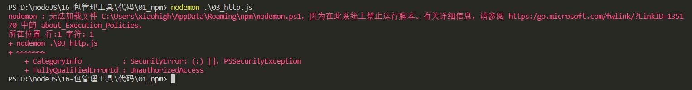
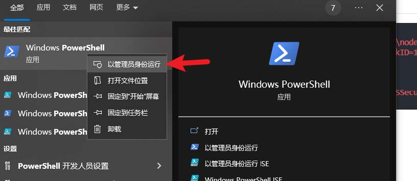
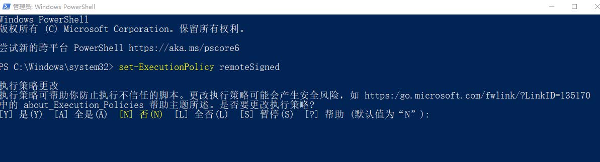
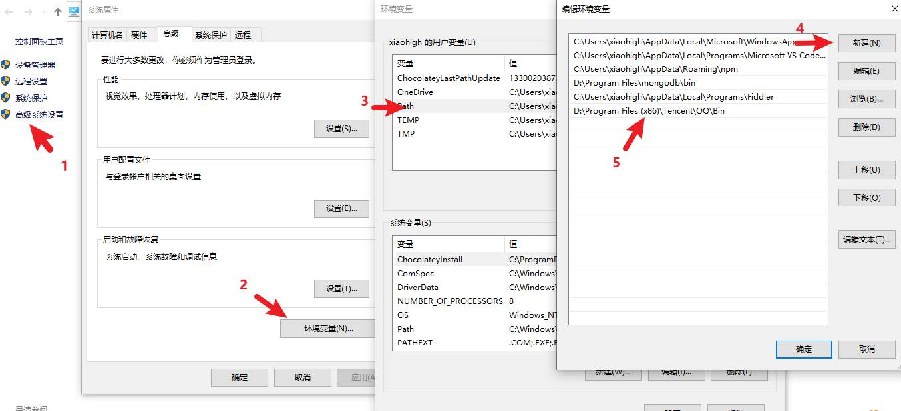

# 包管理工具

## 全局安装

我们可以执行安装选项 -g 进行全局安装

```node
npm i -g nodemon
```

全局安装完成之后就可以在命令行的任何位置运行 <font color=red>nodemon</font> 命令

该命令的作用是 <font color=red>自动重启 node 应用程序</font>

> 说明：
> + 全局安装的命令不受工作目录位置影响
> + 可以通过 <font color=red>npm root -g</font> 查看全局安装包的位置
> + <font color=red>不是所有的包都适合全局安装</font>，只有全局类的工具才适合，可以通过 <font color=red>查看包的官方文档来确定安装方式</font>，这里先不必太纠结。

## 修改 windows 执行策略



windows 默认不允许 npm 全局命令执行脚本文件，所以需要修改执行策略

1. 以管理员身份打开 powershell 命令行



2. 键入命令 set-ExecutionPolicy remoteSigned



3. 键入 A 然后敲回车 👌

4. 如果不生效，可以尝试重启 vscode

## 环境变量 Path

Path 是操作系统的一个环境变量，可以设置一些文件夹的路径，在当前工作目录下找不到可执行文件时，就会在环境变量 Path 的目录中挨个的查找，如果找到则执行，如果没有找到就会报错



> &nbsp;
> 补充说明：
> + 如果希望某个程序在任何工作目录下都能正常运行，就应该将该程序的所在目录配置到环境
变量 Path 中
> + windows 下查找命令的所在位置
>   + <font color=red>cmd</font> 命令行中执行 <font color=red>where nodemon</font>
>   + <font color=red>powershell</font>命令行执行 <font color=red>get-command nodemon</font>
> &nbsp;

## cnpm

### 介绍

cnpm 是一个淘宝构建的 npmjs.com 的完整镜像，也称为『淘宝镜像』，网址[https://npmmirror.com/](https://npmmirror.com/)

cnpm 服务部署在国内阿里云服务器上， 可以提高包的下载速度

官方也提供了一个全局工具包 cnpm ，操作命令与 npm 大体相同

### 安装

我们可以通过 npm 来安装 cnpm 工具

```node
npm install -g cnpm --registry=https://registry.npmmirror.com
```

### 操作命令

功能|命令
---|---
初始化|cnpm init
安装包|cnpm i uniq<br>cnpm i -S uniq<br>cnpm i -D uniq<br>cnpm i -g nodemon
安装项目依赖|cnpm i
删除|cnpm r uniq

### npm 配置淘宝镜像

用 npm 也可以使用淘宝镜像，配置的方式有两种

- 直接配置
- 工具配置

#### 直接配置

执行如下命令即可完成配置

```node
npm config set registry https://registry.npmmirror.com/
```

#### 工具配置

使用 nrm 配置 npm 的镜像地址 npm registry manager

1. 安装 nrm

```node
npm i -g nrm
```

2. 修改镜像

```node
nrm use taobao
```

3. 检查是否配置成功（选做）

```node
npm config list
```

检查 registry 地址是否为 https://registry.npmmirror.com/ , 如果是则表明成功

> &nbsp;
> 补充说明：
> 1. 建议使用第二种方式进行镜像配置，因为后续修改起来会比较方便
> 2. 虽然 cnpm 可以提高速度，但是 npm 也可以通过淘宝镜像进行加速，所以 npm 的使用率还
是高于 cnpm
> &nbsp;

## yarn

### yarn 介绍

yarn 是由 Facebook 在 2016 年推出的新的 Javascript 包管理工具，官方网址： [https://yarnpkg.com/](https://yarnpkg.com/)

### yarn 特点

yarn 官方宣称的一些特点

- 速度超快：yarn 缓存了每个下载过的包，所以再次使用时无需重复下载。 同时利用并行下载以最大化资源利用率，因此安装速度更快
- 超级安全：在执行代码之前，yarn 会通过算法校验每个安装包的完整性
- 超级可靠：使用详细、简洁的锁文件格式和明确的安装算法，yarn 能够保证在不同系统上无差异的工作

### yarn 安装

我们可以使用 npm 安装 yarn

```node
npm i -g yarn
```

### yarn 常用命令

功能|命令
---|---
初始化|yarn init / yarn init -y
安装包|yarn add uniq 生产依赖<br>yarn add less --dev 开发依赖<br>yarn global add nodemon 全局安装
删除包|yarn remove uniq 删除项目依赖包<br>yarn global remove nodemon 全局删除包
安装项目依赖|yarn
运行命令别名|yarn <别名> #不需要添加 run

> &nbsp;
> 问题：
> - 这里有个小问题就是全局安装的包不可用 ，yarn 全局安装包的位置可以通过 <font color=red>yarn global bin</font> 来查看。
> 解决：
> - 可以配置 <font color=red>yarn global bin</font> 获取的路径到环境变量中，全局安装的命令就可以使用了。
> &nbsp;

### yarn 配置淘宝镜像

可以通过如下命令配置淘宝镜像

```node
yarn config set registry https://registry.npmmirror.com/
```

可以通过 <font color=red>yarn config list</font> 查看 <font color=red>yarn</font> 的配置项

## 管理发布包

### 创建与发布

我们可以将自己开发的工具包发布到 npm 服务上，方便自己和其他开发者使用，操作步骤如下：

1. 创建文件夹，并创建文件 index.js， 在文件中声明函数，使用 module.exports 暴露
2. npm 初始化工具包，package.json 填写包的信息 (包的名字是唯一的)
3. 注册账号 https://www.npmjs.com/signup
4. 激活账号 （ 一定要激活账号）
5. 修改为官方的官方镜像 (命令行中运行 nrm use npm )
6. 命令行下 npm login 填写相关用户信息
7. 命令行下npm publish 提交包 👌

### 更新包

后续可以对自己发布的包进行更新，操作步骤如下

1. 更新包中的代码
2. 测试代码是否可用
3. 修改 package.json 中的版本号
4. 发布更新

```node
npm publish
```

### 删除包

执行如下命令删除包

```node
npm unpublish --force
```

> &nbsp;
> 删除包需要满足一定的条件， https://docs.npmjs.com/policies/unpublish
> - 你是包的作者
> - 发布小于 24 小时
> - 大于 24 小时后，没有其他包依赖，并且每周小于 300 下载量，并且只有一个维护者
> &nbsp;

## 扩展内容

在很多语言中都有包管理工具，比如：

语言|包管理工具
---|---
PHP|composer
Python|pip
Java|maven
Go|go mod
JavaScript|npm/yarn/cnpm/other
Ruby|rubyGems

除了编程语言领域有包管理工具之外，操作系统层面也存在包管理工具，不过这个包指的是『<font color=red>软件包</font>』

操作系统|包管理工具|网址
---|---|---
Centos|yum|https://packages.debian.org/stable/
Ubuntu|apt|https://packages.ubuntu.com/
MacOS|homebrew|https://brew.sh/
Windows|chocolatey|https://chocolatey.org/

## nvm

### 介绍

nvm 全称 Node Version Manager 顾名思义它是用来管理 node 版本的工具，方便切换不同版本的 Node.js

### 使用

nvm 的使用非常简单，跟 npm 的使用方法类似

### 下载安装

首先下载 nvm ，下载地址：https://github.com/coreybutler/nvm-windows/releases

选择 nvm-setup.exe 下载即可

### 常用命令

命令|说明
---|---
nvm list avaliable|显示所有可以下载的 Node.js 版本
nvm list|显示已安装的版本
nvm install 18.12.1|安装18.12.1版本的 Node.js
nvm install latest|安装最新版本的 Node.js
nvm uninstall 18.12.1|删除某个版本的 Node.js
nvm use 18.12.1|切换 18.12.1 版本的 Node.js