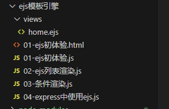

# express框架
## express 介绍

express 是一个基于 Node.js 平台的极简、灵活的 WEB 应用开发框架，官方网址： https://www.expressjs.com.cn/

简单来说，express 是一个封装好的工具包，封装了很多功能，便于我们开发 WEB 应用（HTTP 服务）

## express 初体验

大家可以按照这个步骤进行操作：

1. 创建 JS 文件，键入如下代码

```node
//1. 导入 express
const express = require('express');
//2. 创建应用对象
const app = express();
//3. 创建路由规则
app.get('/home', (req, res) => {
res.end('hello express server');
});
//4. 监听端口 启动服务
app.listen(3000, () =>{
console.log('服务已经启动, 端口监听为 3000...');
});
```

## express 路由

### 什么是路由

官方定义： <font color=red>路由确定了应用程序如何响应客户端对特定端点的请求</font>

### 路由的使用

一个路由的组成有<font color=red>请求方法</font>，<font color=red>路径</font>和<font color=red>回调函数</font>组成

express 中提供了一系列方法，可以很方便的使用路由，使用格式如下：

```node
app.<method>(path，callback)
```

代码示例：

```node
//导入 express
const express = require('express');
//创建应用对象
const app = express();
//创建 get 路由
app.get('/home', (req, res) => {
  res.send('网站首页');
});
//首页路由
app.get('/', (req,res) => {
  res.send('我才是真正的首页');
});
//创建 post 路由
app.post('/login', (req, res) => {
  res.send('登录成功');
});
//匹配所有的请求方法
app.all('/search', (req, res) => {
  res.send('1 秒钟为您找到相关结果约 100,000,000 个');
});
//自定义 404 路由
app.all("*", (req, res) => {
  res.send('<h1>404 Not Found</h1>')
});
//监听端口 启动服务
app.listen(3000, () =>{
  console.log('服务已经启动, 端口监听为 3000');
});
```

### 获取请求参数

express 框架封装了一些 API 来方便获取请求报文中的数据，并且兼容原生 HTTP 模块的获取方式

```node
// 导入 express
const express = require('express');
// 创建应用对象
const app = express();
// 获取请求的路由规则
app.get('/request', (request, response) => {
  // 1、获取报文的方式与原生 HTTP 获取方式是兼容的
  // 原生操作
  console.log(request.method);
  console.log(request.url);
  console.log(request.httpVersion);
  console.log(request.headers);
  // 2、express 独有的获取报文的方式
  // express 操作
  console.log(request.path);
  // 获取查询字符串
  console.log(request.query); // 『相对重要』
  // 获取 ip
  console.log(request.ip)
  // 获取指定的请求头
  console.log(request.get('host'));
  response.send('请求报文的获取');
});
// 启动服务
app.listen(3000, () => {
  console.log('启动成功....')
})
```

### 获取路由参数

路由参数指的是 <font color=red>URL 路径中的参数（数据）</font>

```node
app.get('/:id.html', (req, res) => {
  res.send('商品详情, 商品 id 为' + req.params.id);
});
```

## express 响应设置

express 框架封装了一些 API 来方便给客户端响应数据，并且兼容原生 HTTP 模块的获取方式

```node
// 1、导入 express
const express = require('express');

// 2、创建应用对象
const app = express();

// 3、创建路由
app.get('/response', (request, response) => {
  // 原生响应
  // response.statusCode = 404;
  // response.statusMessage = 'love';
  // response.setHeader('xxx', 'yyy');
  // response.write('hello express');
  // response.end('response');

  // express 响应
  // response.status(500);
  // response.set('aaa', 'bbb');
  // response.send('你好，express');

  //连贯操作
  // res.status(404).set('xxx','yyy').send('你好朋友')

  // 其他响应
  // response.redirect('https:www.baidu.com'); // 重定向
  // 下载响应
  // response.download(__dirname + '/package.json');
  // json响应
  // response.json({
  //   name: "孙悟空",
  //   age: 18
  // })
  // 响应文件内容
  response.sendFile(__dirname + '/package.json');
})

// 4、监听端口，启动服务
app.listen(3000, () => {
  console.log('服务已经启动，端口3000正在监听中。。。')
})
```

## express 中间件

### 什么是中间件

<font color=red>中间件（Middleware）本质是一个回调函数</font>

<font color=red>中间件函数</font>可以像路由回调一样访问<font color=red>请求对象（request）</font> ， <font color=red>响应对象（response）</font>

### 中间件的作用

<font color=red>中间件的作用</font>就是<font color=red>使用函数封装公共操作，简化代码</font>

### 中间件的类型

- 全局中间件
- 路由中间件

#### 1、定义全局中间件

<font color=red>每一个请求</font>到达服务端之后<font color=red>都会执行全局中间件函数</font>

声明中间件函数

```node
let recordMiddleware = function(request,response,next){
  //实现功能代码
  //.....
  //执行next函数(当如果希望执行完中间件函数之后，仍然继续执行路由中的回调函数，必须调用next)
  next();
}
```


应用中间件

```node
app.use(recordMiddleware);
```

声明时可以直接将匿名函数传递给 <font color=red>use</font>

```node
app.use(function (request, response, next) {
  console.log('定义第一个中间件');
  next();
})
```

完整代码

```node
// 1、导入 express
const express = require('express');
const fs = require('fs');
const path = require('path');

// 2、创建应用对象
const app = express();

// 声明中间件函数
function recordMiddleware(request, response, next) {
  // 获取url和ip
  const { url, ip } = request;
  // 将信息保存在文件中 access.log
  fs.appendFileSync(path.resolve(__dirname, './access.log'), `${url} ${ip}\r\n`);
  // 调用next()
  next();
}

// 使用中间件函数
app.use(recordMiddleware);

// 3、创建路由
app.get('/home', (request, response) => {
  response.send('前台首页');
})

app.get('/admin', (request, response) => {
  response.send('后台首页');
})

app.all('*', (request, response) => {
  response.send('<h1>404 Not Found</h1>');
})

// 4、监听端口，启动服务
app.listen(3000, () => {
  console.log('服务已经启动，端口3000正在监听中。。。')
})
```

#### 2、定义路由中间件

如果<font color=red>只需要对某一些路由进行功能封装</font>，则就需要路由中间件

```node
/**
 * 实现需求：
 *  针对/admin /setting 的请求，要求url携带code=521，否则提示暗号错误
 */
// 1、导入 express
const express = require('express');
const fs = require('fs');
const path = require('path');

// 2、创建应用对象
const app = express();

// 3、创建路由
app.get('/home', (request, response) => {
  response.send('前台首页');
})

// 声明中间件
let checkCodeMiddleware = (request, response, next) => {
  // 判断 url 中是否 code 参数为521
  if(request.query.code === '521') {
    next();
  }else {
    response.send('暗号错误');
  }
}

app.get('/admin', checkCodeMiddleware, (request, response) => {
  response.send('后台首页');
})

app.get('/setting', checkCodeMiddleware, (request, response) => {
  response.send('设置首页');
})

app.all('*', (request, response) => {
  response.send('<h1>404 Not Found</h1>');
})

// 4、监听端口，启动服务
app.listen(3000, () => {
  console.log('服务已经启动，端口3000正在监听中。。。')
})
```

### 静态资源中间件

express 内置处理静态资源的中间件

```node
// 1、导入 express
const express = require('express');

// 2、创建应用对象
const app = express();

// 静态资源中间件的设置，将当前文件夹下的public目录作为网站的根目录
app.use(express.static(__dirname + '/public'))

//如果访问的内容经常变化，还是需要设置路由
//但是，在这里有一个问题，如果public目录下有index.html文件，单独也有index.html的路由，
//则谁书写在前，优先执行谁

// 3、创建路由
app.get('/home', (request, response) => {
  response.send('前台首页');
})

// 4、监听端口，启动服务
app.listen(3000, () => {
  console.log('服务已经启动，端口3000正在监听中。。。')
})
```

> &nbsp;
> 注意事项：
> 1. index.html 文件为默认打开的资源(http://127.0.0.1:3000/ 默认查找index文件)
> 2. 如果静态资源与路由规则同时匹配，谁先匹配谁就响应
> 3. 路由响应动态资源，静态资源中间件响应静态资源
> &nbsp;

### 获取请求体数据 body-parser

express 可以使用 body-parser 包处理请求体

第一步：安装

```node
npm i body-parser
```

第二步：导入 body-parser 包

```node
const bodyParser = require('body-parser');
```

第三步：获取中间件函数

```node
//处理 querystring 格式的请求体
let urlParser = bodyParser.urlencoded({extended:false}));
//处理 JSON 格式的请求体
let jsonParser = bodyParser.json();
```

第四步：设置路由中间件，然后使用 request.body 来获取请求体数据

```node
/**
 * 按要求搭建 HTTP 服务
 *    GET /login 显示表单网页
 *    POST /login 获取表单中的 用户名 和 密码
 */

const express = require('express');
const bodyParser = require('body-parser');
const app = express();

// 解析 json 格式的请求体中间件
let jsonParser = bodyParser.json();
// 解析 querystring 格式请求体的中间件
let urlencodeParser = bodyParser.urlencoded({ extended: false })

// 创建路由规则
app.get('/login', (request, response) => {
  // 响应html文件内容
  response.sendFile(__dirname + '/login.html');
})

// 请求经过 urlencodeParser 中间件处理后会在 request 身上增加一个 body 属性
app.post('/login', urlencodeParser, (request, response) => {
  console.log(request.body.username) // [Object: null prototype] { username: '123', password: '111' }
  response.send('获取用户数据');
})

app.listen(3000, () => {
  console.log('server is running......')
})
```

## 路由模块化（Router）

### 什么是 Router

express 中的 Router 是一个完整的中间件和路由系统，可以看做是一个小型的 app 对象。

### Router 作用

对路由进行模块化，更好的管理路由

### Router 使用

创建独立的 JS 文件（homeRouter.js）

```node
//1. 导入 express
const express = require('express');
//2. 创建路由器对象
const router = express.Router();
//3. 在 router 对象身上添加路由
router.get('/', (req, res) => {
  res.send('首页');
})
router.get('/cart', (req, res) => {
  res.send('购物车');
});
//4. 暴露
module.exports = router;
```

主文件

```node
const express = require('express');
const app = express();
//5.引入子路由文件
const homeRouter = require('./routes/homeRouter');
//6.设置和使用中间件
app.use(homeRouter);
app.listen(3000,()=>{
  console.log('3000 端口启动....');
})
```

## EJS 模板引擎

### 什么是模板引擎

模板引擎是分离<font color=red>用户界面和业务数据</font>的一种技术

### 什么是 EJS

EJS 是一个高效的 Javascript 的模板引擎

- 官网：[https://ejs.co/](https://ejs.co/)
- 中文站：[https://ejs.bootcss.com/](https://ejs.bootcss.com/)

### EJS 初体验

下载安装EJS

```node
npm i ejs --save
```

### EJS 使用

创建模板文件

```html
<!DOCTYPE html>
<html lang="en">
  <head>
    <meta charset="UTF-8">
    <meta http-equiv="X-UA-Compatible" content="IE=edge">
    <meta name="viewport" content="width=device-width, initial-scale=1.0">
    <title>ejs模板引擎</title>
  </head>
  <body>
    <h1>我爱你，<%= china%></h1>
  </body>
</html>
```

主文件

```node
const ejs = require('ejs');
const fs = require('fs');

let china = '中国';
let str = fs.readFileSync('./01-ejs初体验.html').toString();

// 使用ejs渲染
let result = ejs.render(str, { china });
console.log(result)
```

### ejs 列表渲染

```node
const ejs = require('ejs');
const xiyou = ['唐僧', '孙悟空', '猪八戒', '沙和尚'];

let result = ejs.render(`<ul>
    <% xiyou.forEach(item => { %>
      <li><%= item %></li>
      <% }) %>
  </ul>`, { xiyou });
  
console.log(result);
```

### 条件渲染

```node
/**
 * 通过 isLogin 决定最终的输出内容
 *    true 输出 <span>欢迎回来</span>
 *    false 输出 <button>登录</button> <button>注册</button>
 */

const ejs = require('ejs');

let isLogin = false;

let result = ejs.render(`
    <% if (isLogin) { %>
      <span>欢迎回来</span>
    <% }else { %>
      <button>登录</button> <button>注册</button>
      <% } %>
  `, { isLogin });
  
  console.log(result);
```

### express 中使用 ejs



home.ejs

```html
<!DOCTYPE html>
<html lang="en">
  <head>
    <meta charset="UTF-8">
    <meta http-equiv="X-UA-Compatible" content="IE=edge">
    <meta name="viewport" content="width=device-width, initial-scale=1.0">
    <title>express中使用ejs</title>
  </head>
  <body>
    <h1><%= title %></h1>
  </body>
</html>
```

主文件

```node
const express = require('express');
const fs = require('fs');
const path = require('path');

// 创建应用对象
const app = express();

// 设置模板引擎
app.set('view engine', 'ejs');
// 设置模板文件存放位置  模板文件：具有模板语法内容的文件
app.set('views', path.resolve(__dirname, './views'));

app.get('/home', (request, response) => {
  let title = '尚硅谷，让天下没有难学的技术';
  response.render('home', { title });
})

// 监听端口，启动服务
app.listen(3000, () => {
  console.log('服务已经启动，端口3000正在监听中。。。')
})
```

## 文件上传

参考代码见：[code/express-generator-demo](code/express-generator-demo)

```node
var express = require('express');
var router = express.Router();
var { formidable } = require('formidable');
var path = require('path')

/* GET home page. */
router.get('/', function(req, res, next) {
  res.render('index', { title: 'Express' });
});

router.get('/portrait', (req, res, next) => {
  res.render('portrait');
})

router.post('/portrait', (req, res, next) => {
  const form = formidable({
    multiples: true,
    // 设置上传文件的保存目录
    uploadDir: path.resolve(__dirname, '../public/images'),
    // 保持文件后缀
    keepExtensions: true
  });

  form.parse(req, (err, fields, files) => {
    if (err) {
      next(err);
      return;
    }
    console.log(files.portrait[0].newFilename);
    // 服务器保存该图片的访问 url
    let url = '/images/' + files.portrait[0].newFilename;
    res.send(url);
  });
})

module.exports = router;
```

## express 脚手架（express-generator）

### express-generator 介绍

网址：[https://www.expressjs.com.cn/starter/generator.html](https://www.expressjs.com.cn/starter/generator.html)

### 全局安装

```node
npm install -g express-generator
```

### 创建项目

```node
express -e <项目名>
```


