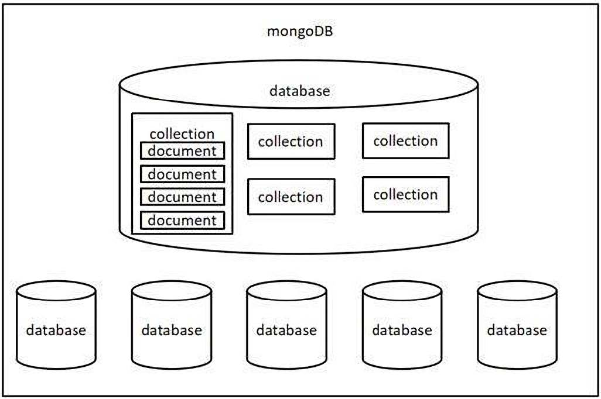
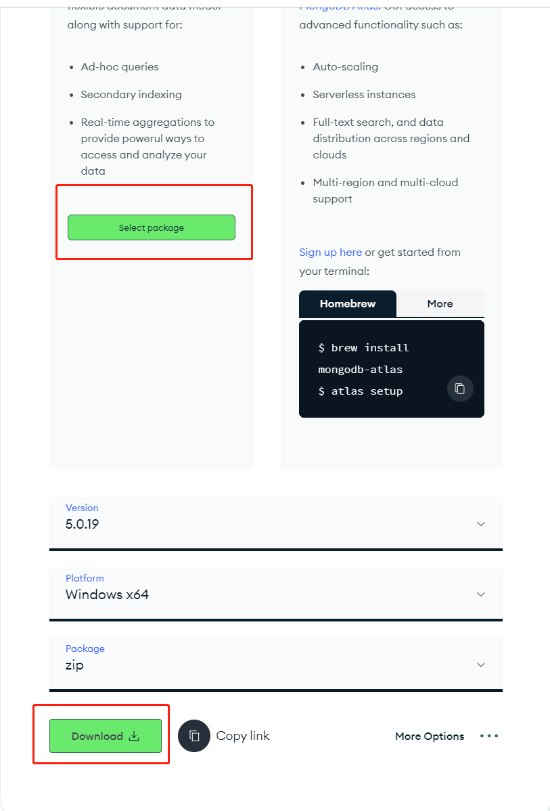
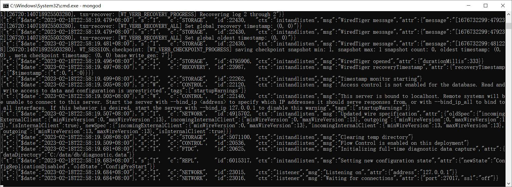
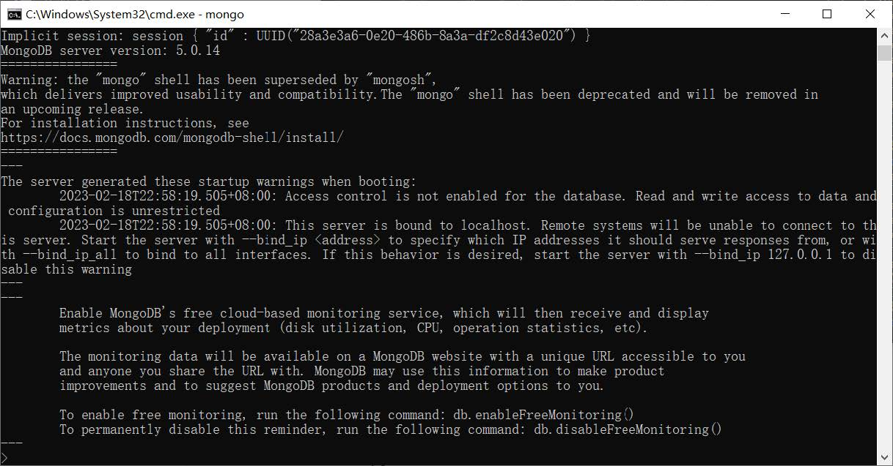
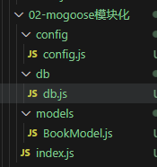

# mongodb数据库

## 一、简介

### 1.1 Mongodb 是什么

MongoDB 是一个基于分布式文件存储的数据库，官方地址：[https://www.mongodb.com/](https://www.mongodb.com/)

### 1.2 数据库是什么

数据库（DataBase）是按照数据结构来组织、存储和管理数据的<font color=red>应用程序</font>

### 1.3 数据库的作用

数据库的主要作用就是<font color=red>管理数据</font>，对数据进行<font color=red>增（c）、删（d）、改（u）、查（r）</font>

### 1.4 数据库管理数据的特点

相比于纯文件管理数据，数据库管理数据有如下特点：

1. 速度更快
2. 扩展性更强
3. 安全性更强

### 1.5 为什么选择 Mongodb

操作语法与 JavaScript 类似，容易上手，学习成本低

## 二、核心概念

Mongodb 中有三个重要概念需要掌握

- 数据库（database） 数据库是一个数据仓库，数据库服务下可以创建很多数据库，数据库中可以存放很多集合
- 集合（collection） 集合类似于 JS 中的数组，在集合中可以存放很多文档
- 文档（document） 文档是数据库中的最小单位，类似于 JS 中的对象



JSON 文件示例：

```json
{
  "accounts": [
    {
      "id": "3-YLju5f3",
      "title": "买电脑",
      "time": "2023-02-08",
      "type": "-1",
      "account": "5500",
      "remarks": "为了上网课"
    },
    {
      "id": "3-YLju5f4",
      "title": "请女朋友吃饭",
      "time": "2023-02-08",
      "type": "-1",
      "account": "214",
      "remarks": "情人节聚餐"
    },
    {
      "id": "mRQiD4s3K",
      "title": "发工资",
      "time": "2023-02-19",
      "type": "1",
      "account": "4396",
      "remarks": "终于发工资啦!~~"
    }
  ],
    "users": [
      {
        "id": 1,
        "name": "zhangsan",
        "age": 18
      },
      {
        "id": 2,
        "name": "lisi",
        "age": 20
      },
      {
        "id": 3,
        "name": "wangwu",
        "age": 22
      }
    ]
}
```

大家可以通过 JSON 文件来理解 Mongodb 中的概念

- 一个 <font color=red>JSON 文件</font>好比是一个<font color=red>数据库</font>，一个 Mongodb 服务下可以有 N 个数据库
- JSON 文件中的<font color=red>一级属性的数组值</font>好比是<font color=red>集合</font>
- 数组中的对象好比是<font color=red>文档</font>
- 对象中的属性有时也称之为<font color=red>字段</font>

> &nbsp;
> 一般情况下
> - 一个项目使用一个数据库
> - 一个集合会存储同一种类型的数据
> &nbsp;

## 三、下载安装与启动

下载地址：[https://www.mongodb.com/try/download/community](https://www.mongodb.com/try/download/community)

建议选择 <font color=red>zip</font> 类型， 通用性更强



配置步骤如下:

- 1、将压缩包移动到 <font color=red>C:\Program Files</font> 下，然后解压
- 2、创建<font color=red>C:\data\db</font> 目录，mongodb 会将数据默认保存在这个文件夹
- 3、以 mongodb 中 bin 目录作为工作目录，启动命令行
- 4、运行命令 <font color=red>mongod</font>



看到最后的 <font color=red>waiting for connections</font> 则表明服务已经<font color=red>启动成功</font>

然后可以使用 mongo 命令连接本机的 mongodb 服务



> &nbsp;
> 注意：
> - 为了方便后续方便使用 mongod 命令，可以将 bin 目录配置到环境变量 Path 中
> - <font color=red>千万不要选中服务端窗口的内容</font>，选中会停止服务，可以<font color=red>敲回车</font>取消选中
> &nbsp;

## 四、命令行交互

命令行交互一般是学习数据库的第一步，不过这些命令在后续用的比较少，所以大家了解即可

### 4.1 数据库命令

显示所有的数据库

```js
show dbs
```

切换到指定的数据库，如果数据库不存在会自动创建数据库

```js
use 数据库名
```

显示当前所在的数据库

```js
db
```

删除当前数据库

```js
use 库名
db.dropDatabase()
```

### 4.2 集合命令

创建集合

```js
db.createCollection('集合名称')
```

显示当前数据库中的所有集合

```js
show collections
```

删除某个集合

```js
db.集合名.drop()
```

重命名集合

```js
db.集合名.renameCollection('newName')
```

### 4.3 文档命令

插入文档

```js
db.集合名.insert(文档对象);
```

查询文档

```js
db.集合名.find(查询条件)
```

<font color=red>_id 是 mongodb 自动生成的唯一编号，用来唯一标识文档</font>

更新文档

```js
db.集合名.update(查询条件,新的文档)
db.集合名.update({name:'张三'},{$set:{age:19}})
```

删除文档

```js
db.集合名.remove(查询条件)
```

## 五、Mongoose

### 5.1 介绍

Mongoose 是一个对象文档模型库，官网 [http://www.mongoosejs.net/](http://www.mongoosejs.net/)

### 5.2 作用

方便使用代码操作 mongodb 数据库

### 5.3 使用流程

```node
// 1、导入 mongoose(mongoose 版本6)
const mongoose = require('mongoose');

mongoose.set('strictQuery', false); // 去掉6版本的警告

// 2、连接 mongodb 服务
mongoose.connect('mongodb://127.0.0.1:27017/bilibili');

// 3、设置回调
mongoose.connection.once('open', () => {
  console.log('连接成功');
}); // 设置连接成功的回调
mongoose.connection.on('error', () => {
  console.log('连接失败')
}); // 设置连接错误的回调
mongoose.connection.on('close', () => {
  console.log('连接关闭')
}); // 设置连接关闭的回调

// 关闭 mongodb 的连接
setTimeout(() => {
  mongoose.disconnect();
}, 2000)
```

### 5.4 字段类型

文档结构可选的常用字段类型列表

类型|描述
---|---
String|字符串
Number|数字
Boolean|布尔值
Array|数组，也可以使用[]来标识
Date|日期
Buffer|Buffer对象
Mixed|任意类型，需要使用 <font color=red>mongoose.Schema.Types.Mixed</font> 指定
ObjectId|对象id，需要使用 <font color=red>mongoose.Schema.Types.ObjectId</font> 指定
Decimal128|高精度数字，需要使用 <font color=red>mongoose.Schema.Types.Decimal128</font> 指定

### 5.5 字段值验证

Mongoose 有一些内建验证器，可以对字段值进行验证

#### 5.5.1 必填项

```node
title: {
  type: String,
  required: true // 设置必填项
},
```

#### 5.5.2 默认值

```node
author: {
  type: String,
  default: '匿名' //默认值
},
```

#### 5.5.3 枚举值

```node
gender: {
  type: String,
  enum: ['男','女'] //设置的值必须是数组中的
},
```

#### 5.5.4 唯一值

```node
username: {
  type: String,
  unique: true
},
```
> &nbsp;
> <font color=red>unique</font> 需要重建集合才能有效果(在已有集合中插入相同key的文档，不会触发 <font color=red>unique</font> 校验)
> 永远不要相信用户的输入
> &nbsp;

### 5.6 CURD

新建集合 novels

```node
//1. 安装 mongoose
//2. 导入 mongoose
const mongoose = require('mongoose');

//设置 strictQuery 为 true
mongoose.set('strictQuery', true);

//3. 连接 mongodb 服务                        数据库的名称
mongoose.connect('mongodb://127.0.0.1:27017/bilibili');

//4. 设置回调
// 设置连接成功的回调  once 一次   事件回调函数只执行一次
mongoose.connection.once('open', () => {
  //5. 创建文档的结构对象
  //设置集合中文档的属性以及属性值的类型
  let BookSchema = new mongoose.Schema({
    name: String,
    author: String,
    price: Number,
    is_hot: Boolean
  });

  //6. 创建模型对象  对文档操作的封装对象（mongoose 会使用集合名称的复数创建集合）
  let BookModel = mongoose.model('novel', BookSchema);

  //7. 新增
  BookModel.insertMany([{
    name: '西游记',
    author: '吴承恩',
    price: 19.9,
    is_hot: true
  }, {
    name: '红楼梦',
    author: '曹雪芹',
    price: 29.9,
    is_hot: true
  }, {
    name: '三国演义',
    author: '罗贯中',
    price: 25.9,
    is_hot: true
  }, {
    name: '水浒传',
    author: '施耐庵',
    price: 20.9,
    is_hot: true
  }, {
    name: '活着',
    author: '余华',
    price: 19.9,
    is_hot: true
  }, {
    name: '狂飙',
    author: '徐纪周',
    price: 68,
    is_hot: true
  }, {
    name: '大魏能臣',
    author: '黑男爵',
    price: 9.9,
    is_hot: false
  },
  {
    name: '知北游',
    author: '洛水',
    price: 59,
    is_hot: false
  },{
    name: '道君',
    author: '跃千愁',
    price: 59,
    is_hot: false
  },{
    name: '七煞碑',
    author: '游泳的猫',
    price: 29,
    is_hot: false
  },{
    name: '独游',
    author: '酒精过敏',
    price: 15,
    is_hot: false
  },{
    name: '大泼猴',
    author: '甲鱼不是龟',
    price: 26,
    is_hot: false
  },
  {
    name: '黑暗王者',
    author: '古羲',
    price: 39,
    is_hot: false
  },
  {
    name: '不二大道',
    author: '文刀手予',
    price: 89,
    is_hot: false
  },
  {
    name: '大泼猴',
    author: '甲鱼不是龟',
    price: 59,
    is_hot: false
  },
  {
    name: '长安的荔枝',
    author: '马伯庸',
    price: 45,
    is_hot: true
  },
  {
    name: '命运',
    author: '蔡崇达',
    price: 59.8,
    is_hot: true
  },
  {
    name: '如雪如山',
    author: '张天翼',
    price: 58,
    is_hot: true
  },
  {
    name: '三体',
    author: '刘慈欣',
    price: 23,
    is_hot: true
  },
  {
    name: '秋园',
    author: '杨本芬',
    price: 38,
    is_hot: true
  },
  {
    name: '百年孤独',
    author: '范晔',
    price: 39.5,
    is_hot: true
  },
  {
    name: '在细雨中呼喊',
    author: '余华',
    price: 25,
    is_hot: true
  },], (err, data) => {
    //判断是否有错误
    if (err) {
      console.log(err);
      return;
    }
    //如果没有出错, 则输出插入后的文档对象
    console.log(data);
    //8. 关闭数据库连接 (项目运行过程中, 不会添加该代码)
    mongoose.disconnect();
  });

});

// 设置连接错误的回调
mongoose.connection.on('error', () => {
  console.log('连接失败');
});

//设置连接关闭的回调
mongoose.connection.on('close', () => {
  console.log('连接关闭');
});
```

#### 5.6.1 新增

```node
// 1、导入 mongoose(mongoose 版本6)
const mongoose = require('mongoose');

mongoose.set('strictQuery', false);

// 2、连接 mongodb 服务
mongoose.connect('mongodb://127.0.0.1:27017/bilibili');

// 3、设置回调
mongoose.connection.once('open', () => {
  console.log('连接成功');
  // 4、创建文档的结构对象
  // 设置集合中文档的属性以及属性值的类型
  let BookSchema = new mongoose.Schema({
    name: String,
    author: String,
    price: Number
  });
  // 5、创建模型对象，对文档操作的封装对象
  let BookModel = mongoose.model('books', BookSchema);
  // 6、新增
  BookModel.create({name: '西游记', author: '吴承恩', price: 99}, (err, data) => {
    // 判断是否有错误
    if (err) {
      console.log(err);
      return
    }
    // 如果没有出错，则输出插入后的文档对象
    console.log(data);
    // 7、关闭数据库连接(项目运行过程中，不会添加该代码)
    mongoose.disconnect();
  });
}); // 设置连接成功的回调
mongoose.connection.on('error', () => {
  console.log('连接失败')
}); // 设置连接错误的回调
mongoose.connection.on('close', () => {
  console.log('连接关闭')
}); // 设置连接关闭的回调
```

#### 5.6.2 删除

```node
// 1、导入 mongoose(mongoose 版本6)
const mongoose = require('mongoose');

mongoose.set('strictQuery', false);

// 2、连接 mongodb 服务
mongoose.connect('mongodb://127.0.0.1:27017/bilibili');

// 3、设置回调
mongoose.connection.once('open', () => {
  console.log('连接成功');
  // 4、创建文档的结构对象
  // 设置集合中文档的属性以及属性值的类型
  let BookSchema = new mongoose.Schema({
    name: String,
    author: String,
    price: Number,
    is_hot: Boolean
  });
  // 5、创建模型对象，对文档操作的封装对象（mongoose 会使用集合名称的复数创建集合）
  let BookModel = mongoose.model('novel', BookSchema);
  // 6、删除一条
  // BookModel.deleteOne({_id:'64ba32a2c2b336aa5a5f293c'}, (err, data) => {
  //   // 判断
  //   if (err) {
  //     console.log('删除失败');
  //     return
  //   }
  //   console.log(data);
  // })
  // 6、批量删除
  BookModel.deleteMany({is_hot: false}, (err, data) => {
    // 判断
    if (err) {
      console.log('删除失败');
      return
    }
    console.log(data);
  })
}); // 设置连接成功的回调
mongoose.connection.on('error', () => {
  console.log('连接失败')
}); // 设置连接错误的回调
mongoose.connection.on('close', () => {
  console.log('连接关闭')
}); // 设置连接关闭的回调
```

#### 5.6.3 更新

```node
// 1、导入 mongoose(mongoose 版本6)
const mongoose = require('mongoose');

mongoose.set('strictQuery', false);

// 2、连接 mongodb 服务
mongoose.connect('mongodb://127.0.0.1:27017/bilibili');

// 3、设置回调
mongoose.connection.once('open', () => {
  console.log('连接成功');
  // 4、创建文档的结构对象
  // 设置集合中文档的属性以及属性值的类型
  let BookSchema = new mongoose.Schema({
    name: String,
    author: String,
    price: Number,
    is_hot: Boolean
  });
  // 5、创建模型对象，对文档操作的封装对象（mongoose 会使用集合名称的复数创建集合）
  let BookModel = mongoose.model('novel', BookSchema);
  // 6、更新文档，更新一条
  // BookModel.updateOne({name: '红楼梦'}, {price: 9.9}, (err, data) => {
  //   // 判断
  //   if (err) {
  //     console.log('更新失败');
  //     return
  //   }
  //   console.log(data);
  // })
  // 6、批量更新
  BookModel.updateMany({author: '余华'}, {is_hot: false}, (err, data) => {
    // 判断
    if (err) {
      console.log('更新失败');
      return
    }
    console.log(data);
  })
  
}); // 设置连接成功的回调
mongoose.connection.on('error', () => {
  console.log('连接失败')
}); // 设置连接错误的回调
mongoose.connection.on('close', () => {
  console.log('连接关闭')
}); // 设置连接关闭的回调
```

#### 5.6.3 读取

```node
// 1、导入 mongoose(mongoose 版本6)
const mongoose = require('mongoose');

mongoose.set('strictQuery', false);

// 2、连接 mongodb 服务
mongoose.connect('mongodb://127.0.0.1:27017/bilibili');

// 3、设置回调
mongoose.connection.once('open', () => {
  console.log('连接成功');
  // 4、创建文档的结构对象
  // 设置集合中文档的属性以及属性值的类型
  let BookSchema = new mongoose.Schema({
    name: String,
    author: String,
    price: Number,
    is_hot: Boolean
  });
  // 5、创建模型对象，对文档操作的封装对象（mongoose 会使用集合名称的复数创建集合）
  let BookModel = mongoose.model('novel', BookSchema);
  // 6、读取文档，读取一条
  // BookModel.findOne({name: '狂飙'}, (err, data) => {
  //   // 判断
  //   if (err) {
  //     console.log('读取失败');
  //     return
  //   }
  //   console.log(data);
  // })
  // 6、根据 id 获取文档
  // BookModel.findById('64ba32a2c2b336aa5a5f2941', (err, data) => {
  //   // 判断
  //   if (err) {
  //     console.log('读取失败');
  //     return
  //   }
  //   console.log(data);
  // })
  // 6、批量获取（有条件）
  // BookModel.find({author: '余华'}, (err, data) => {
  //   // 判断
  //   if (err) {
  //     console.log('读取失败');
  //     return
  //   }
  //   console.log(data);
  // })
  // 6、批量获取（无条件）
  BookModel.find((err, data) => {
    // 判断
    if (err) {
      console.log('读取失败');
      return
    }
    console.log(data);
  })
  
}); // 设置连接成功的回调
mongoose.connection.on('error', () => {
  console.log('连接失败')
}); // 设置连接错误的回调
mongoose.connection.on('close', () => {
  console.log('连接关闭')
}); // 设置连接关闭的回调
```

### 5.7 条件控制

#### 5.7.1 运算符

在 mongodb 不能 > < >= <= !== 等运算符，需要使用替代符号

- <font color=red>\></font> 使用 <font color=red>$gt</font>
- <font color=red>\<</font> 使用 <font color=red>$lt</font>
- <font color=red>\>=</font> 使用 <font color=red>$gte</font>
- <font color=red>\<=</font> 使用 <font color=red>$lte</font>
- <font color=red>!==</font> 使用 <font color=red>$ne</font>

```node
db.students.find({id:{$gt:3}}); // id号比3大的所有的记录
```

#### 5.7.2 逻辑运算

<font color=red>$or</font> 逻辑或的情况

```node
db.students.find({$or:[{age:18},{age:24}]});
```

<font color=red>$and</font> 逻辑与的情况

```node
db.students.find({$and: [{age: {$lt:20}}, {age: {$gt: 15}}]});
```

#### 5.7.3 正则匹配

条件中可以直接使用 JS 的正则语法，通过正则可以进行模糊查询

```node
db.students.find({name:/imissyou/});
```

### 5.8 个性化读取

#### 字段筛选、数据排序、数据截取

```node
// 1、导入 mongoose(mongoose 版本6)
const mongoose = require('mongoose');

mongoose.set('strictQuery', false);

// 2、连接 mongodb 服务
mongoose.connect('mongodb://127.0.0.1:27017/bilibili');

// 3、设置回调
mongoose.connection.once('open', () => {
  console.log('连接成功');
  // 4、创建文档的结构对象
  // 设置集合中文档的属性以及属性值的类型
  let BookSchema = new mongoose.Schema({
    name: String,
    author: String,
    price: Number,
    is_hot: Boolean
  });
  // 5、创建模型对象，对文档操作的封装对象（mongoose 会使用集合名称的复数创建集合）
  let BookModel = mongoose.model('novel', BookSchema);
  // 6、字段筛选
  // 设置字段 1：需要读取的字段 0：不需要读取的字段
  // BookModel.find().select({name: 1, author: 1, _id: 0}).exec((err, data) => {
  //   // 判断
  //   if (err) {
  //     console.log('读取失败');
  //     return
  //   }
  //   console.log(data);
  // })
  // 6、数据排序 1：升序  0：降序
  // BookModel.find().select({name: 1, author: 1,price: 1, _id: 0}).sort({price: 1}).exec((err, data) => {
  //   // 判断
  //   if (err) {
  //     console.log('读取失败');
  //     return
  //   }
  //   console.log(data);
  // })
  // 6、数据截取
  // skip 跳过 limit 限定
  // 按照价格升序排序，取出4-6名排名
  BookModel.find().select({name: 1, author: 1,price: 1, _id: 0}).sort({price: 1}).skip(3).limit(3).exec((err, data) => {
    // 判断
    if (err) {
      console.log('读取失败');
      return
    }
    console.log(data);
  })
}); // 设置连接成功的回调
mongoose.connection.on('error', () => {
  console.log('连接失败')
}); // 设置连接错误的回调
mongoose.connection.on('close', () => {
  console.log('连接关闭')
}); // 设置连接关闭的回调
```

### 5.9 mongoose 模块化



代码参考：code/mongoose-demo/02-mongoose模块化

## 六、 图形化管理工具

我们可以使用图形化的管理工具来对 Mongodb 进行交互，这里演示两个图形化工具

- Robo 3T 免费 https://github.com/Studio3T/robomongo/releases
- Navicat 收费 https://www.navicat.com.cn/