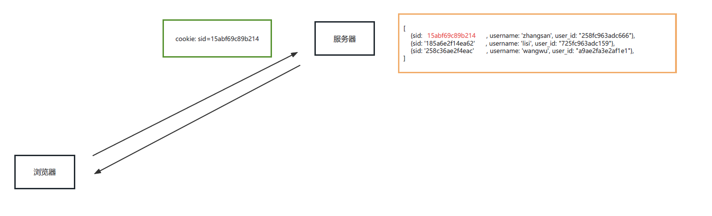
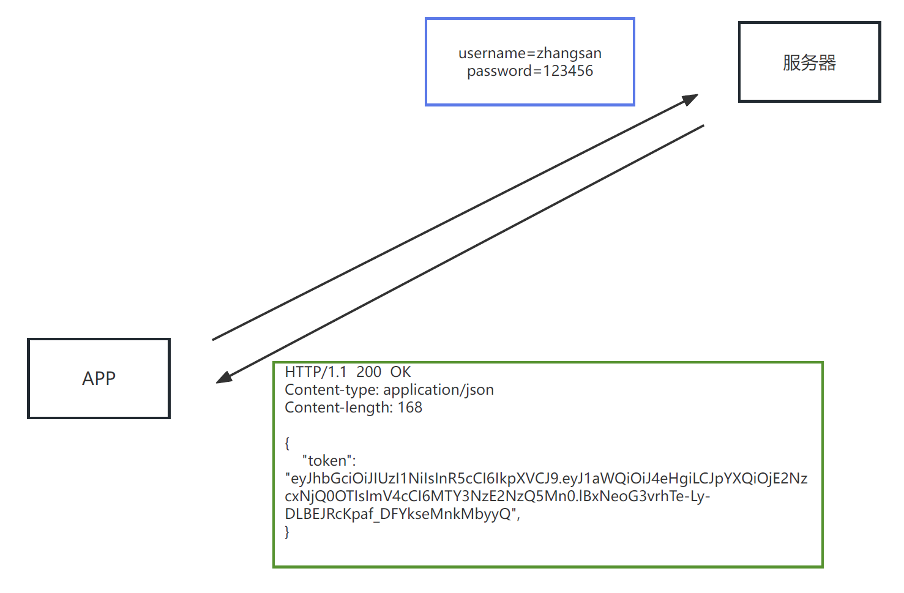

# 会话控制

## 一、介绍

所谓会话控制就是<font color=red>对会话进行控制</font>

HTTP 是一种无状态的协议，它没有办法区分多次的请求是否来自于同一个客户端，<font color=red>无法区分用户</font>

而产品中又大量存在的这样的需求，所以我们需要通过<font color=red>会话控制</font>来解决该问题

常见的会话控制技术有三种：

- cookie
- session
- token

## 二、cookie

### 2.1 cookie 是什么

cookie 是 HTTP 服务器发送到用户浏览器并保存在本地的一小块数据

<font color=red>cookie 是保存在浏览器端的一小块数据</font>

<font color=red>cookie 是按照域名划分保存的</font>

简单示例：

域名|cookie
---|---
www.baidu.com|a=100; b=200
www.bilibili.com|xid=1020abce121;hm=112411213
jd.com|x=100;ocw=12414cce

### 2.2 cookie 的特点

浏览器向服务器发送请求时，会自动将<font color=red>当前域名下</font>可用的 cookie 设置在请求头中，然后传递给服务器

这个请求头的名字也叫 <font color=red>cookie</font> ，所以将 <font color=red>cookie 理解为一个 HTTP 的请求头也是可以的</font>

### 2.3 cookie 的运行流程

填写账号和密码校验身份，校验通过后下发 cookie


有了 cookie 之后，后续向服务器发送请求时，就会自动携带 cookie


### 2.4 浏览器操作 cookie

1. 禁用所有 cookie
2. 删除 cookie
3. 查看 cookie

### 2.5 express 中操作 cookie

```node
const express = require('express');
const cookieParser = require('cookie-parser');

const app = express();
app.use(cookieParser());

// 设置cookie
app.get('/set-cookie', (req, res) => {
  res.cookie('name', 'zhangsan'); // 设置cookie 会在浏览器关闭的时候销毁
  // res.cookie('name', 'rose', { maxAge: 60*1000 }); // 设置cookie失效时间
  res.send('set-cookie')
})

// 删除cookie
app.get('/remove-cookie', (req, res) => {
  res.clearCookie('name'); // 移除 cookie 中的 name 属性
  res.send('remove-cookie')
})

// 读取cookie（通过cookie-parser中间件）
app.get('/get-cookie', (req, res) => {
  console.log(req.cookies); // 读取 cookie 中的 name 属性
  res.send('get-cookie')
})

app.listen(3000)
```

## 三、session

### 3.1 session 是什么

session 是保存在<font color=red>服务器端的一块儿数据</font>，保存当前访问用户的相关信息

### 3.2 session 的作用

实现会话控制，可以识别用户的身份，快速获取当前用户的相关信息

### 3.3 session 运行流程

填写账号和密码校验身份，校验通过后创建 <font color=red>session 信息</font>，然后将 <font color=red>session_id</font> 的值通过响应头返回给浏览器


有了 cookie，下次发送请求时会自动携带 cookie，服务器通过 <font color=red>cookie</font> 中的 <font color=red>session_id</font> 的值确定用户的身份



### 3.4 session 的代码操作

```node
const express = require('express');
//1. 安装包 npm i express-session connect-mongo
//2. 引入 express-session connect-mongo
const session = require("express-session");
const MongoStore = require('connect-mongo');
const app = express();
//3. 设置 session 的中间件
app.use(session({
  name: 'sid', //设置cookie的name，默认值是：connect.sid
  secret: 'atguigu', //参与加密的字符串（又称签名）
  saveUninitialized: false, //是否为每次请求都设置一个cookie用来存储session的id
  resave: true, //是否在每次请求时重新保存session
  store: MongoStore.create({
    mongoUrl: 'mongodb://127.0.0.1:27017/project' //数据库的连接配置
  }),
  cookie: {
    httpOnly: true, // 开启后前端无法通过 JS 操作
    maxAge: 1000 * 300 // 这一条 是控制 sessionID 的过期时间的！！！
  },
}))
//创建 session
app.get('/login', (req, res) => {
  if (req.query.username === 'admin' && req.query.password === 'admin') {
    //设置session
    req.session.username = 'zhangsan';
    req.session.email = 'zhangsan@qq.com'
    res.send('登录成功');
  } else {
    res.send('登录失败')
  }
})
//获取 session
app.get('/home', (req, res) => {
  console.log('session的信息');
  console.log(req.session.username);
  if (req.session.username) {
    res.send(`你好 ${req.session.username}`);
  } else {
    res.send('登录 注册');
  }
})
//销毁 session
app.get('/logout', (req, res) => {
  //销毁session
  // res.send('设置session');
  req.session.destroy(() => {
    res.send('成功退出');
  });
});

app.listen(3000, () => {
  console.log('服务已经启动, 端口 ' + 3000 + ' 监听中...');
})
```

## 四、session 和 cookie 的区别

cookie 和 session 的区别主要有如下几点：

1. 存在的位置
    cookie：浏览器端
    session：服务端
2. 安全性
    cookie 是以明文的方式存放在客户端的，安全性相对较低
    session 存放于服务器中，所以安全性相对较好
3. 网络传输量
    cookie 设置内容过多会增大报文体积， 会影响传输效率
    session 数据存储在服务器，只是通过 cookie 传递 id，所以不影响传输效率
4. 存储限制
    浏览器限制单个 cookie 保存的数据不能超过4K ，且单个域名下的存储数量也有限制
    session 数据存储在服务器中，所以没有这些限制

## 五、token

### 5.1 token 是什么

<font color=red>token</font> 是服务端生成并返回给 HTTP 客户端的一串加密字符串， <font color=red>token</font> 中保存着<font color=red>用户信息</font>

### 5.2 token 的作用

实现会话控制，可以识别用户的身份，主要用于移动端 APP

### 5.3 token 的工作流程

填写账号和密码校验身份，校验通过后响应 token，token 一般是在响应体中返回给客户端的



后续发送请求时，需要手动将 token 添加在请求报文中，一般是放在请求头中


### 5.4 token 的特点

- 服务端压力更小
  - 数据存储在客户端
- 相对更安全
  - 数据加密
  - 可以避免 CSRF（跨站请求伪造）
- 扩展性更强
  - 服务间可以共享
  - 增加服务节点更简单

### 5.5 JWT

JWT（JSON Web Token ）是目前最流行的跨域认证解决方案，可用于基于 <font color=red>token</font> 的身份验证

JWT 使 token 的生成与校验更规范

我们可以使用 <font color=red>jsonwebtoken</font> 包 来操作 <font color=red>token</font>

```node
//导入 jsonwebtokan
const jwt = require('jsonwebtoken');
//创建 token
// let token = jwt.sign(数据, 加密字符串, 配置对象)
let token = jwt.sign({
  username: 'zhangsan'
}, 'atguigu', {
  expiresIn: 60 //生命周期，单位是 秒
})
//解析 token
jwt.verify(token, 'atguigu', (err, data) => {
  if(err){
    console.log('校验失败~~');
    return
  }
  console.log(data);
})
```