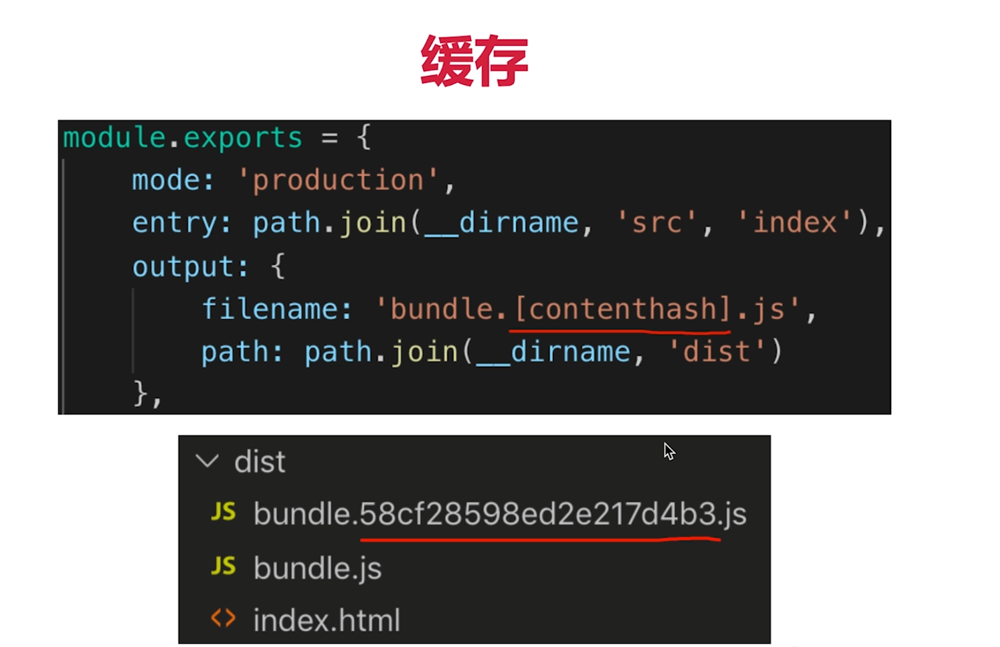
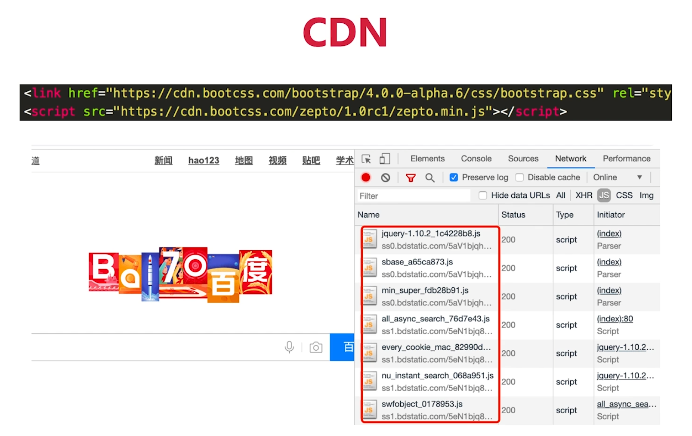
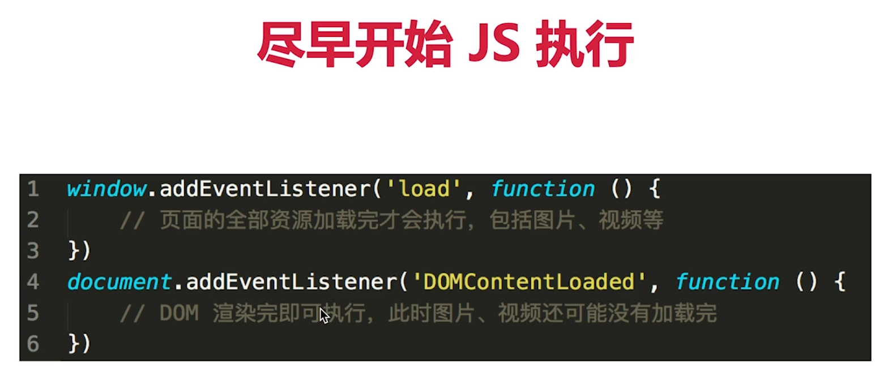
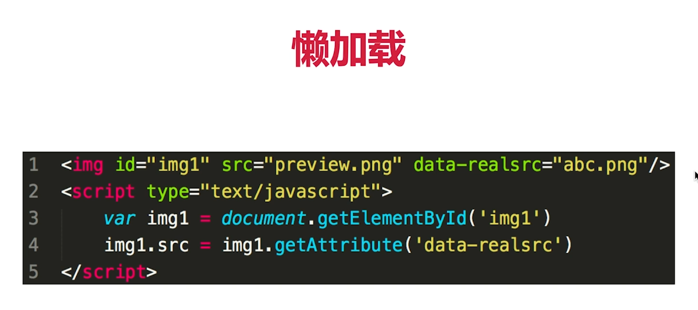
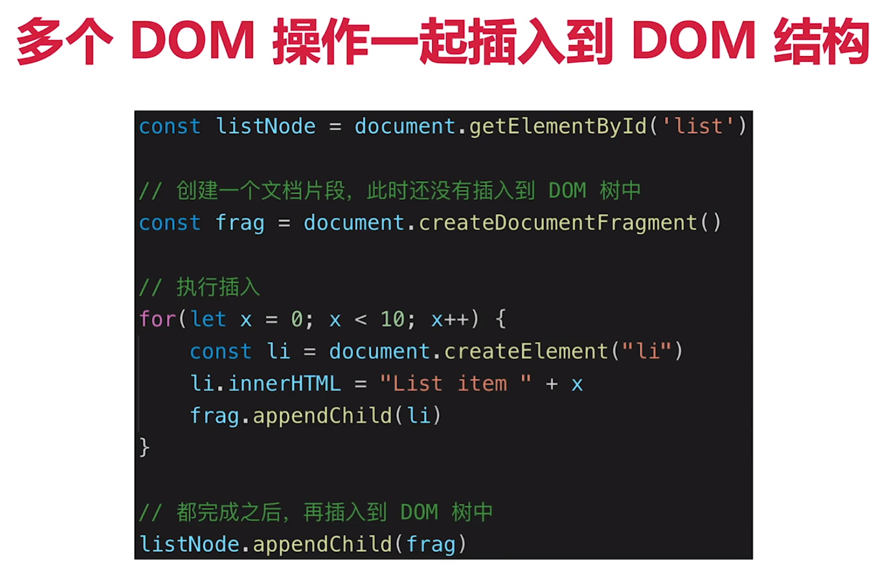

# 性能优化

##### 性能优化原则

- 多使用内存、缓存或其他方法

- 减少CPU计算量，减少网络加载耗时

- （适用所有变成的性能优化）空间换时间

##### 从何入手

- 让加载更快

- 让渲染更快

##### 让加载更快

1、减少加载体积：压缩代码（gzip）

2、减少访问次数：合并代码，SSR服务端渲染，缓存。

- 缓存 

静态资源加hash后缀，根据文件内容计算hash。文件内容不变，则hash不变，则url不变。url和文件不变，则会自动触发http缓存机制，返回304

- SSR服务端渲染

将网页和数据一起加载，一起渲染

非SSR（前后端分离）：先加载网页，再加载数据，再渲染数据

3、使用更快的网路：CDN

##### 让渲染更快

1、CSS放在header，JS放在body下面

2、尽早开始执行JS，用DOMContentLoaded触发

3、懒加载（图片懒加载、上滑加载更多）

4、对DOM查询进行缓存

5、频繁DOM操作，合并到一起插入DOM结构（虚拟DOM）

6、节流 throttle 防抖 debounce

