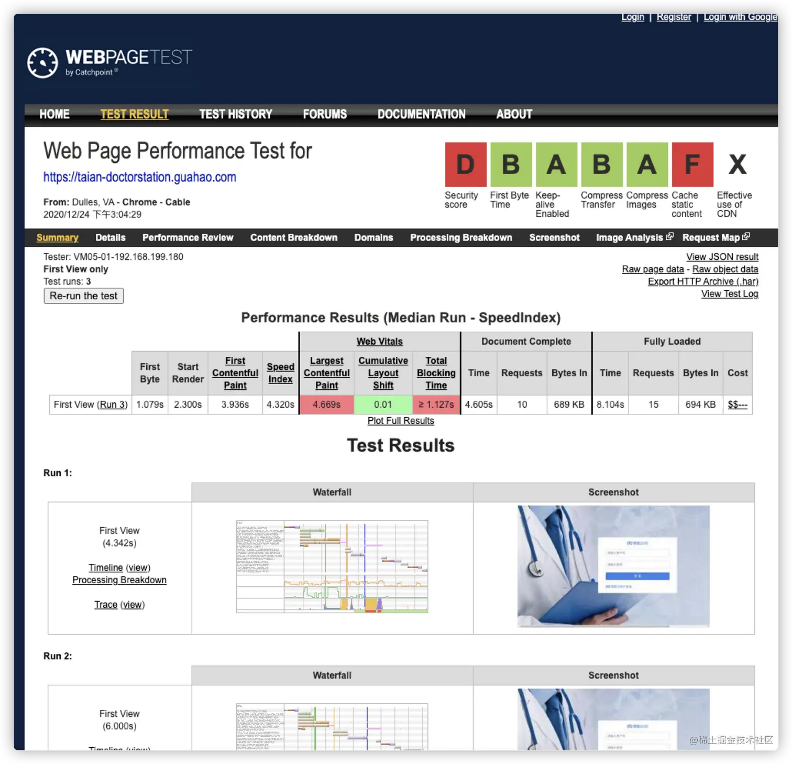
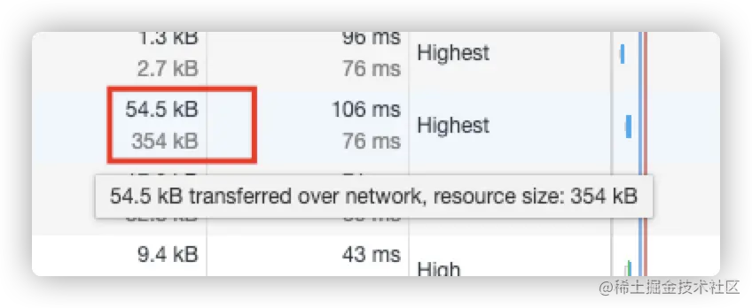

# 性能优化总结

<font color=red>转载自：https://juejin.cn/post/6911472693405548557#heading-4</font>

## 一、调试工具

### 1、Network


这里可以看到资源加载详情，初步评估影响 <font color=red>页面性能</font> 的因素。鼠标右键可以自定义选项卡，页面底部是当前加载资源的一个概览。DOMContentLoaded DOM渲染完成的时间，Load：当前页面所有资源加载完成的时间

**思考：如何判断哪些资源对当前页面加载无用，做对应优化？**

**shift + ctrl + P（mac：shift + cmd + P） 调出控制台的扩展工具，添加规则**


**扩展工具 更多使用姿势**


**瀑布流waterfall**


- <font color=red>Queueing</font> 浏览器将资源放入队列时间
- <font color=red>Stalled</font> 因放入队列时间而发生的停滞时间
- <font color=red>DNS Lookup</font> DNS解析时间
- <font color=red>Initial connection</font>  建立HTTP连接的时间
- <font color=red>SSL</font> 浏览器与服务器建立安全性连接的时间
- <font color=red>TTFB</font> 等待服务端返回数据的时间
- <font color=red>Content Download</font>  浏览器下载资源的时间

### 2、Lighthouse


- <font color=red>First Contentful Paint</font> 首屏渲染时间，1s以内绿色
- <font color=red>Speed Index</font> 速度指数，4s以内绿色
- <font color=red>Time to Interactive</font> 到页面可交换的时间

根据chrome的一些策略自动对网站做一个质量评估，并且会给出一些优化的建议。

### 3、Peformance


对网站最专业的分析~后面会多次讲到

### 4、webPageTest

可以模拟不同场景下访问的情况，比如模拟不同浏览器、不同国家等等，在线测试地址：[webPageTest](https://www.webpagetest.org/)




### 5、资源打包分析

**webpack-bundle-analyzer**


```js
npm install --save-dev webpack-bundle-analyzer
// webpack.config.js 文件
const BundleAnalyzerPlugin = require('webpack-bundle-analyzer').BundleAnalyzerPlugin
module.exports={
  plugins: [
    new BundleAnalyzerPlugin({
          analyzerMode: 'server',
          analyzerHost: '127.0.0.1',
          analyzerPort: 8889,
          reportFilename: 'report.html',
          defaultSizes: 'parsed',
          openAnalyzer: true,
          generateStatsFile: false,
          statsFilename: 'stats.json',
          statsOptions: null,
          logLevel: 'info'
        }),
  ]
}

// package.json
"analyz": "NODE_ENV=production npm_config_report=true npm run build"
```

**开启source-map**

webpack.config.js

```js
module.exports = {
    mode: 'production',
    devtool: 'hidden-source-map',
}
```

package.json

```json
"analyze": "source-map-explorer 'build/*.js'",
```

npm run analyze


## 二、WEB API

工欲善其事，必先利其器。浏览器提供的一些分析API<font color=red>至关重要</font>

### 1、监听视窗激活状态

大学都刷过慕课吧？只要离开窗口视频就会暂停~

或者一些考试网站，提醒你不能离开当前窗口

再或者，这种效果~


```js
// 窗口激活状态监听
let vEvent = 'visibilitychange';
if (document.webkitHidden != undefined) {
    vEvent = 'webkitvisibilitychange';
}

function visibilityChanged() {
    if (document.hidden || document.webkitHidden) {
        document.title = '客官，别走啊~'
        console.log("Web page is hidden.")
    } else {
        document.title = '客官，你又回来了呢~'
        console.log("Web page is visible.")
    }
}

document.addEventListener(vEvent, visibilityChanged, false);
```

### 2、观察长任务（performance 中Task）

```js
const observer = new PerformanceObserver((list) => {
    for (const entry of list.getEntries()) {
        console.log(entry)
    }
})

observer.observe({entryTypes: ['longtask']})
```

### 3、监听网络变化

网络变化时给用户反馈网络问题，有时候看直播的时候自己的网络卡顿，直播平台也会提醒你或者自动给你切换清晰度

```js
var connection = navigator.connection || navigator.mozConnection || navigator.webkitConnection;
var type = connection.effectiveType;

function updateConnectionStatus() {
  console.log("Connection type changed from " + type + " to " + connection.effectiveType);
  type = connection.effectiveType;
}

connection.addEventListener('change', updateConnectionStatus);
```

### 4、计算DOMContentLoaded时间

```js
window.addEventListener('DOMContentLoaded', (event) => {
    let timing = performance.getEntriesByType('navigation')[0];
    console.log(timing.domInteractive);
    console.log(timing.fetchStart);
    let diff = timing.domInteractive - timing.fetchStart;
    console.log("TTI: " + diff);
})
```

### 5、更多计算规则

```js
DNS 解析耗时: domainLookupEnd - domainLookupStart
TCP 连接耗时: connectEnd - connectStart
SSL 安全连接耗时: connectEnd - secureConnectionStart
网络请求耗时 (TTFB): responseStart - requestStart
数据传输耗时: responseEnd - responseStart
DOM 解析耗时: domInteractive - responseEnd
资源加载耗时: loadEventStart - domContentLoadedEventEnd
First Byte时间: responseStart - domainLookupStart
白屏时间: responseEnd - fetchStart
首次可交互时间: domInteractive - fetchStart
DOM Ready 时间: domContentLoadEventEnd - fetchStart
页面完全加载时间: loadEventStart - fetchStart
http 头部大小： transferSize - encodedBodySize
重定向次数：performance.navigation.redirectCount
重定向耗时: redirectEnd - redirectStart
```

## 三、老生常谈，雅虎军规

关于雅虎军规，你知道的有多少条，平时写用到的又有哪些？针对以下规则，我们可以做很多优化工作


### 1、减少cookie传输

cookie传输会造成带宽浪费，可以：

- 减少cookie中存储的东西
- 静态资源不需要cookie，可以采用其他的域名，不会主动带上cookie。

### 2、避免过多的回流与重绘

连续触发页面回流操作

```js
  let cards = document.getElementsByClassName("MuiPaper-rounded");
  const update = (timestamp) => {
    for (let i = 0; i <cards.length; i++) {
      let top = cards[i].offsetTop;
      cards[i].style.width = ((Math.sin(cards[i].offsetTop + timestamp / 100 + 1) * 500) + 'px')
    }
    window.requestAnimationFrame(update)
  }
  update(1000);
```

看下效果，很明显的卡顿


performance分析结果，load事件之后存在大量的回流，并且chrome都给标记了红色


使用fastDom进行优化，将对dom的读和写分离，合并

```js
 let cards = document.getElementsByClassName("MuiPaper-rounded");
  const update = (timestamp) => {
    for (let i = 0; i < cards.length; i++) {
      fastdom.measure(() => {
        let top = cards[i].offsetTop;
        fastdom.mutate(() => {
          cards[i].style.width =
            Math.sin(top + timestamp / 100 + 1) * 500 + "px";
        });
      });
    }
    window.requestAnimationFrame(update)
  }
  update(1000);
```

再看下效果，很流畅~


performance分析结果，load事件之后也没有了那么多的红色标记


感兴趣的可以去了解一下fastDom：[github fastdom](https://github.com/wilsonpage/fastdom) 在线预览：[fastdom demo](http://wilsonpage.github.io/fastdom/examples/animation.html)

关于任务拆分与组合的思想，<font color=red>react fiber</font> 架构做的很牛逼，有兴趣的可以去了解一下调度算法在fiber中的实践

## 四、压缩

### 1、Gzip

开启方式可参考：[nginx开启gzip](https://juejin.cn/post/6844903605187641357)



还有一种方式：打包的时候生成gz文件，上传到服务器端，这样就不需要nginx来压缩了，可以降低服务器压力。 可参考：[gzip压缩文件&webPack配置Compression-webpack-plugin](https://segmentfault.com/a/1190000020976930)

### 2、服务端压缩

server.js

```js
const express = require('express');
const app = express();
const fs = require('fs');
const compression = require('compression');
const path = require('path');


app.use(compression());
app.use(express.static('build'));

app.get('*', (req,res) =>{
    res.sendFile(path.join(__dirname+'/build/index.html'));
});

const listener = app.listen(process.env.PORT || 3000, function () {
    console.log(`Listening on port ${listener.address().port}`);
});
```

package.json

```json
"start": "npm run build && node server.js",
```


### 3、JavaScript、Css、Html压缩

工程化项目中直接使用对应的插件即可，webpack的主要有下面三个：

- UglifyJS
- webpack-parallel-uglify-plugin
- terser-webpack-plugin

具体优缺点可参考：webpack常用的三种JS压缩插件。压缩原理简单的讲就是去除一些空格、换行、注释，借助es6模块化的功能，做了一些tree-shaking的优化。同时做了一些代码混淆，一方面是为了更小的体积，另一方面也是为了源码的安全性。

css压缩主要是mini-css-extract-plugin，当然前面的js压缩插件也会给你做好css压缩。使用姿势：

html压缩可以用HtmlWebpackPlugin，单页项目就一个index.html,性能提升微乎其微~

## 五、webpack优化

上文中也提到了部分webpack插件，下面我再来看看还有哪些~

### 1、DllPlugin 提升构建速度

通过DllPlugin插件，将一些比较大的，基本很少升级的包拆分出来，生成xx.dll.js文件,通过manifest.json引用

webpack.dll.config.js

```js
const path = require("path");
const webpack = require("webpack");
module.exports = {
    mode: "production",
    entry: {
        react: ["react", "react-dom"],
    },
    output: {
        filename: "[name].dll.js",
        path: path.resolve(__dirname, "dll"),
        library: "[name]"
    },
    plugins: [
        new webpack.DllPlugin({
            name: "[name]",
            path: path.resolve(__dirname, "dll/[name].manifest.json")
        })
    ]
};
```

package.json

```js
"scripts": {
    "dll-build": "NODE_ENV=production webpack --config webpack.dll.config.js",
  },
```

### 2、splitChunks 拆包

```js
optimization: {
        splitChunks: {
            cacheGroups: {
                vendor: {
                    name: 'vendor',
                    test: /[\\/]node_modules[\\/]/,
                    minSize: 0,
                    minChunks: 1,
                    priority: 10,
                    chunks: 'initial'
                },
                common: {
                    name: 'common',
                    test: /[\\/]src[\\/]/,
                    chunks: 'all',
                    minSize: 0,
                    minChunks: 2
                }
            }
        }
    },
```

## 六、骨架屏

用css提前占好位置，当资源加载完成即可填充，减少页面的回流与重绘，同时还能给用户最直接的反馈。 图中使用插件：[react-placeholder](https://github.com/buildo/react-placeholder)


关于实现骨架屏还有很多种方案，用Puppeteer服务端渲染的挺多的

## 七、窗口化

原理：只加载当前窗口能显示的DOM元素，当视图变化时，删除隐藏的，添加要显示的DOM就可以保证页面上存在的dom元素数量永远不多，页面就不会卡顿

图中使用的插件：[react-window](https://github.com/bvaughn/react-window)


安装：npm i react-window

引入：import { FixedSizeList as List } from 'react-window';

使用：

```js
const Row = ({ index, style }) => (
  <div style={style}>Row {index}</div>
);
 
const Example = () => (
  <List
    height={150}
    itemCount={1000}
    itemSize={35}
    width={300}
  >
    {Row}
  </List>
);
```

## 八、缓存

### 1、http缓存

**keep-alive**

判断是否开启：看response headers中有没有Connection: keep-alive 。开启以后，看network的瀑布流中就没有 Initial connection耗时了

nginx设置keep-alive（默认开启）

```js
# 0 为关闭
#keepalive_timeout 0;
# 65s无连接 关闭
keepalive_timeout 65;
# 连接数，达到100断开
keepalive_requests 100;
```

**Cache-Control / Expires / Max-Age**

设置资源是否缓存，以及缓存时间

**Etag / If-None-Match**

资源唯一标识作对比，如果有变化，从服务器拉取资源。如果没变化则取缓存资源，状态码304，也就是协商缓存

**Last-Modified / If-Modified-Since**

通过对比时间的差异来觉得要不要从服务器获取资源

### 2、Service Worker

借助webpack插件WorkboxWebpackPlugin和ManifestPlugin,加载serviceWorker.js,通过serviceWorker.register()注册

```js
new WorkboxWebpackPlugin.GenerateSW({
    clientsClaim: true,
    exclude: [/\.map$/, /asset-manifest\.json$/],
    importWorkboxFrom: 'cdn',
    navigateFallback: paths.publicUrlOrPath + 'index.html',
    navigateFallbackBlacklist: [
        new RegExp('^/_'),
        new RegExp('/[^/?]+\\.[^/]+$'),
    ],
}),

new ManifestPlugin({
    fileName: 'asset-manifest.json',
    publicPath: paths.publicUrlOrPath,
    generate: (seed, files, entrypoints) => {
        const manifestFiles = files.reduce((manifest, file) => {
            manifest[file.name] = file.path;
            return manifest;
        }, seed);
        const entrypointFiles = entrypoints.app.filter(
            fileName => !fileName.endsWith('.map')
        );

        return {
            files: manifestFiles,
            entrypoints: entrypointFiles,
        };
    },
}),
```


## 九、预加载 && 懒加载

### 1、preload

就拿demo中的字体举例，正常情况下的加载顺序是这样的：


加入preload：

```html
<link rel="preload" href="https://fonts.gstatic.com/s/longcang/v5/LYjAdGP8kkgoTec8zkRgqHAtXN-dRp6ohF_hzzTtOcBgYoCKmPpHHEBiM6LIGv3EnKLjtw.119.woff2" as="font" crossorigin="anonymous"/> 
<link rel="preload" href="https://fonts.gstatic.com/s/longcang/v5/LYjAdGP8kkgoTec8zkRgqHAtXN-dRp6ohF_hzzTtOcBgYoCKmPpHHEBiM6LIGv3EnKLjtw.118.woff2" as="font" crossorigin="anonymous"/> 
<link rel="preload" href="https://fonts.gstatic.com/s/longcang/v5/LYjAdGP8kkgoTec8zkRgqHAtXN-dRp6ohF_hzzTtOcBgYoCKmPpHHEBiM6LIGv3EnKLjtw.116.woff2" as="font" crossorigin="anonymous"/> 
```


### 2、prefetch

场景：首页不需要这样的字体文件，下个页面需要：首页会以最低优先级Lowest来提前加载

加入prefetch：

```html
<link rel="prefetch" href="https://fonts.gstatic.com/s/longcang/v5/LYjAdGP8kkgoTec8zkRgqHAtXN-dRp6ohF_hzzTtOcBgYoCKmPpHHEBiM6LIGv3EnKLjtw.113.woff2" as="font"/> 
<link rel="prefetch" href="https://fonts.gstatic.com/s/longcang/v5/LYjAdGP8kkgoTec8zkRgqHAtXN-dRp6ohF_hzzTtOcBgYoCKmPpHHEBiM6LIGv3EnKLjtw.118.woff2" as="font"/> 
<link rel="prefetch" href="https://fonts.gstatic.com/s/longcang/v5/LYjAdGP8kkgoTec8zkRgqHAtXN-dRp6ohF_hzzTtOcBgYoCKmPpHHEBiM6LIGv3EnKLjtw.117.woff2" as="font"/> 
```

需要的页面，从prefetch cache中取


webpack也是支持这两个属性的:[webpackPrefetch 和 webpackPreload](https://www.cnblogs.com/skychx/p/webpack-webpackChunkName-webpackPreload-webpackPreload.html)

### 3、懒加载

**路由懒加载**

通过函数 + import实现

```js
const Page404 = () => import(/* webpackChunkName: "error" */'@views/errorPage/404');
```

## 十、ssr && react-snap

服务端渲染SSR，vue使用nuxt.js，react使用next.js

react-snap可以借助Puppeteer实现先渲染单页，然后保留DOM，发送到客户端
