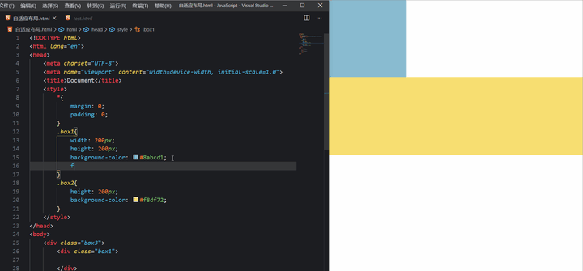
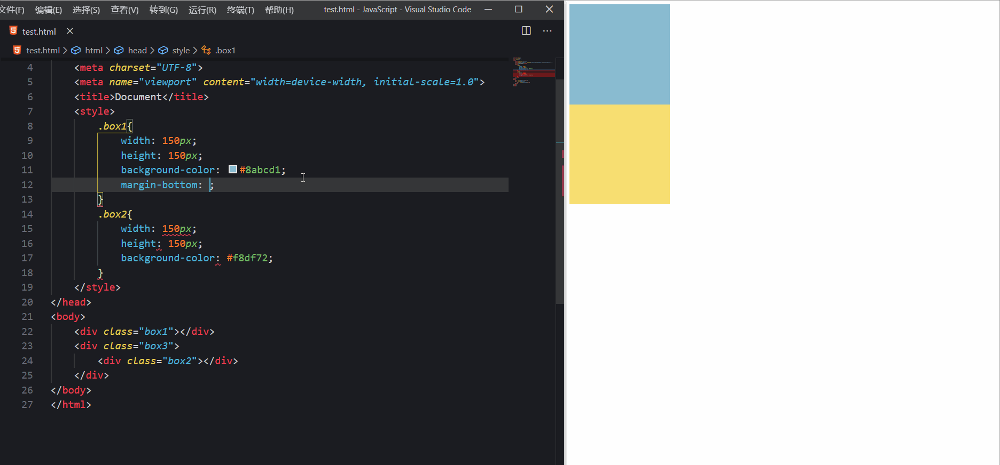

# BFC

## BFC是什么？

BFC(block formatting context)块级格式化上下文，它是页面中的一块渲染区域，并且有一套属于自己的渲染规则，它决定了元素如何对齐内容进行布局，以及与其他元素的关系和相互作用。 当涉及到可视化布局的时候，BFC提供了一个环境，HTML元素在这个环境中按照一定规则进行布局

简短的总结：**BFC是一个独立的布局环境，BFC内部的元素布局与外部互不影响**

## BFC的布局规则

1、内部的Box会在垂直方向一个接着一个地放置。
2、Box垂直方向上的距离由margin决定。属于同一个BFC的两个相邻的Box的margin会发生重叠。
3、每个盒子的左外边框紧挨着包含块的左边框，即使浮动元素也是如此。
4、BFC的区域不会与float box重叠。
5、BFC就是页面上的一个隔离的独立容器，容器里面的子元素不会影响到外面的元素，反之亦然。
6、计算BFC的高度时，浮动子元素也参与计算。

## 如何触发BFC？

这里只记录常用方法，想要了解全部触发BFC的方法请点击此[链接](https://developer.mozilla.org/zh-CN/docs/Web/Guide/CSS/Block_formatting_context)

元素或属性 | 属性值
--------- | ------
根元素    |
flot      | 值不为 none
position  | absolute, fixed
overflow  | 值不为 visible
display   | inline-block, table-cell

## BFC可以解决哪些问题？

- 解决浮动元素令父元素高度坍塌的问题

方法：给父元素开启BFC

原理：计算BFC的高度时，浮动子元素也参与计算

演示：

- 非浮动元素被浮动元素覆盖

方法：给非浮动元素开启BFC

原理：BFC的区域不会与float box重叠

演示：

- 两栏自适应布局

方法：给固定栏设置固定宽度，给不固定栏开启BFC。

原理：BFC的区域不会与float box重叠

演示：

- 外边距垂直方向重合的问题

方法：给上box或者下box任意一个包裹新的box并开启BFC

原理：属于同一个BFC的两个相邻的Box的margin会发生重叠。

演示：

