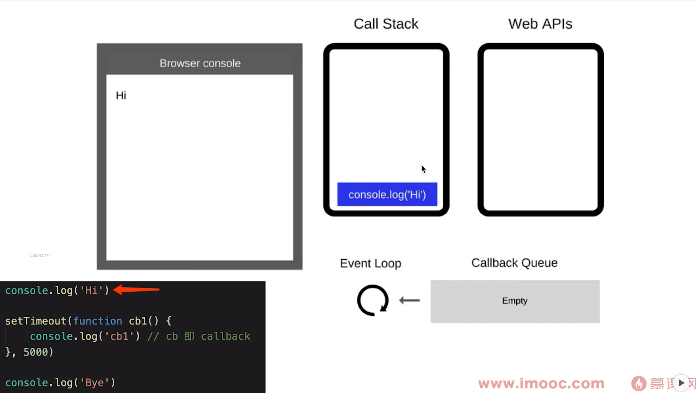
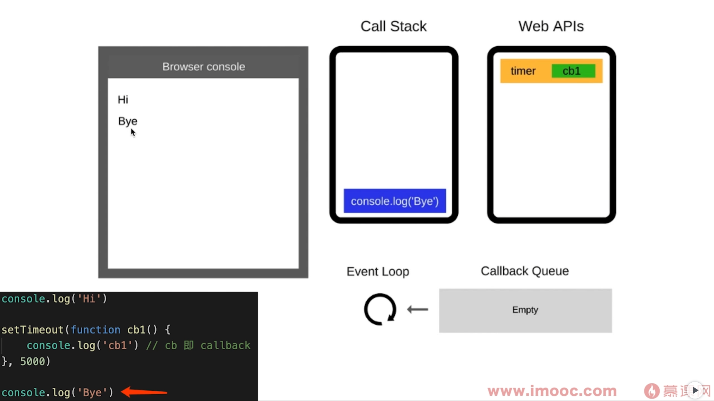
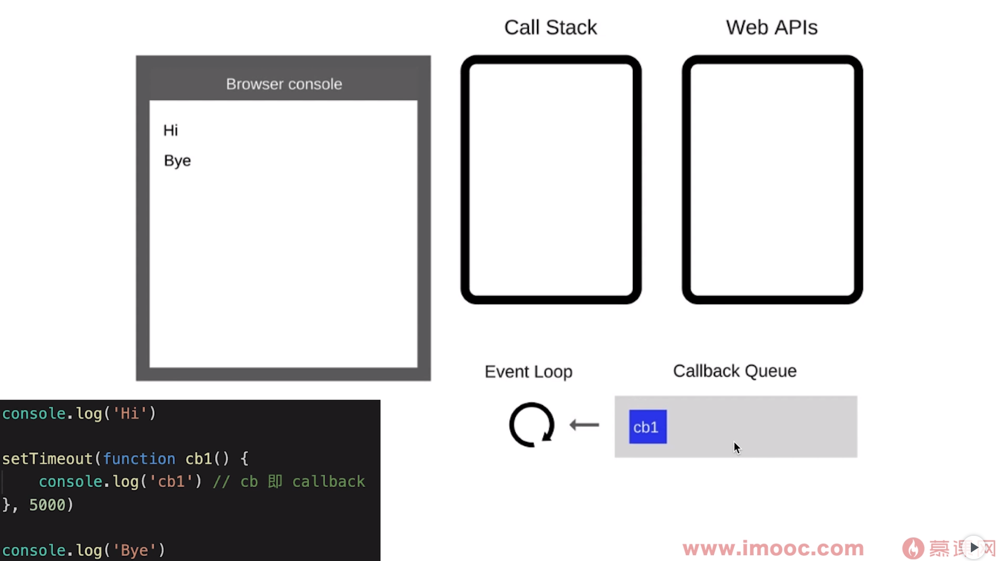
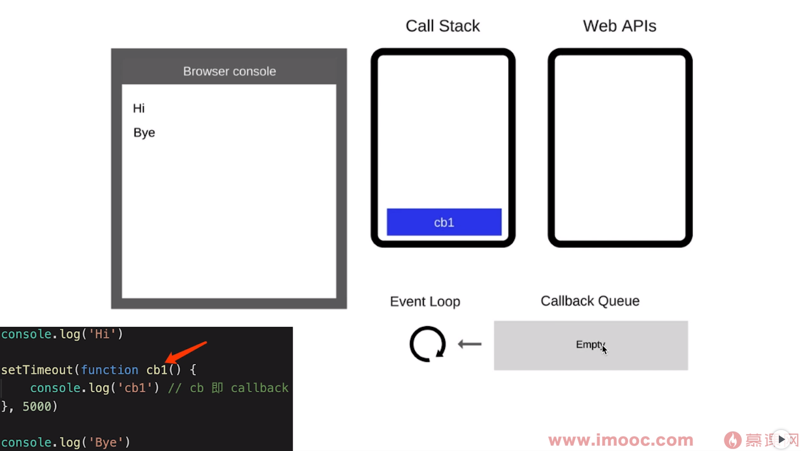
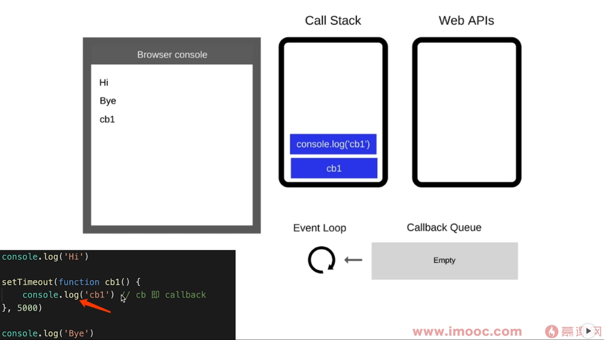
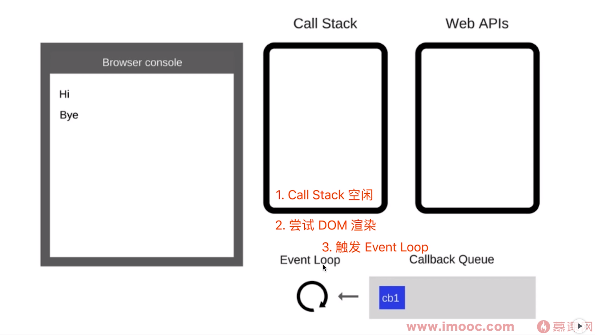
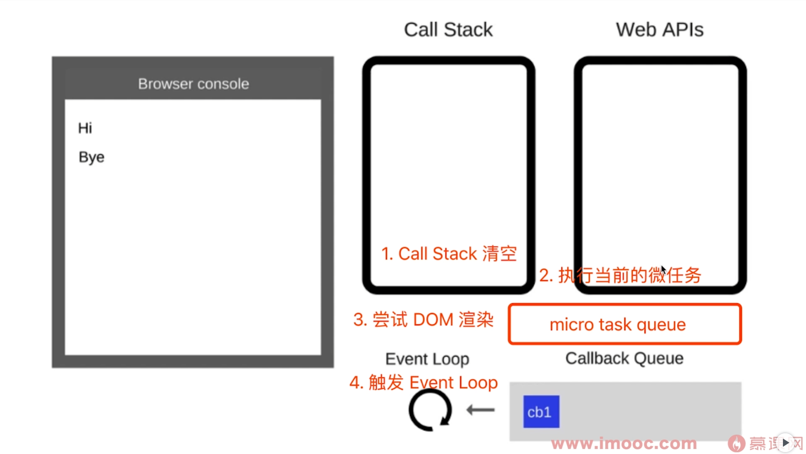

# 事件循环

## event loop 执行过程

先来看一个代码示例

```js
console.log('Hi')

setTimeout((function cb1) {
  console.log('cb1') // cb 即 callback
}, 5000)

console.log('Bye')
// 执行结果： Hi Bye cb1
```

分析执行过程如下：

1、js主线程顺序执行代码，遇到 conosle.log('Hi') ，把代码推入到 Call Stack（调用栈）并执行代码输出Hi，代码执行完后清空调用栈。



2、继续执行主线程代码，执行到setTimeout，会把timeout放到定时器任务中，等待5秒后才会把回调函数放到 Callback Queue 中，此时会清空调用栈，主线程会继续向下执行代码


3、继续执行主线程代码，执行到 console.log('Bye') ，会把代码推入到 Call Stack（调用栈）并执行代码输出 Bye ， 代码执行完后会再次清空调用栈。此时主线程代码已经执行结束了。



4、此时主线程代码执行结束了，浏览器内核会启动 event loop 机制，event loop 会从 callbackQueue查找是否有待执行函数。有则会把待执行函数放到调用栈中执行。

等待5秒左右定时器任务结束，把回调函数放到 Callback Queue 中


event loop 发现 Callback Queue 中有待执行函数，把回调函数放到调用栈中执行


执行结束，输出 cb1



## event loop 和 Dom 渲染之间的关系

当所有同步代码执行完后， Call Stack 空闲时，会尝试 DOM 渲染（不一定渲染，看代码是否有修改DOM结构），然后才去触发 event loop



代码演示

```html
<!DOCTYPE html>
<html lang="en">
  <head>
    <meta charset="UTF-8">
    <meta http-equiv="X-UA-Compatible" content="IE=edge">
    <meta name="viewport" content="width=device-width, initial-scale=1.0">
    <title>js异步demo</title>
  </head>
  <body>
    <p>js异步demo</p>
    <div id="container"></div>
    <script src="https://cdn.bootcss.com/jquery/3.4.0/jquery.js"></script>
    <script>
      const $p1 = $('<p>一段文字</p>');
      const $p2 = $('<p>一段文字</p>');
      const $p3 = $('<p>一段文字</p>');
      $('#container') 
                    .append($p1)
                    .append($p2)
                    .append($p3)
      console.log('length', $('#container').children().length)
      alert('本次 call stack 结束， DOM结构已更新，但尚未触发渲染')
    </script>
  </body>
</html>
```

### promise then 的回调函数是在遇到 resolve 语句的时候就被加入微任务队列，还是在遇到 then 语句的时候被加入到微任务队列？

如果先 resolve，那么promise就会被 fullfilled，在后面调用 then 的时候直接把回调函数送到微任务队列里；而如果在调用 then 的时候还没有 resolve，那么只会把回调函数缓存起来，只有在后面确实 resolve 之后，promise 才会达到 fullfilled 状态，才会缓存中取出这个回调函数放到微任务队列里。

## 微任务与宏任务的区别

宏任务：DOM 渲染后触发，如setTimeout

微任务：DOM 渲染前触发，如Promise



代码演示

```html
<!DOCTYPE html>
<html lang="en">
  <head>
    <meta charset="UTF-8">
    <meta http-equiv="X-UA-Compatible" content="IE=edge">
    <meta name="viewport" content="width=device-width, initial-scale=1.0">
    <title>js异步demo</title>
  </head>
  <body>
    <p>js异步demo</p>
    <div id="container"></div>
    <script src="https://cdn.bootcss.com/jquery/3.4.0/jquery.js"></script>
    <script>
      const $p1 = $('<p>一段文字</p>');
      const $p2 = $('<p>一段文字</p>');
      const $p3 = $('<p>一段文字</p>');
      $('#container') 
                    .append($p1)
                    .append($p2)
                    .append($p3)
      // 微任务：DOM 渲染前触发
      Promise.resolve().then(() => {
        console.log('length1', $('#container').children().length)
        alert('微任务触发')
      })
      // 宏任务：DOM 渲染后触发
      setTimeout(() => {
        console.log('length2', $('#container').children().length)
        alert('宏任务触发')
      })
    </script>
  </body>
</html>
```

## 异步面试题

### 题目一

```html
<!DOCTYPE html>
<html lang="en">
  <head>
    <meta charset="UTF-8">
    <meta http-equiv="X-UA-Compatible" content="IE=edge">
    <meta name="viewport" content="width=device-width, initial-scale=1.0">
    <title>异步实战</title>
  </head>
  <body>
    <h1>异步实战</h1>
    <script>
      const promise = new Promise((resolve, reject) => {
        console.log(1)
        resolve()
        console.log(2)
      })
      promise.then(() => {
        console.log(3)
      })
      console.log(4)
    </script>
  </body>
</html>
```

### 题目二

```html
<!DOCTYPE html>
<html lang="en">
  <head>
    <meta charset="UTF-8">
    <meta http-equiv="X-UA-Compatible" content="IE=edge">
    <meta name="viewport" content="width=device-width, initial-scale=1.0">
    <title>异步实战</title>
  </head>
  <body>
    <h1>异步实战</h1>
    <script>
      const promise1 = new Promise((resolve, reject) => {
        setTimeout(() => {
          resolve('success')
        }, 1000)
      })
      const promise2 = promise1.then(() => {
        throw new Error('error!!!')
      })

      console.log('promise1', promise1)
      console.log('promise2', promise2)

      setTimeout(() => {
        console.log('promise1', promise1)
        console.log('promise2', promise2)
      }, 2000)
    </script>
  </body>
</html>
```
### 题目三

```html
<!DOCTYPE html>
<html lang="en">
  <head>
    <meta charset="UTF-8">
    <meta http-equiv="X-UA-Compatible" content="IE=edge">
    <meta name="viewport" content="width=device-width, initial-scale=1.0">
    <title>异步实战</title>
  </head>
  <body>
    <h1>异步实战</h1>
    <script>
      const promise = new Promise((resolve, reject) => {
        resolve('success1')
        reject('error')
        resolve('success2')
      })

      promise
        .then((res) => {
          console.log('then: ', res)
        })
        .catch((err) => {
          console.log('catch: ', err)
        })
    </script>
  </body>
</html>
```

### 题目四

```html
<!DOCTYPE html>
<html lang="en">
  <head>
    <meta charset="UTF-8">
    <meta http-equiv="X-UA-Compatible" content="IE=edge">
    <meta name="viewport" content="width=device-width, initial-scale=1.0">
    <title>异步实战</title>
  </head>
  <body>
    <h1>异步实战</h1>
    <script>
      Promise.resolve(1)
      .then((res) => {
        console.log(res)
        return 2
      })
      .catch((err) => {
        return 3
      })
      .then((res) => {
        console.log(res)
      })
    </script>
  </body>
</html>
```

### 题目五

```html
<!DOCTYPE html>
<html lang="en">
  <head>
    <meta charset="UTF-8">
    <meta http-equiv="X-UA-Compatible" content="IE=edge">
    <meta name="viewport" content="width=device-width, initial-scale=1.0">
    <title>异步实战</title>
  </head>
  <body>
    <h1>异步实战</h1>
    <script>
      const promise = new Promise((resolve, reject) => {
        setTimeout(() => {
          console.log('once')
          resolve('success')
        }, 1000)
      })

      const start = Date.now()
      promise.then((res) => {
        console.log(res, Date.now() - start)
      })
      promise.then((res) => {
        console.log(res, Date.now() - start)
      })
    </script>
  </body>
</html>
```

解释：promise 的 .then 或者 .catch 可以被调用多次，但这里 Promise 构造函数只执行一次。或者说 promise 内部状态一经改变，并且有了一个值，那么后续每次调用 .then 或者 .catch 都会直接拿到该值。

### 题目六

```html
<!DOCTYPE html>
<html lang="en">
  <head>
    <meta charset="UTF-8">
    <meta http-equiv="X-UA-Compatible" content="IE=edge">
    <meta name="viewport" content="width=device-width, initial-scale=1.0">
    <title>异步实战</title>
  </head>
  <body>
    <h1>异步实战</h1>
    <script>
      Promise.resolve()
      .then(() => {
        return new Error('error!!!')
      })
      .then((res) => {
        console.log('then: ', res)
      })
      .catch((err) => {
        console.log('catch: ', err)
      })
    </script>
  </body>
</html>
```

解释：.then 或者 .catch 中 return 一个 error 对象并不会抛出错误，所以不会被后续的 .catch 捕获，需要改成其中一种：

```js
return Promise.reject(new Error('error!!!'))
throw new Error('error!!!')
```

### 题目七

```html
<!DOCTYPE html>
<html lang="en">
  <head>
    <meta charset="UTF-8">
    <meta http-equiv="X-UA-Compatible" content="IE=edge">
    <meta name="viewport" content="width=device-width, initial-scale=1.0">
    <title>异步实战</title>
  </head>
  <body>
    <h1>异步实战</h1>
    <script>
      const promise = Promise.resolve()
        .then(() => {
          return promise
        })
      promise.catch(console.error)
    </script>
  </body>
</html>
```

解释：.then 或 .catch 返回的值不能是 promise 本身，否则会造成死循环。类似于：

```js
process.nextTick(function tick () {
  console.log('tick')
  process.nextTick(tick)
})
```

### 题目八

```html
<!DOCTYPE html>
<html lang="en">
  <head>
    <meta charset="UTF-8">
    <meta http-equiv="X-UA-Compatible" content="IE=edge">
    <meta name="viewport" content="width=device-width, initial-scale=1.0">
    <title>异步实战</title>
  </head>
  <body>
    <h1>异步实战</h1>
    <script>
      Promise.resolve(1)
        .then(2)
        .then(Promise.resolve(3))
        .then(console.log)
    </script>
  </body>
</html>
```

解释：.then 或者 .catch 的参数期望是函数，传入非函数则会发生值穿透。